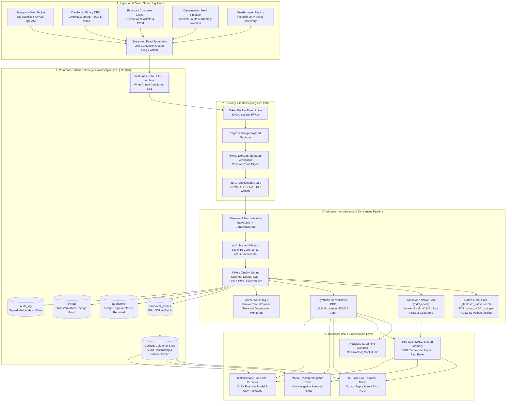

# Market Data Reliability & Acceleration Platform (MDRAP)
### Enterprise Self-Hosted Reliability, Reconciliation & Audit Infrastructure for Real-Time Financial Market Data

[](pyproject.toml)
[](https://www.python.org/)
[-brightgreen.svg)](tests/)
[](docs/benchmark-methodology.md)
[-purple.svg)](docs/architecture.md)
[](docs/USER_GUIDE.md)
[](LICENSE)

> [!IMPORTANT]
> **Commercial Self-Hosted Product Architecture & Market Data Licensing Notice**
> MDRAP is an enterprise software platform designed to be deployed and operated **self-hosted on customer-owned infrastructure** (bare-metal, on-premise data centers, or private clouds).
> **MDRAP DOES NOT PROVIDE, BROKER, OR RESELL MARKET DATA.**
> Deploying organizations are solely responsible for obtaining and maintaining valid commercial data licenses from their market data vendors (e.g., Polygon.io, Databento, CME, Nasdaq, OPRA). See the [Data Licensing Guide](docs/data-licensing.md) for full compliance information.

MDRAP ingests multiple live market data feeds, cross-reconciles them in real time, flags anomalies with explainable reason codes, and produces a cryptographically auditable record of every data quality decision. It sits **before** your trading engine, database, or research code.

---

## ⚡ Self-Hosted Quickstart

### 1. Run via Docker Compose (Recommended)

```bash
# 1. Clone repository and initialize environment
git clone https://github.com/Aryan-20-04/mdrap.git && cd mdrap
cp .env.example .env

# 2. Boot production container
docker compose up -d --build

# 3. Verify health
curl http://localhost:8000/v1/health
```

The service exposes:
- **FastAPI REST API**: `http://localhost:8000/v1`
- **Interactive Swagger Documentation**: `http://localhost:8000/docs`
- **Real-Time WebSocket Feed**: `ws://localhost:8000/v1/events/stream`
- **TCP Wire Protocol**: `tcp://localhost:9001`
- **Optional TLS Reverse Proxy (Caddy)**: `docker compose --profile tls up -d`

### 2. Run via Python CLI

```bash
# Install dependencies
pip install -e ".[all]"

# Create initial Admin API key (hashed in database; raw token shown ONCE)
python cli.py keys create --client-id TradingDesk_Admin --role ADMIN

# Launch REST & WebSocket server
python cli.py serve --host 0.0.0.0 --port 8000
```

| Feature | MDRAP | QuestDB | NautilusTrader | kdb+ |
|---------|-------|---------|----------------|------|
| Cross-source reconciliation | ✅ Built-in dynamic consensus | ❌ | ❌ | ❌ |
| Statistical quality scoring | ✅ 7-rule engine + X-Macro rules | ❌ | ❌ | Manual |
| Explainable reason codes | ✅ Per-event bitmask & JSON | ❌ | ❌ | ❌ |
| Cryptographic audit trail | ✅ Tamper-evident Merkle hash chain | ❌ | ❌ | ❌ |
| Standalone C Hot-Path (`mdrap-core`) | ✅ 44.8–61.3 ns / 16.3M–22.3M eps | ❌ | ❌ (C++ core) | ✅ (q kernel) |
| Zero-lock SPSC shared memory | ✅ 128B cache-line aligned seqlock | ❌ | ❌ | Custom |
| Tick-level persistence | SQLite WAL + DuckDB Parquet | ✅ Purpose-built | ✅ Parquet catalog | ✅ Purpose-built |
| Strategy execution & MM | Avellaneda-Stoikov HFT SDK | ❌ | ✅ Purpose-built | Via q |
| `pip install` + CLI | ✅ Zero-dependency pure stdlib | ❌ (Java) | ✅ | ❌ (Commercial) |

> MDRAP is not a replacement for QuestDB, NautilusTrader, or kdb+ — it is the high-performance validation and reliability layer you run **before** them, guaranteeing that downstream models and execution algos never trade on corrupted, crossed, stale, or phantom data.

### 🤖 Built for AI Agents & Automated Pipelines
Every data-producing command supports `--json` for direct ingestion by automated trading systems and AI coding agents (Claude Code, Cursor, Copilot, Codex) with zero regex or text scraping:
```bash
mdrap bbo AAPL --json          # Real-time consolidated NBBO in structured JSON
mdrap doctor --json            # Environment, compiler, active tier, and clock diagnostics
mdrap status --json            # Pipeline health, queue counts, and storage metrics
mdrap analytics spread --json  # Bid/ask spread statistics & crossed quotes
mdrap retention --json         # Pruning statistics and WAL compaction summary
mdrap q latest AAPL            # Canonical tick records with provenance metadata
```

📖 **Complete Operator Guide**: See the [**Comprehensive Operator & User Manual**](docs/USER_GUIDE.md) for full syntax, flags, and workflow instructions.

---

## High-Level Platform Architecture



---

## Key Platform Capabilities

### 1. 7-Rule Data Quality Engine & X-Macro Architecture (`src/quality.py`, `src/rules.def`)
- **Single Source of Truth (`src/rules.def`)**: Canonical C X-Macro reserving bitmask ranges:
  - **Bits 0–15**: Core platform rules (`SCHEMA_ERROR`, `SEQUENCE_GAP`, `DUPLICATE_EVENT`, `OUT_OF_ORDER`, `TIMESTAMP_STALE`, `PRICE_SANITY_FAILED`, `CROSSED_QUOTE`).
  - **Bits 16–31**: Exchange-specific microstructure rules (`CIRCUIT_FILTER_BREACH` for NSE/BSE, `VOLATILITY_INTERRUPTION` for Xetra/Eurex, `SPECIAL_QUOTE_INDICATION` for TSE/JPX).
  - **Bits 32–63**: User-defined rules registered dynamically via Python decorator `@register_rule(bit=32..63)`.
- **Exact & Sliding-Window Deduplication**: 64-bit sequence bitmaps for sequenced feeds and 2-generation sliding tables for unsequenced feeds.
- **Statistical Price Sanity Checks**: Evaluates sudden price jumps ($>6\sigma$) using Welford's online variance algorithm with relative $\sigma$-floor and regime-shift re-seeding.
- **Strict Quality Priority**: Non-downgradable progression: `INVALID` > `SUSPICIOUS` > `VALID`. Quarantines bad data; **every drop is counted and reported**.

### 2. Standalone Native Core (`mdrap-core` / `src/mdrap_core.c`)
- **Zero-Python Execution**: Standalone compiled C binary running wire-to-SHM with zero Python interpreter frames, CPython FFI, or GIL overhead.
- **Verified Throughput**: **16.31M to 22.35M events/second** (**44.8 to 61.3 ns per tick** end-to-end wire-to-SHM latency).
- **Benchmark Proven**: Reproducible via `python benchmarks/bench_mdrap_core.py`, with committed report [`benchmarks/mdrap_core_bench.json`](benchmarks/mdrap_core_bench.json).

### 3. Zero-Lock SPSC Shared Memory Ring Buffer (`src/shm.py` v3 Layout)
- **Cache-Line Aligned Architecture**: Cross-platform memory-mapped circular ring buffer with 128-byte aligned slots, atomic release fences, and two-phase commit protocol (`UNCOMMITTED` seq invalidation $\to$ payload write $\to$ fence $\to$ commit sequence publication).
- **Sub-Microsecond Streaming**: Fast in-memory epoch validation (`struct.unpack_from("<Q", buf, 16)`, ~5 ns) during active streaming, deferring OS kernel handle probes to idle/spinning states. Eliminates syscall overhead and guarantees sub-microsecond tick reads.
- **Lapping & Overrun Protection**: Seqlock double-checks detect torn reads; slow-reader lap counters record overrun events.

### 4. Native C Hot-Path Accelerator (`src/fastpath.c`, `src/fastpath.py`)
- Compiled native shared library (`_fastpath_native.so` / `_fastpath_native.dll`) with lazy 96-byte slot allocation and contiguous memory indexing.
- **37.5 ns/event** batch evaluation in CPU L1 cache; **50.0 ns** single-tick evaluation; **~15.3 µs** Python in-memory pipeline.
- Transparent pure-Python fallback when compilers are unavailable or symbol universes exceed 8,192 entries.

### 5. Institutional Diagnostics & Doctor (`mdrap doctor`)
- Built-in diagnostic CLI command verifying:
  - Python version, runtime build, and memory allocator.
  - C compiler detection (`gcc`, `clang`, `cl.exe`) and native build status.
  - Active engine tier (`mdrap-core` standalone binary present/ready, C DLL fastpath active).
  - Clock source precision: Linux PTP Hardware Clocks (`/dev/ptp*`), kernel `SO_TIMESTAMPING`, or high-resolution Windows QPC.
  - Layered configuration validity and SHA-256 hash checksum.
  - SQLite WAL journal mode and active table schemas.
  - 10,000-event self-test smoke benchmark.

### 6. Layered Configuration & Extension Points (`mdrap.toml`, `src/config_loader.py`, `src/adapters/`)
- **Hierarchical Config (`mdrap.toml`)**: Loaded via Python 3.11+ stdlib `tomllib` with layered inheritance: `[defaults] -> [venue.X] -> [venue.X.instrument_class.Y] -> [venue.X.instrument.Z]`. Inspectable via `mdrap config show`.
- **Feed Adapter Protocol (`src/adapters/`)**: `@runtime_checkable` `FeedAdapter` protocol (`open`, `__iter__`, `close`) discoverable dynamically through Python entry points (`mdrap.adapters`).

### 7. Direct Streaming Feeds & Historical Ingestion
- **Polygon.io WebSocket**: Real-time US Equities and Crypto quotes (`Q`), trades (`T`), and aggregate bars (`AM`) with multiplexed channels, exponential backoff, and offline wire-format mocks.
- **Databento Binary Encoding (DBN)**: Sub-microsecond binary record decoding using `struct.Struct` C layouts for Databento formats (`MBP-1`, `MBP-10`, `TradeMsg`), nanosecond UTC epoch timestamps, fixed-point price scaling ($10^9$), and live TCP / `.dbn` file streaming.
- **CryptoHFTData (CHD) Historical Ingestion**: Native discovery, UTC interval planning, resumable Parquet downloads for six crypto datasets, and atomic replay archives ([`docs/CHD.md`](docs/CHD.md)).

### 8. DuckDB Columnar Time-Series Storage & SIMD Analytics (`src/columnar.py`)
- **Zero-Copy SQLite Sync**: Directly attaches operational SQLite databases via DuckDB's native SQLite scanner (`ATTACH '...' AS sqldb (TYPE SQLITE)`), copying 300,000+ ticks in ~2.8s into columnar memory.
- **Vectorized Resampling**: Resamples trade ticks into OHLCV candles via `arg_min(price, exchange_timestamp)` and `arg_max(price, exchange_timestamp)` in a single pass (**37.2x faster than SQLite**).
- **SIMD Quantiles & VWAP**: Computes exact institutional VWAP (`sum(P*Q) / sum(Q)`) across tens of thousands of trades in <10ms (**63.3x faster than SQLite**); sub-microsecond latency quantiles (`p50`, `p90`, `p95`, `p99`, `p99.9`) via `quantile_cont()`.
- **Compressed Parquet Export**: Direct export of tick universes to compressed `.parquet` files with Zstandard (`zstd`), Snappy, or GZIP (299k ticks compressed to 1.52 MB).

### 9. Level-2 Market Depth & Real-Time VWAP Slippage Curve (`src/depth.py`)
- Aggregates multi-venue order books into a consolidated L2 depth ladder.
- Dynamic VWAP slippage curve computation: calculates executed price, basis-point slippage, and market impact across configurable order sizes.

### 10. Quantitative Research, Trading & Risk Suite
- **Avellaneda-Stoikov HFT Market Maker (`src/strategy_sdk.py`)**: High-frequency market-making strategy with inventory reservation pricing, toxic order-flow spread widening, tick grid quantization, and integrated `FastQualityEngine` quality shield.
- **Portfolio Risk & Value-at-Risk (`src/risk.py`)**: Historical simulation, Parametric, and Monte Carlo VaR, Expected Shortfall (CVaR), and multi-tier circuit breakers (`mdrap risk`).
- **Event-Driven Backtester (`src/backtest.py`)**: Sharpe, Sortino, Calmar ratios, high-watermark drawdown curves, win rate, profit factor, and walk-forward optimization (`mdrap backtest`).
- **Multi-Timeframe Bar Database (`src/bardb.py`)**: Incremental candle rollups across 7 intervals (`1s` to `1d`) with WAL SQLite storage and temporal as-of queries (`mdrap bars`).
- **Options & Derivatives Pricing (`src/options.py`)**: Black-Scholes-Merton European & CRR Binomial American models, full Greeks chain (Delta through Volga), Newton-Raphson IV solver, and volatility surface modeling (`mdrap options`).
- **Institutional TCA & Flow Tracking (`src/tca.py`, `src/flow_tracker.py`)**: Post-trade execution analysis (SEC 606), Lee-Ready aggressor classification, and Cumulative Volume Delta (CVD) tracking (`mdrap tca`, `mdrap flow`).
- **SEC EDGAR Alternative Data (`src/research.py`)**: Real-time extraction of 8-K material event items (e.g. `Item 5.02` executive changes, `Item 2.02` earnings), Form 4 insider transaction XML parsing, and audited GAAP XBRL financials (`mdrap edgar`).
- **Maritime Vessel Intelligence (`src/vessel.py`)**: Commercial crude tanker (VLCC), LNG, bulk, and container tracking across 8 geopolitical chokepoints with C geofencing fastpath (`mdrap vessel`).

### 11. Modal Keyboard Navigator Desk (`src/navigator.py`, `mdrap desk`)
- Vim-inspired modal navigation (`h`/`j`/`k`/`l` or arrow keys) across symbol watchlists, stats, and L2 books.
- Two-stage armed execution tickets (`b` for Buy, `S` for Sell) requiring explicit confirmation (`Enter` or `y`) to submit, preventing accidental key submissions.
- Real-time incremental search (`/`) and metric sorting (`s`).

### 12. T2 FPGA Hardware Learning Track (`fpga/`)
- Explores the software-to-hardware boundary between software T1 and hardware T2:
  - **Synthesizable Verilog RTL**: [`fpga/mdrap_crossed_quote.v`](fpga/mdrap_crossed_quote.v) (64-bit carry-chain comparator), [`fpga/mdrap_sequence_gap.v`](fpga/mdrap_sequence_gap.v) (pipelined gap and retrograde detector), and [`fpga/tb_mdrap_rules.v`](fpga/tb_mdrap_rules.v) (self-checking testbench).
  - **Cycle-Accurate Parity**: [`tests/test_fpga_parity.py`](tests/test_fpga_parity.py) verifies 100% agreement against Python and C engines across 1,000 synthetic events.
  - **Findings Report**: [FPGA Spike Findings](docs/fpga-spike-findings.md) detailing resource usage (~130 LUTs, 69 FFs, ~3.3 ns evaluation) and an architectural assessment of the ~100 ns gap to commercial tick-to-trade appliances.

---

## Latency Architecture & Industry Tiering

| Tier | Industry Scope & Technology | Representative Latency | MDRAP Implementation |
|---|---|:---:|:---:|
| **T0 — Baseline** | In-process Python/C pipeline, SQLite WAL persistence | ~15.3 µs in-memory, ~783.6 µs durable | **Shipped & Verified** |
| **T1 — Good Software** | Standalone native core (`mdrap-core`), zero-lock SPSC shared memory ring, kernel bypass (`SO_TIMESTAMPING`/`io_uring`), core isolation | **44.8–61.3 ns** single-tick, **~1–5 µs** wire-to-SHM | **Shipped & Verified** (`mdrap-core`) |
| **T2 — Specialist Hardware** | Commercial FPGA tick-to-trade appliances | Sub-microsecond (~100 ns) | **Bounded Learning Spike** (`fpga/`, non-production) |
| **T3 — Physical Infra** | Colocation, optical cross-connects, microwave/laser links | Sub-100 ns transport | **Out of Scope** (Real estate & capital budget) |

> 📖 **Deep Dive**: See [From T0 to T1: The MDRAP Low-Latency Architecture Journey](docs/T0_TO_T1_JOURNEY.md) for full empirical benchmarks, thread contention analysis, and systems engineering trade-offs.

---

## Verified Platform Benchmark Audit

All latency and throughput figures trace directly to committed JSON benchmark reports generated with fixed random seeds (`seed=42`). See [`docs/benchmark-methodology.md`](docs/benchmark-methodology.md) for full measurement standards:

| Tier | Component / Pipeline Stage | Throughput (eps) | Latency p50 | Latency p95 | Latency p99 | Source Report / Reproducible Command |
|---|---|:---:|:---:|:---:|:---:|---|
| **Tier 1A** | Native C Kernel (Batch L1) | **26,652,452 eps** | **37.5 ns** (0.038 µs) | 37.5 ns | 37.5 ns | `benchmarks/stage_breakdown.json` (`stage_breakdown.py`) |
| **Tier 1B** | Native C Kernel (Single Call) | **18,669,082 eps** | **50.0 ns** (0.050 µs) | 55.0 ns | 72.0 ns | `benchmarks/micro_ffi.py --iterations 100000` |
| **Tier 1C** | ctypes FFI Overhead (Scalar) | — | **~1.7 µs** | ~2.5 µs | ~3.8 µs | `benchmarks/micro_ffi.py` |
| **Tier 1D** | ctypes FFI Overhead (Batch) | — | **~0.35 µs/event** | ~0.50 µs | ~0.80 µs | `benchmarks/micro_ffi.py` (5.2x faster than scalar FFI) |
| **Tier 1E** | Standalone Native Core (`mdrap-core`) | **16,317,473–22,345,370 eps** | **44.8–61.3 ns** (0.05 µs) | 58.7 ns | 63.4 ns | `benchmarks/mdrap_core_bench.json` (`bench_mdrap_core.py`) |
| **Tier 2A** | SBE Binary Frame Decoder | **1,175,606 eps** | **600 ns** (0.60 µs) | 900 ns | 1,100 ns | `benchmarks/stage_breakdown.json` (vs Python JSON 3,000 ns) |
| **Tier 2B** | Contiguous Event Allocation | **987,066 eps** | **700 ns** (0.70 µs) | 1,200 ns | 1,500 ns | `benchmarks/stage_breakdown.json` (vs Dataclass 2,000 ns) |
| **Tier 2C** | V4 In-Memory Hot Path (Batch C) | **34,241 eps** | **15.30 µs** (0.015 ms) | 28.40 µs | 45.10 µs | `benchmarks/baseline_*.json` (`cli.py compare -e 100000`) |
| **Tier 2D** | V1 In-Memory Baseline (Pure Py) | **28,562 eps** | **21.00 µs** (0.021 ms) | 38.20 µs | 58.90 µs | `benchmarks/baseline_v1_*.json` (`cli.py compare -e 100000`) |
| **Tier 3A** | SHM Broadcast Ring Publish | **208,479 eps** | **4.10 µs** (0.004 ms) | 5.30 µs | 8.10 µs | `benchmarks/stage_breakdown.json` |
| **Tier 3B** | SQLite WAL Batched Flush (Sync) | **330,136 eps** | **2.27 µs** (in-memory) | 4.15 µs | 8.88 µs | `benchmarks/stage_breakdown.json` (also tracked in live `Metrics.stages_us`) |
| **Tier 4** | End-to-End Durable Ingest-to-Disk | **23,600 eps** | **783.6 µs** (0.78 ms) | 1,240 µs | 2,850 µs | Full pipeline with SQLite WAL batched commits |

### Latency Hierarchy & Physical Bounds
- **Native C Batch (37.5 ns) vs Pipeline (15.3 µs)**: The **37.5 ns** figure measures the C accelerator alone operating on pre-batched contiguous arrays in CPU L1 cache. The **15.3 µs** figure is the same accelerator measured end-to-end inside the full Python pipeline compute loop (normalization + 7-rule scoring + cross-feed reconciliation + NBBO tracking).
- **Standalone Core (44.8–61.3 ns)**: The out-of-process standalone binary (`mdrap-core`) bypasses the Python interpreter completely, achieving wire-to-SHM execution at hardware speeds.
- **Physics of the "~5 Nanosecond" Myth**: At 4.0 GHz, one CPU clock cycle is 0.25 nanoseconds; **5 nanoseconds is exactly 20 CPU cycles**. Software running on general-purpose OS kernels cannot receive network packets, parse payloads, and evaluate state in 5 nanoseconds (PCIe bus transfer from NIC to RAM alone takes 100–250 ns). Sub-20 ns latencies are only physically possible in dedicated hardware FPGA gate logic.

---

## Quick Start

### Installation

**1. Install from Source (Recommended for Full Native Features)**
```bash
git clone https://github.com/Aryan-20-04/mdrap.git
cd mdrap
pip install -e . pytest rich pytest-timeout
```

**2. Compile Native Accelerators**
```bash
python build_fastpath.py
# Compiles both _fastpath_native shared library and mdrap-core standalone binary
```

**3. Run Diagnostics**
```bash
python cli.py doctor
```

---

### Interactive Wall Street & Quant Terminal
Run `mdrap` (or `python cli.py` / `.\mdrap.bat`) with zero arguments to enter the pre-warmed interactive shell:
```bash
python cli.py
```
```text
mdrap> doctor            # Run platform integrity checks, compiler detection, and clock diagnostics
mdrap> desk              # Launch modal keyboard navigator desk with Vim controls & armed tickets
mdrap> live AAPL         # Live market stream with in-place updating table & candlestick chart
mdrap> chart BTC/USD     # Standalone visual candlestick chart with volume histogram
mdrap> depth AAPL        # Consolidated Level-2 market depth ladder
mdrap> vwap AAPL 1000    # Calculate VWAP slippage curve for 1,000 shares
mdrap> export AAPL --open# Export 5-tab financial model workbook to Excel and open it
mdrap> bbo BTC/USD       # 5-Venue Consolidated NBBO across Binance, Coinbase, Kraken, OKX, Bybit
mdrap> core -e 1000000   # Launch out-of-process standalone C hot path engine (1M ticks)
mdrap> audit             # Cryptographically verify tamper-evident Merkle hash chain
```

You can also run all commands directly from your OS shell:
```bash
mdrap doctor                          # Platform diagnostics & health check
mdrap desk                            # Modal keyboard trading desk
mdrap live AAPL                       # In-place terminal ticker & candlestick chart
mdrap chart AAPL                      # Unicode candlestick chart
mdrap depth AAPL                      # L2 market depth ladder
mdrap vwap AAPL --size 500            # Execution slippage schedule
mdrap export AAPL --open              # Generate Excel model (.xlsx) & open immediately
mdrap bbo BTC/USD                     # 5-Venue crypto NBBO quote
mdrap core --events 1000000           # Standalone C hot path engine execution
```

---

### Headless Streaming Daemon & Shared Memory IPC
In **Terminal 1**, start the background ingestion daemon:
```bash
# High-speed simulated multi-venue feed
mdrap daemon --speed 2000

# Or live multi-venue market feeds (Binance, Coinbase, Kraken, OKX, Bybit)
mdrap daemon --live
```

In **Terminal 2**, stream clean canonical ticks directly from shared memory or standard output:
```bash
# Formatted ANSI stream
mdrap sub BTC/USD

# Raw JSON stream for automated algorithmic bots or jq
mdrap sub BTC/USD --json | jq '{bid: .bbo.bid, ask: .bbo.ask}'
```

---

## CLI Command Reference

| Command | Aliases | Description |
|---|---|---|
| `doctor` | `doc` | Inspect environment, compiler, engine tier, clock source, and run 10k smoke check |
| `status` | `s`, `stat` | Show platform status overview, database statistics, and engine readiness |
| `desk` | `terminal`, `nav` | Launch high-velocity modal keyboard navigator desk with Vim controls and armed order tickets |
| `shell` | `sh` | Launch low-latency interactive slash-command terminal shell |
| `live` | `stream`, `watch`, `ticker` | Stream live market ticks with in-place updating table & candlestick chart |
| `feed` | `stream-feed`, `feeds` | Inspect, benchmark, and test direct streaming feeds (Polygon, Databento, Crypto WS) |
| `chart` | `candle`, `graph` | Display visual in-terminal ASCII/Unicode candlestick chart with volume histogram |
| `depth` | `l2`, `book`, `ladder` | Display Consolidated Level-2 Multi-Venue Market Depth Ladder |
| `vwap` | `curve`, `slip` | Compute multi-venue real-time VWAP execution & slippage curves |
| `export` | `exp`, `excel`, `xlsx` | Export market microstructure data to 5-tab Excel (.xlsx) or CSV package |
| `bbo` | `nbbo` | Query Synthetic Consolidated Best Bid & Offer (NBBO) across 5 exchanges |
| `core` | — | Execute standalone native C hot-path engine (`mdrap-core`) wire-to-SHM |
| `edgar` | `research`, `events`, `filings`, `company`, `insiders` | SEC EDGAR Alternative Data: 8-K material events, Form 4 insider trades, XBRL GAAP facts |
| `vessel` | `vessels`, `tankers`, `ships`, `ais`, `cargo` | Maritime Tanker & Cargo Tracking: Crude oil, LNG, bulk tracking & chokepoints |
| `run` | `r` | Run validation pipeline against simulator (with live HUD, `--strict-sync`, `--no-sync`) |
| `benchmark` | `bench`, `b` | Run controlled benchmark and score quality detection against ground truth |
| `compare` | `comp`, `c` | Run V1 Baseline and Native C Hot Path on identical workloads and print report |
| `loadtest` | `load`, `l` | Sweep increasing event volumes (10k to 250k) and report performance trend |
| `stress` | `str` | Run multi-directional stress testing suite and 1M–1B transaction scale analysis |
| `chaos` | `ch` | Execute automated chaos & resilience drills (source kill, network jitter, storage outage) |
| `watchdog` | `w`, `wd` | Show source health status, silence alerts, and automated failover events |
| `security` | `sec` | Display platform security posture, HMAC verification, RBAC, and rate limiting status |
| `audit` | — | View and cryptographically verify signed hash audit logs with external anchors |
| `query` | `q` | Inspect stored SQLite tables: health, latest ticks, lineage trail, and quarantine |
| `historical`| `history`, `chd` | Discover, download and ingest CHD history with verified files and replay provenance |
| `replay` | `rep` | Replay archived raw events deterministically through the pipeline |
| `columnar` | `col`, `duck`, `duckdb` | Query DuckDB columnar storage, vectorized SIMD OHLCV/VWAP, zero-copy SQLite sync |
| `daemon` | `d` | Run headless streaming socket daemon service (Spec §18) |
| `sub` | `subscribe`, `listen` | Subscribe to daemon stream and output formatted ticks or depth to stdout |
| `test-all` | `test`, `t` | Run all platform CLI commands, benchmarks, queries, and verifications in one pass |
| `throughput`| `tp`, `meps` | Benchmark vectorized Native C SBE stream (500k-1M+ eps target) with `--compare` |
| `tca` | `bestex` | Run institutional Best Execution & Transaction Cost Analysis (SEC 606) |
| `flow` | `cvd` | Track institutional order flow, Lee-Ready aggressor side, and Cumulative Volume Delta |

---

## Commercial REST & WebSocket API

MDRAP provides a production-grade **FastAPI HTTP/JSON REST and WebSocket interface** designed for self-hosted quantitative trading desks, risk engines, and surveillance systems.

```bash
# Start the API server on 0.0.0.0:8000
python cli.py serve --host 0.0.0.0 --port 8000 --db ./mdrap.db
```

### Authentication & Role-Based Access Control (RBAC)

All API endpoints (except `/v1/health`) require authentication via either:
- HTTP Header: `X-API-Key: <token>`
- HTTP Header: `Authorization: Bearer <token>`
- WebSocket Query Param: `?token=<token>`

API keys are stored as **cryptographic SHA-256 hashes (`token_hash`)** with masked prefixes (`key_prefix`). Raw tokens are displayed once upon generation and never persisted.

| Role | Permitted Actions | Accessible Endpoints |
|---|---|---|
| `VIEWER` | Read-only market data, consensus, and health | `/v1/health`, `/v1/feeds`, `/v1/events`, `/v1/events/stream`, `/v1/quality`, `/v1/bbo/{symbol}`, `/v1/depth/{symbol}`, `/v1/audit`, `/v1/config` (redacted) |
| `OPERATOR` | Quarantine operations, audit exports, cryptographic proofs | All `VIEWER` endpoints + `/v1/quarantine`, `/v1/audit/verify`, `/v1/audit/export` |
| `ADMIN` | Full administrative control & security key management | All `OPERATOR` endpoints + `POST/DELETE /v1/feeds`, `GET/POST/DELETE /v1/keys` |

### Core REST Endpoints

| Method | Endpoint | RBAC Role | Description |
|---|---|---|---|
| `GET` | `/v1/health` | Public | Process health, uptime, memory, storage status, and active connections |
| `GET` | `/v1/feeds` | `VIEWER` | List registered data feeds, status, latency stats, and message counts |
| `POST` | `/v1/feeds` | `ADMIN` | Register a new market data feed or venue adapter |
| `DELETE` | `/v1/feeds/{id}` | `ADMIN` | Deregister a market data feed |
| `GET` | `/v1/events` | `VIEWER` | Query canonical events by symbol, venue, quality, or timestamp window |
| `GET` | `/v1/quality` | `VIEWER` | Query quality evaluations, rule hit rates, and anomaly statistics |
| `GET` | `/v1/quarantine` | `OPERATOR` | Inspect quarantined anomalies with explainable rule bitmasks |
| `GET` | `/v1/audit` | `VIEWER` | Retrieve cryptographically chained audit log events |
| `GET` | `/v1/audit/verify` | `OPERATOR` | Execute cryptographic SHA-256 Merkle chain verification |
| `GET` | `/v1/audit/export` | `OPERATOR` | Export tamper-evident audit trail with boundary signatures |
| `GET` | `/v1/bbo/{symbol}` | `VIEWER` | Fetch synthetic Consolidated Best Bid and Offer (NBBO) |
| `GET` | `/v1/depth/{symbol}` | `VIEWER` | Fetch aggregated L2 consolidated order book depth and VWAP curve |
| `GET` | `/v1/config` | `VIEWER` | Inspect active platform configuration (all secrets redacted) |
| `POST` | `/v1/keys` | `ADMIN` | Generate a new API key with specific RBAC role (raw key returned once) |
| `GET` | `/v1/keys` | `ADMIN` | List active API keys (showing masked prefixes and metadata) |
| `DELETE` | `/v1/keys/{id}` | `ADMIN` | Immediately revoke an active API key |

### Real-Time WebSocket Streaming (`/v1/events/stream`)

Sub-millisecond real-time event distribution over WebSocket with heartbeat ping/pong and topic filtering:

```python
# Interactive command protocol:
# Subscribe:   {"action": "subscribe", "symbols": ["AAPL", "NVDA"], "quality": ["VALID", "SUSPICIOUS"]}
# Unsubscribe: {"action": "unsubscribe", "symbols": ["NVDA"]}
# Ping:        {"action": "ping"} -> {"event": "pong", "timestamp_ns": ...}
```

---

## Python Client SDK

MDRAP includes an institutional Python client SDK (`src.client.MDRAPClient`) supporting REST queries, WebSocket streaming, and zero-latency local IPC:

```python
from src.client import MDRAPClient

# Connect to self-hosted instance
client = MDRAPClient(
    base_url="http://localhost:8000",
    api_key="mdrap_live_secret_key_..."
)

# 1. Check system health
health = client.health()
print(f"Status: {health['status']}, Storage: {health['storage']['canonical_events']} events")

# 2. Query canonical events and order book depth
events = client.query_events(symbol="AAPL", limit=100)
depth = client.get_depth("AAPL")
print(f"Spread: {depth['spread']:.4f}, Mid: {depth['mid']:.2f}")

# 3. Cryptographic audit verification
audit_check = client.verify_audit()
print(f"Tamper-Evident Chain Valid: {audit_check['verified']}")

# 4. Stream real-time canonical events via WebSocket
for event in client.stream_events(symbols=["AAPL", "MSFT"]):
    print(f"[{event['symbol']}] Price: {event['price']} | Quality: {event['quality_status']}")
```

---

## Online Backups & Disaster Recovery

MDRAP includes hot backup and point-in-time recovery tools that operate without pausing real-time ingestion:

```bash
# Execute hot online backup with SQLite page and SHA-256 Merkle chain verification
python scripts/backup.py --db /data/mdrap.db --out /backups/ --compress

# Validate and restore database (automatically creates safety snapshot of current DB)
python scripts/restore.py --backup /backups/mdrap_backup_20260922_120000.db.gz --target /data/mdrap.db
```

---

## Verification & Testing

MDRAP includes an institutional test suite of **780 automated unit, integration, quantitative, options, native C fastpath, fuzzing, FPGA parity, API security, and commercialization tests** (100% passing):

### 1. Full Production Test Suite (With FastPath & Native Binaries)
```bash
pytest tests/ -q
# Result: 780 passed, 60 deselected in ~103s (0 failures, 100% green)
```

### 2. Pure Python Fallback Verification (No C Libraries)
Simulate an environment without native C compilation by setting `MDRAP_DISABLE_FASTPATH=1`:
```bash
# Linux / macOS / Bash:
MDRAP_DISABLE_FASTPATH=1 pytest tests/ -q

# Windows PowerShell:
$env:MDRAP_DISABLE_FASTPATH="1"; pytest tests/ -q; Remove-Item Env:\MDRAP_DISABLE_FASTPATH
```

### 3. Commercialization & Security Test Suites
```bash
# API Authentication, RBAC, and Token Security
pytest tests/test_api_auth.py tests/test_key_storage_hardening.py -v

# 14 REST Endpoints & WebSocket Protocol
pytest tests/test_api_endpoints.py tests/test_api_websocket.py -v

# Online Zero-Downtime Backup & Recovery
pytest tests/test_backup_restore.py -v

# Python SDK Commercial Integration
pytest tests/test_sdk_commercial.py -v
```

---

## Enterprise Documentation Suite

Comprehensive technical, architectural, and operational documentation is available in [`docs/`](docs/):

- 🚀 [Quickstart Guide](docs/quickstart.md) — 5-minute containerized and CLI deployment
- 🏗️ [Self-Hosted Deployment Architecture](docs/deployment.md) — Hardware sizing, WAL storage, and TLS termination
- 🔒 [Security & Cryptographic Architecture](docs/security.md) — Token hashing, RBAC matrices, and Merkle audit trails
- 🌐 [REST & WebSocket API Reference](docs/api.md) — Full 14-endpoint specification, payloads, and error codes
- 🐍 [Python SDK Integration Guide](docs/sdk.md) — Programmatic ingestion, streaming, and query reference
- 📜 [Market Data Licensing & Compliance](docs/data-licensing.md) — Customer-managed data licensing compliance rules
- 💾 [Backup & Disaster Recovery Runbook](docs/backup-restore.md) — Online zero-downtime hot backups and atomic restoration
- 🔧 [Operational Troubleshooting Runbook](docs/troubleshooting.md) — Triage matrix, health alerts, and diagnosis commands
- 📖 [Operator & User Manual](docs/USER_GUIDE.md) — Quantitative shell, terminal UI, and historical replay
- ⚡ [Scientific Benchmark Methodology](docs/benchmark-methodology.md) — Nanosecond timing and measurement standards
- 📐 [Platform Architecture V1–V5](docs/architecture.md) — Deep architectural specification and evolution

---

## Repository Structure

```text
mdrap/
├── cli.py                     # Unified CLI, interactive quant shell, and command dispatcher
├── build_fastpath.py          # Multi-compiler build script (GCC / Clang / MSVC)
├── Dockerfile                 # Multi-stage production container build (C-accelerated)
├── docker-compose.yml         # Container orchestration with optional Caddy TLS reverse proxy
├── Caddyfile                  # Automatic TLS reverse proxy & WebSocket termination
├── .env.example               # Self-hosted environment configuration template
├── mdrap.toml                 # Hierarchical layered configuration (spec v2, tomllib)
├── pyproject.toml             # Packaging specification & dependencies (v2.2.0)
├── setup.py                   # Automated C fastpath compilation hooks
├── requirements.txt           # Optional runtime & dev dependencies (pure stdlib default)
├── LICENSE                    # MIT License
│
├── src/                       # Core MDRAP Platform Engine
│   ├── api.py                 # Production FastAPI REST (14 endpoints) & WebSocket stream engine
│   ├── client.py              # Formalized Python SDK (REST, WebSocket, SHM, and raw TCP)
│   ├── adapters/              # FeedAdapter Protocol & dynamic entry points
│   │   ├── __init__.py        # FeedAdapter protocol & registry
│   │   ├── binance_ws.py      # Binance WebSocket feed adapter
│   │   ├── databento_adapter.py # Databento binary DBN adapter
│   │   └── polygon_adapter.py # Polygon.io feed adapter
│   ├── rules.def              # Canonical X-Macro single source of truth (bits 0-63)
│   ├── mdrap_core.c           # Standalone native C hot path executable (wire-to-SHM, T1)
│   ├── fastpath.c             # Native C hot path accelerator (GCC -O3 / Clang / MSVC)
│   ├── fastpath.py            # C ctypes wrapper with JIT auto-compilation & Python fallback
│   ├── config_loader.py       # Hierarchical configuration loader (defaults->venue->class->inst)
│   ├── shm.py                 # Zero-lock SPSC shared memory ring buffer IPC (128B slots, seqlock)
│   ├── quality.py             # 7-rule data quality evaluation engine (Spec §7)
│   ├── reconciliation.py      # Multi-feed cross-reconciliation & dynamic consensus scoring
│   ├── pipeline.py            # Synchronous pipeline orchestrator with live WAL flush timing
│   ├── metrics.py             # High-resolution nanosecond latency & flush stage telemetry
│   ├── depth.py               # Consolidated L2 depth aggregation & VWAP slippage curve engine
│   ├── bbo.py                 # Synthetic Consolidated BBO (NBBO) multi-venue engine
│   ├── strategy_sdk.py        # Avellaneda-Stoikov quantitative HFT market-making SDK
│   ├── columnar.py            # DuckDB columnar engine, zero-copy SQLite scanner & Parquet exporter
│   ├── security.py            # SHA-256 token hashing, RBAC, Token Bucket, signed Merkle audit
│   ├── storage.py             # Batched SQLite store (canonical, quarantine, lineage, audit)
│   ├── watchdog.py            # Live source watchdog, silence detection & automated failover
│   ├── research.py            # SEC EDGAR alternative data, Form 8-K taxonomy, Form 4 XML parser
│   ├── vessel.py              # Maritime vessel intelligence, commercial owner tags, geofencing
│   ├── navigator.py           # Modal keyboard trading desk & armed execution tickets
│   ├── simulator.py           # Deterministic feed simulator with seeded anomaly injections
│   ├── terminal_display.py    # In-place live terminal ticker, dashboard HUD & ANSI charts
│   ├── exporter.py            # Institutional 5-tab Excel (.xlsx) & CSV financial model exporter
│   ├── options.py             # Black-Scholes-Merton, CRR Binomial, Greeks & IV solver
│   ├── risk.py                # Institutional portfolio risk: VaR (3 methods), CVaR
│   ├── backtest.py            # Historical backtesting engine & walk-forward optimization
│   ├── bardb.py               # Persistent multi-timeframe OHLCV bar database (SQLite WAL)
│   ├── tca.py                 # Institutional Best Execution & TCA Slippage Engine (SEC 606)
│   └── flow_tracker.py        # Institutional order flow, Lee-Ready aggressor & CVD tracker
│
├── scripts/                   # Production Operational Tooling & Runbooks
│   ├── backup.py              # Zero-downtime online hot SQLite backup & audit verification
│   ├── restore.py             # Atomic database restoration with safety snapshot
│   ├── backup.sh              # Scheduled cron wrapper with automated retention rotation
│   └── restore.sh             # Linux shell recovery wrapper
│
├── fpga/                      # T2 Specialist Hardware Learning Track (Synthesizable RTL)
│   ├── mdrap_crossed_quote.v  # 64-bit carry-chain quote cross comparator
│   ├── mdrap_sequence_gap.v   # Pipelined sequence gap and retrograde arrival detector
│   └── tb_mdrap_rules.v       # Self-checking Verilog testbench
│
├── tests/                     # 780 Automated Unit & Integration Tests (100% Passing)
│   ├── test_api_auth.py       # API key authentication & RBAC boundary test suite
│   ├── test_api_endpoints.py  # Comprehensive 14 REST endpoints functional test suite
│   ├── test_api_websocket.py  # WebSocket real-time subscription & streaming test suite
│   ├── test_backup_restore.py # Hot backup, compression & atomic restore test suite
│   ├── test_key_storage_hardening.py # SHA-256 token hashing & schema migration test suite
│   ├── test_sdk_commercial.py # Python SDK programmatic integration test suite
│   ├── test_build_fastpath.py # Compiler and math library linker validation
│   ├── test_engine_context.py # Multi-instance isolated engine context test
│   ├── test_fpga_parity.py    # Cycle-accurate Verilog-to-C-to-Python parity test
│   ├── test_golden_parity.py  # 350-vector golden parity test
│   ├── test_metrics_flush.py  # Storage flush duration recording & attribution test
│   ├── test_rules_def_sync.py # X-Macro synchronization test
│   ├── test_shm.py            # SHM writer, reader, and sub-microsecond stream test
│   ├── test_shm_decoupled.py  # Decoupled SHM reader fault isolation & restart recovery
│   ├── test_shm_fuzz.py       # Shared memory fuzzing, corruption & boundary tests
│   └── ...                    # Full coverage across all 76 modules
│
├── docs/                      # Platform Architecture & Specifications
│   ├── quickstart.md          # 5-minute containerized & CLI quickstart
│   ├── deployment.md          # Self-hosted production architecture & sizing
│   ├── security.md            # Cryptographic posture, token hashing & RBAC
│   ├── api.md                 # Complete 14-endpoint REST & WebSocket specification
│   ├── sdk.md                 # Python SDK programmatic reference
│   ├── data-licensing.md      # Customer-managed market data licensing rules
│   ├── backup-restore.md      # Hot backup and disaster recovery runbook
│   ├── troubleshooting.md     # Operations triage & diagnostic guide
│   ├── USER_GUIDE.md          # Comprehensive Operator & User Manual
│   ├── architecture.md        # Full platform architecture specification (V1–V5)
│   ├── benchmark-methodology.md # Scientific measurement standards & latency hierarchy
│   ├── fpga-spike-findings.md # Hardware latency findings & FPGA learning track audit
│   ├── T0_TO_T1_JOURNEY.md    # In-depth architectural journey from T0 to T1
│   ├── data-model.md          # Canonical event schema & lineage data model
│   └── decisions/             # Architecture Decision Records (ADRs 0001–0003)
│
└── benchmarks/                # Immutable benchmark runs, JSON reports, and traces
    ├── bench_contention.py    # Lock-free multi-source ingestion contention benchmark
    ├── bench_mdrap_core.py    # Standalone native core benchmark runner
    ├── mdrap_core_bench.json  # Committed benchmark report for mdrap-core
    ├── differential_5m_results.json # 5M-event differential test report
    └── stage_breakdown.json   # Stage-by-stage latency breakdown
```

---

## License

This project is licensed under the MIT License — see the [LICENSE](LICENSE) file for details.

### Market Data Licensing & Redistribution Disclaimer
MDRAP is open-source financial-market infrastructure software designed to process, reconcile, and validate market data feeds that the user is legally authorized and licensed to receive. MDRAP does not provide, resell, or grant rights to redistribute proprietary exchange or vendor data (including CME, Nasdaq, NYSE, OPRA, Polygon.io, or Databento). Users are solely responsible for ensuring their ingestion, storage, processing, and downstream routing comply with their respective data vendor and exchange subscriber agreements.

