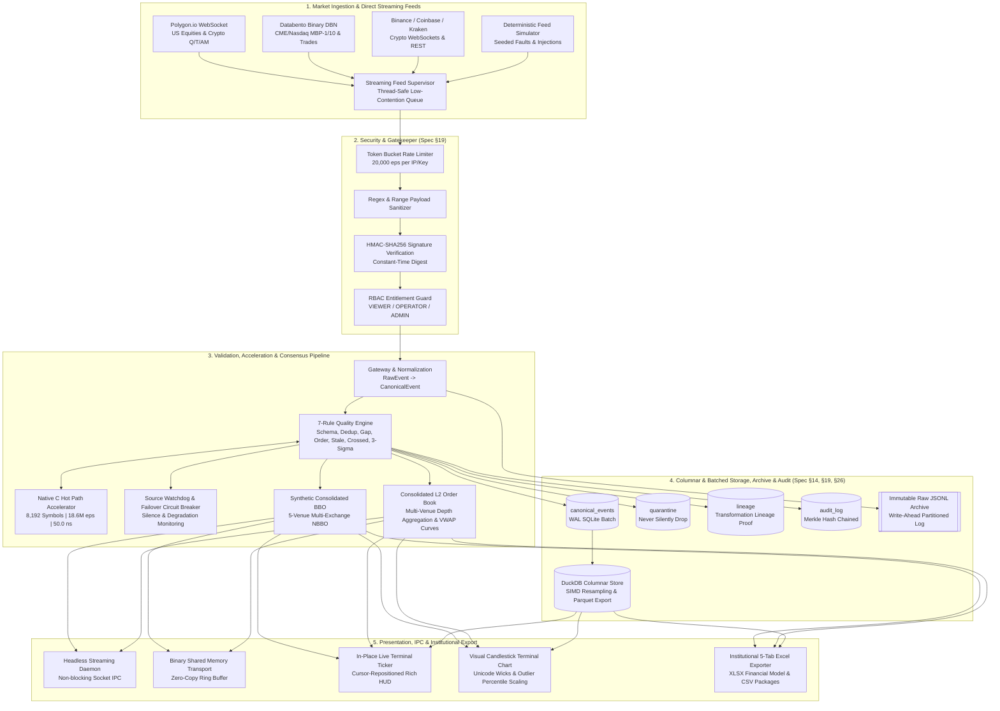

# Market Data Reliability & Acceleration Platform (MDRAP)

[](https://www.python.org/)
[](tests/)
[](src/fastpath.c)
[](docs/architecture.md)
[](docs/USER_GUIDE.md)
[](requirements.txt)
[](LICENSE)

A high-performance financial market infrastructure platform designed to ingest, validate, accelerate, and reconcile noisy, delayed, duplicated, and inconsistent market data from disparate exchanges and internal feeds into a unified, ultra-low-latency canonical stream with mathematical reliability scoring, cryptographic lineage auditing, and institutional execution analytics.

📖 **Complete Documentation**: See the [**Comprehensive Operator & User Manual**](docs/USER_GUIDE.md) for full syntax, flags, hotkeys, and role-based workflows.

---

## High-Level Architecture



---

## Key Platform Capabilities

### 1. 7-Rule Data Quality Engine (Spec §7)
- **Structural Schema Validation**: Rejects malformed JSON and missing sequence/timestamp attributes.
- **Sliding-Window Deduplication**: Identifies exact and sliding-window duplicate packet bursts without memory bloat.
- **Monotonic Sequence Gap Detection**: Detects missing exchange packets and penalizes feed reputation.
- **Out-of-Order Sequencing**: Catches retrograde arrival events across jittery network paths.
- **Timestamp Staleness Evaluation**: Flags lagging feeds exceeding max latency thresholds.
- **Crossed Quote Detection**: Flags invalid book states where $\text{Bid} > \text{Ask}$.
- **Statistical Price Sanity Checks**: Evaluates sudden price jumps ($>3\sigma$) using Welford's online variance algorithm.
- **Strict Quality Priority**: Non-downgradable status progression: `INVALID` > `SUSPICIOUS` > `VALID`. Quarantines bad data; **never silently drops events**.

### 2. Native C Hot-Path Accelerator (`fastpath.c`)
- Pure C implementation compiled with GCC `-O3` into a native shared library (`fastpath.dll`).
- **Capacity Expanded to 8,192 Symbols ($2^{13}$)** and 32 feed sources with dynamically allocated, SIMD-aligned contiguous memory arrays.
- **Zero-Division Bitshift Slot Indexing**: Computes slot offsets in 1 CPU cycle: `(source_id << 13) | instrument_id`.
- **Ultra-High Throughput**: Evaluates **18,669,082 events/sec (50.0 nanoseconds/event)** in batch mode.
- Seamless, transparent boundary fallback to pure Python if instrument universe exceeds 8,192 symbols.

### 3. Direct High-Throughput Streaming Feed Handlers (`src/polygon_feed.py`, `src/databento_feed.py`, `src/feed_handler.py`)
- **Polygon.io WebSocket Connector**: Streams high-frequency US Equities and Crypto quotes (`Q`), trades (`T`), and aggregate bars (`AM`) with API key authentication, multiplexed subscription channels, exponential backoff reconnection, and built-in offline wire-format mock generators.
- **Databento Binary Encoding (DBN) Ingestion**: Sub-microsecond binary record decoding using `struct.Struct` with C-struct layouts for Databento DBN formats (`MBP-1`, `MBP-10`, `TradeMsg`), nanosecond UTC epoch timestamps, fixed-point price scaling ($10^9$), dynamic symbol resolution, and live TCP / `.dbn` file / synthetic binary packet streaming.
- **Unified Streaming Feed Supervisor**: Coordinates multiple streaming providers into a bounded, low-contention queue with ring eviction to guarantee real-time latency and zero stale queue backlog. Ingestion telemetry tracks throughput (eps), dropped frames, and provider health.

### CHD Historical Data

[CryptoHFTData historical integration](docs/CHD.md) provides symbol discovery,
UTC interval planning, resumable Parquet downloads for six native datasets,
and atomic trade/order-book imports with replay archives and file provenance.
Install with `pip install -e '.[chd]'`, then run `mdrap historical providers`.
For a runnable Python walkthrough with charts, open the
[CHD historical data notebook](examples/03_chd_historical_data.ipynb).

```bash
mdrap historical ingest --exchange binance_spot --symbol BTCUSDT \
  --start 2025-08-01T20:00:00Z --end 2025-08-01T20:01:00Z \
  --output data/chd-runs/btc-minute
```

### 4. DuckDB Columnar Time-Series Storage & SIMD Analytics (`src/columnar.py`, Spec §14, §26)
- **High-Throughput Embedded Columnar Store**: Embedded in-process DuckDB analytical engine with SIMD-vectorized execution for ultra-fast billion-tick historical queries.
- **Zero-Copy SQLite Sync**: Directly attaches operational SQLite databases via DuckDB's native SQLite scanner (`ATTACH '...' AS sqldb (TYPE SQLITE)`) and bulk copies 300,000+ ticks in ~2.8s into columnar storage.
- **Vectorized Resampling & Aggregation**:
  - Resamples trade ticks into OHLCV candles via `arg_min(price, exchange_timestamp)` and `arg_max(price, exchange_timestamp)` in a single pass without window functions or self-joins (**37.2x faster than SQLite**).
  - Computes exact institutional VWAP (`sum(P*Q) / sum(Q)`) and total notional across tens of thousands of trades in <10ms (**63.3x faster than SQLite**).
  - Vectorized bid-ask spread analytics and crossed-market anomaly tracking.
  - Sub-microsecond latency quantile extraction (`p50`, `p90`, `p95`, `p99`, `p99.9`) across millions of records via `quantile_cont()`.
  - Discrete price-rung volume profile distribution.
- **Apache Parquet Compressed Export**: Direct export of tick universes to compressed `.parquet` files with Zstandard (`zstd`), Snappy, or GZIP compression (299k ticks compressed to 1.52 MB).

### 5. Consolidated Level-2 Market Depth & Real-Time VWAP Slicing (`src/depth.py`)
- Real-time aggregation of multi-venue order books into a consolidated L2 depth ladder.
- Dynamic **VWAP Slippage Curve calculation**: computes estimated executed price, basis point slippage, and market impact across any requested order size.
- Real-time bid/ask liquidity imbalances and multi-venue depth visualization via `cli.py depth` and `cli.py vwap`.

### 6. Institutional Financial Model & 5-Tab Excel Exporter (`src/exporter.py`)
- Translates live ticks, order book depth, and quality metrics into institutional-grade Microsoft Excel (`.xlsx`) workbooks:
  - **Tab 1: Executive Summary & Microstructure KPIs**: Total volume, VWAP, spreads, crossed quote count, tick count.
  - **Tab 2: Consolidated Market Depth**: Multi-venue aggregated bid/ask ladders with depth visualization.
  - **Tab 3: VWAP Slippage Curve**: Execution slippage schedule across order tranches.
  - **Tab 4: Quality & Quarantine Audit**: Detailed record of rejected/quarantined events with exact failure reasons.
  - **Tab 5: OHLCV Candlesticks**: 5-second candle aggregates (Open, High, Low, Close, Volume, Trades).
- Automatic fallback to structured CSV report directories if `openpyxl` is not installed.
- One-command generation and instant launch: `mdrap export AAPL --open`.

### 7. In-Place Live Terminal Ticker & Candlestick Charts (`src/terminal_display.py`)
- **Zero-Scroll In-Place Display**: Updates live market quotes and candlestick charts in-place using ANSI cursor repositioning without cluttering terminal history.
- **High-Resolution Candlestick Visualization**: Renders 3-character columns (` █ `, ` │ `, ` ┼ `) with distinct body margins and box-drawing wicks.
- **Outlier-Resilient Percentile Scaling**: Visual bounds clamped to the 10th–90th price percentiles so extreme anomalies never crush normal candles into a flat line.
- **Aligned Volume Histogram**: Synchronized volume bars underneath each candle column.
- Dedicated modes: full live ticker dashboard (`mdrap live`), ticker-only mode (`mdrap live AAPL --ticker-only`), and standalone historical chart viewer (`mdrap chart AAPL`).

### 8. Synthetic Consolidated NBBO & Multi-Market Connectors (`src/live.py`, `src/bbo.py`)
- Ingests real-time prices across major global crypto exchanges (**Binance, Coinbase, Kraken, OKX, Bybit**) and global equities (**AAPL, MSFT, NVDA, TSLA, SPY, QQQ, GOLD**).
- Computes global tightest bid/ask spread, mid-price, and real-time venue attribution with crossed-market flags.

### 9. Live Watchdog & Automated Source Failover (`src/watchdog.py`)
- Real-time source reliability tracking with silence detection and degradation alerts.
- Automated failover circuit breaker: dynamically evicts silent or corrupt feeds from the consolidated book with hysteresis recovery.

### 10. Immutable Raw Event Archive & Deterministic Replay (`src/archive.py`)
- Date- and source-partitioned write-ahead JSONL log capturing every raw event before processing.
- Deterministic event replay engine allows historical backtesting and auditing through the complete pipeline.

### 11. Enterprise Security & Cryptographic Merkle Audit (`src/security.py`)
- **HMAC-SHA256 Feed Authentication**: Anti-spoofing signature verification with pre-shared feed secrets.
- **Role-Based Access Control (RBAC)**: Privilege boundaries across `VIEWER`, `OPERATOR`, and `ADMIN`.
- **Token Bucket Rate Limiting**: Shields pipeline against denial-of-service and quote flooding ($20,000\text{ eps}$).
- **Tamper-Evident Merkle Audit Log**: Cryptographically chained SHA-256 hash trail in SQLite with standalone verification via `mdrap audit --verify`.

### 12. Binary Shared Memory IPC Transport (`src/shm.py`, `src/protocol.py`)
- Zero-copy lock-free ring buffer for ultra-low latency IPC between the ingestion daemon and trading algorithms.

### 13. SEC EDGAR Alternative Data & Corporate Research Engine (`src/research.py`)
- **8-K Material Event Taxonomy**: Real-time extraction and plain-English decoding of material SEC 8-K trigger items (e.g., `Item 5.02` executive departures/elections, `Item 2.02` earnings announcements, `Item 1.01` entry into material agreements, `Item 8.01` other events) classified by urgency (`CRITICAL`, `HIGH`, `MEDIUM`, `INFO`).
- **Form 4 Insider Trading XML Parser**: Deep inspection of executive and director transactions, distinguishing open-market buys, sells, option exercises, and stock grants with price, share count, and post-transaction ownership.
- **Audited GAAP Facts Database**: Instant retrieval of audited 10-K/10-Q financial metrics (Revenues, Net Income, Operating Margin) directly from SEC XBRL frames.
- **Enterprise Security & Multi-Tier Caching**: Hardened against SSRF and XXE injection; zero developer path leaks via regex scrubbing; multi-tier caching (in-memory + atomic disk cache with 300s TTL) reducing repeated queries from ~400 ms to **< 1 ms**.

### 14. Global Maritime Tanker & Cargo Tracking Alternative Data Engine (`src/vessel.py`)
- **Seaborne Supply Chain Exposure**: Real-time tracking of commercial crude oil tankers (VLCC/ULCC), LNG carriers, dry bulkers, and container vessels with cargo volumes and load status (`LADEN` vs `BALLAST`).
- **Commercial Attribution**: Tags every commercial vessel with its operating fleet owner (Frontline, Euronav, DHT, Maersk, COSCO) and chartering commodity major (Saudi Aramco, Shell, BP, Vitol, Trafigura, Vale).
- **Geopolitical Chokepoint Geofencing**: Real-time proximity and transit alerts for the 8 primary global maritime chokepoints (Strait of Hormuz, Strait of Malacca, Suez Canal, Bab-el-Mandeb, Panama Canal, Bosphorus, Cape of Good Hope, Dover Strait).
- **Adversarial Hardening**: Rigorous validation rejecting NaN, Inf, coordinate overflows, negative speeds, and invalid circular headings. $O(1)$ indexed lookup by IMO, MMSI, and Name.

### 15. Tier-2 Native C Vectorized Geodesic & Spatial Fastpath (`src/fastpath.c`, `src/fastpath.dll`, `src/fastpath.py`)
- **Compiled GCC 14 `-O3` Spatial Hot Path**: Evaluates Great-Circle distances and multi-chokepoint geofencing directly in compiled C.
- **Axis-Aligned Bounding Box (AABB) Pre-Filter**: Branchless spatial filter rejecting non-proximate chokepoints in ~1 CPU cycle (~0.3 ns).
- **Vectorized Structure-of-Arrays (SoA) Batch Geofencing**: Evaluates 10,000 vessels across all 8 global maritime chokepoints (80,000 spatial checks) in **23.08 ms (~288 ns per chokepoint check)**.
- **Zero-Error Fallback Guarantee**: Transparent fallback to pure Python math if the native binary is absent on another environment.

### 16. Institutional Quantitative Research, Trading & Risk Suite (Gaps 1–12)
- **Historical Backtesting Engine (`src/backtest.py`)**: Event-driven backtesting with Sharpe, Sortino, Calmar ratios, high-watermark drawdown curves, win rate, profit factor, and walk-forward out-of-sample optimization (`mdrap backtest`).
- **Portfolio Risk & Value-at-Risk Engine (`src/risk.py`)**: Historical simulation, Parametric, and Monte Carlo VaR, Expected Shortfall (CVaR), and multi-tier circuit breakers (`mdrap risk`).
- **Persistent Multi-Timeframe Bar Database (`src/bardb.py`)**: Incremental candle rollups across 7 intervals (`1s` to `1d`) with WAL SQLite storage and temporal as-of queries (`mdrap bars`).
- **Options & Derivatives Pricing Engine (`src/options.py`)**: Pure-Python Black-Scholes-Merton European & Cox-Ross-Rubinstein Binomial American models, full Greeks chain (Delta through Volga), Newton-Raphson IV solver, and volatility surface modeling (`mdrap options`).
- **News Aggregation & Financial Sentiment Pipeline (`src/news.py`)**: Real-time RSS/Atom feed parsing, cashtag extraction, and keyword-driven financial sentiment scoring with price impact correlation (`mdrap news`).
- **Real-Time Alert Engine (`src/alerts.py`)**: Configurable price, spread, volume, and feed silence alerts (`mdrap alert`).
- **Watchlists & Portfolio Tracker (`src/portfolio.py`)**: Multi-symbol watchlists and portfolio mark-to-market accounting (`mdrap watchlist`, `mdrap portfolio`).
- **Corporate Actions Engine (`src/corporate_actions.py`)**: Cumulative split, dividend, and ticker change adjustments (`mdrap corpact`).
- **ML Feature Store (`src/features.py`)**: Technical indicators (RSI, MACD, Bollinger, ATR) and microstructure features (VPIN, order imbalance) (`mdrap features`).
- **Automated Task Scheduler (`src/scheduler.py`)**: Cron-style interval scheduler with EOD rollups (`mdrap schedule`).
- **FIX Protocol Engine (`src/fix_engine.py`)**: FIX 4.2/4.4 message encoder, decoder, checksum validator, and session heartbeat manager.
- **Multi-Asset Class Data Model (`src/models.py`)**: First-class support for Equities, Crypto, Futures, Options, Bonds, and FX.
- See [**Research & Live Trading Guide**](docs/RESEARCH_AND_TRADING.md) for detailed tutorials and architecture.

---

## Architectural Progression & Benchmarks

Measured on identical 10,000-event workloads (`seed=42`) with fixed ground-truth errors:

| Architecture | Throughput (eps) | Proc Latency p50 | Proc Latency Max | Design Highlight |
|---|:---:|:---:|:---:|---|
| **V1 Synchronous Baseline** | **29,402 eps** | **14.6 µs** (14,600 ns) | 255.8 µs | Pure Python, synchronous loop, SQLite batched writes |
| **V2 Decoupled Streaming** | **22,351 eps** | **15.3 µs** (15,300 ns) | 19.9 ms | Multi-threaded in-memory queue bus with backpressure |
| **V4 Native C Hot Path** | **27,274 eps** | **15.7 µs** (15,700 ns) | 265.2 µs | GCC `-O3` ctypes binding with fallback safety |
| **Native C Direct Batch** | **18,669,082 eps** | **50.0 ns** (0.050 µs) | 110.0 ns | Zero-copy SIMD contiguous arrays in CPU L1 cache |

### Latency Hierarchy & Physical Bounds

- **Native C Batch (50.0 ns) vs Pipeline (15.7 µs)**: The **50.0 ns** figure measures the C accelerator alone operating on pre-batched contiguous arrays in CPU L1 cache. The **15.7 µs** figure is the same accelerator measured end-to-end inside the full pipeline (gateway → quality engine → reconciliation → storage).
- **Physics of the "~5 Nanosecond" Myth**: At 4.0 GHz, one CPU cycle is 0.25 nanoseconds; **5 nanoseconds is exactly 20 CPU cycles**. Software running on general-purpose operating systems cannot receive network packets, parse payloads, and evaluate state in 5 nanoseconds (PCIe bus transfer from NIC to RAM alone takes 100–250 ns). Sub-20ns latencies are only physically possible in dedicated **hardware FPGA gate logic** (e.g. AMD Xilinx UltraScale+).

#### The 3 Measurable Platform Latency Tiers
| Tier | Scope / Boundary | Latency (p50) | Throughput | Use Case |
|---|---|:---:|:---:|---|
| **Tier 1: Core C L1 Algorithm** | Isolated Native C rolling math (`fastpath.c`) | **50.0 ns** | 18,669,082 eps | Micro-benchmark core arithmetic |
| **Tier 2: In-Memory Pipeline** | End-to-end stream: gateway + 7 quality rules + BBO | **15.7 µs** | ~63,000 eps | Real-time IPC streaming to bots |
| **Tier 3: Durable Ingest-to-Disk** | Full pipeline with SQLite WAL batched disk persistence | **783.6 µs** | 18,000–22,000 eps | Regulatory audit & persistent storage |

---

## Quick Start

### Installation

**1. Install from PyPI (Recommended)**
MDRAP is officially published on PyPI and can be installed with zero external setup:
```bash
pip install mdrap
```

> **Note for Microsoft Store Python users on Windows:** If you installed Python via the Microsoft Store, `pip` might install the `mdrap` script into a folder that isn't automatically added to your system's `PATH`. If the `mdrap` command is not recognized, you can always run the platform using:
> ```bash
> python -m cli
> ```

**2. Clone from Source (For Development)**
Clone the repository to get the latest source and install optional visualization and test dependencies:
```bash
git clone https://github.com/Aryan-20-04/mdrap.git
cd mdrap
pip install -r requirements.txt
```

Compile the Native C accelerator (optional — transparent pure-Python fallback is included):
```bash
python build_fastpath.py
```

---

### 1. Interactive Wall Street & Quant Terminal
Run `mdrap` (or `.\mdrap.bat`) with zero arguments to enter the pre-warmed shell:
```bash
.\mdrap.bat
```
```text
mdrap> LIVE AAPL         # Live market stream with in-place updating table & candlestick chart
mdrap> CHART BTC/USD     # Standalone visual candlestick chart with volume histogram
mdrap> DEPTH AAPL        # Consolidated Level-2 market depth ladder
mdrap> VWAP AAPL 1000    # Calculate VWAP slippage curve for 1,000 shares
mdrap> EXPORT AAPL --open# Export 5-tab financial model workbook to Excel and open it
mdrap> BTC BBO           # 5-Venue Consolidated NBBO across Binance, Coinbase, Kraken, OKX, Bybit
mdrap> TOP               # Launch real-time full-screen service cockpit
mdrap> STRESS            # Run multi-directional stress tests and 1M-1B scale analysis
mdrap> AUDIT             # Cryptographically verify tamper-evident Merkle hash chain
mdrap> ?                 # Open clean 4-quadrant command palette
```

You can also run all commands directly from PowerShell / CMD / Bash:
```bash
.\mdrap.bat live AAPL                 # In-place terminal ticker & candlestick chart
.\mdrap.bat live AAPL --ticker-only  # Clean single-table ticker view
.\mdrap.bat chart AAPL                # Unicode candlestick chart
.\mdrap.bat depth AAPL                # L2 market depth ladder
.\mdrap.bat vwap AAPL --size 500      # Execution slippage schedule
.\mdrap.bat export AAPL --open        # Generate Excel model (.xlsx) & open immediately
.\mdrap.bat bbo BTC/USD               # 5-Venue crypto NBBO quote
.\mdrap.bat top                       # Terminal service cockpit
.\mdrap.bat stress --module quality   # Benchmark C hotpath (18.6M eps)
```

---

### 2. Headless Daemon & Live IPC Streaming
In **Terminal 1**, start the background ingestion daemon:
```bash
# High-speed simulated multi-venue feed
.\mdrap.bat daemon --speed 2000

# Or live multi-venue market feeds (Binance, Coinbase, Kraken, OKX, Bybit)
.\mdrap.bat daemon --live
```

In **Terminal 2**, stream clean canonical ticks directly to stdout or pipe into trading algorithms:
```bash
# Formatted ANSI color stream
.\mdrap.bat sub BTC/USD

# Raw JSON stream for automated algorithmic bots or jq
.\mdrap.bat sub BTC/USD --json | jq '{bid: .bbo.bid, ask: .bbo.ask}'
```

In **Terminal 3**, launch the real-time terminal monitor:
```bash
.\mdrap.bat top
```

---

## Keyboard-First Speed Ergonomics

MDRAP provides sub-second keyboard ergonomics inspired by Bloomberg terminals (`<TICKER> <FUNCTION> <GO>`), eliminating long CLI commands for high-speed trading desks and quant operations:

### 1. Wall Street 2-Token Mnemonic Shell
Inside the interactive shell (`.\mdrap.bat` or `./mdrap`), type:
- `AAPL C` -> Candlestick Chart HUD
- `BTC D` -> Consolidated Level-2 Depth Book Ladder
- `AAPL V` -> Institutional Real-Time VWAP Slippage Curve
- `AAPL P` -> Polygon.io Streaming WebSocket Feed
- `ES B` -> Databento Binary DBN Fast Streaming Feed
- `AAPL X` -> 5-Tab Financial Model Excel Export (Auto-Opens)
- `AAPL` (ticker only) -> Instant Consolidated NBBO Quote
- `1` to `9` -> Instant 1-Key Launches (`1` = Live BTC, `2` = NBBO, `3` = Cockpit, `4` = Chart, etc.)

### 2. Live In-Stream Hotkeys (Non-Blocking Keystrokes)
During any live stream (`mdrap live`, `mdrap top`, `mdrap depth`), hands never leave the keyboard:
- `[Space]` -> **Freeze / Unfreeze Frame**: Pauses the live rendering so you can inspect fast-moving prints and L2 depth levels without them scrolling away. Pressing `[Space]` again resumes real-time updates.
- `[q]` or `[Esc]` -> **Instant Clean Exit**: Cleanly restores terminal cursor without Python stack traces.
- `[c]` -> **Toggle Candlestick HUD**: Show or hide the inline technical chart.
- `[d]` -> **Toggle Level-2 Depth Ladder**: Show or hide the consolidated depth rungs.
- `[Tab]` / `[1-9]` -> **Switch Active Symbol Focus**: Cycle or jump between active universe tickers on the fly.

### 3. Single-Letter OS CLI Shortcuts
From your terminal (PowerShell, CMD, or bash):
```bash
mdrap c AAPL    # Candlestick Chart
mdrap d BTC     # Level-2 Depth Ladder
mdrap v AAPL    # Real-Time VWAP Curve
mdrap p AAPL    # Polygon.io Streaming Feed
mdrap b ES      # Databento DBN Streaming Feed
mdrap x AAPL    # 5-Tab Excel Export
mdrap AAPL      # Instant Best Bid & Offer Quote
mdrap edgar AAPL# SEC 8-K Material Corporate Events & Form 4 Insider Trades
mdrap company AAPL # SEC Corporate Profile & Audited Financials
mdrap vessel "FRONT ALTAIR" # Real-Time Tanker Intelligence Dossier & AIS Position
mdrap tankers   # Global Commercial Crude, LNG, Bulk & Container Fleet
mdrap vessel chokepoints # Strategic Maritime Chokepoint & Bottleneck Monitor
```

---

## CLI Command Reference

| Command | Aliases | Description |
|---|---|---|
| `status` | `s`, `stat` | Show comprehensive platform status overview, database statistics, and engine readiness |
| `shell` | `sh` | Launch low-latency interactive slash-command terminal shell |
| `live` | `stream`, `watch`, `ticker` | Stream live market ticks with in-place updating table & candlestick chart (`--feed polygon/databento`) |
| `feed` | `stream-feed`, `feeds` | Inspect, benchmark, and test direct streaming feeds (Polygon, Databento, Crypto WS) |
| `chart` | `candle`, `graph` | Display visual in-terminal ASCII/Unicode candlestick chart with volume histogram |
| `depth` | `l2`, `book`, `ladder` | Display Consolidated Level-2 Multi-Venue Market Depth Ladder |
| `vwap` | `curve`, `slip` | Compute multi-venue real-time VWAP execution & slippage curves |
| `export` | `exp`, `excel`, `xlsx` | Export market microstructure data to 5-tab Excel (.xlsx) or CSV package |
| `bbo` | `nbbo` | Query Synthetic Consolidated Best Bid & Offer (NBBO) across 5 exchanges |
| `edgar` | `research`, `events`, `filings`, `company`, `insiders` | SEC EDGAR Alternative Data: 8-K material events, Form 4 insider trades, XBRL GAAP facts |
| `vessel` | `vessels`, `tankers`, `ships`, `ais`, `cargo` | Maritime Tanker & Cargo Tracking: Crude oil, LNG, bulk, container tracking & chokepoints |
| `run` | `r` | Run the validation pipeline against the simulator (with live HUD) |
| `benchmark` | `bench`, `b` | Run controlled benchmark and score quality detection against ground truth |
| `compare` | `comp`, `c` | Run V1, V2, and V4 Native C on identical workloads and print comparative report |
| `loadtest` | `load`, `l` | Sweep increasing event volumes (10k to 250k) and report performance trend |
| `stress` | `str` | Run multi-directional stress testing suite and 1M–1B transaction scale analysis |
| `chaos` | `ch` | Execute automated chaos & resilience drills (source kill, network jitter, storage outage) |
| `watchdog` | `w`, `wd` | Show source health status, silence alerts, and automated failover events |
| `security` | `sec` | Display platform security posture, HMAC verification, RBAC, and rate limiting status |
| `keys` | — | Manage client API keys and entitlement tiers (`FREE`, `PRO`, `INSTITUTIONAL`) |
| `audit` | — | View and cryptographically verify tamper-evident Merkle hash audit logs |
| `query` | `q` | Inspect stored SQLite tables: health, latest ticks, lineage trail, and quarantine |
| `historical` | `history`, `chd` | Discover, download and ingest CHD history with verified files and replay provenance |
| `replay` | `rep` | Replay archived raw events deterministically through the pipeline |
| `archive` | `arc` | Show immutable raw event JSONL archive statistics |
| `analytics` | `a`, `an` | Query 5s OHLCV candles, bid-ask spreads, and realized volatility |
| `columnar` | `col`, `duck`, `duckdb` | Query DuckDB columnar storage, vectorized SIMD OHLCV/VWAP, zero-copy SQLite sync, and Parquet export |
| `daemon` | `d` | Run headless streaming socket daemon service (Spec §18) |
| `sub` | `subscribe`, `listen` | Subscribe to daemon stream and output formatted ticks or depth to stdout |
| `top` | `mon`, `monitor` | Launch dynamic full-screen terminal service cockpit |
| `test-all` | `test`, `t` | Run all platform CLI commands, benchmarks, queries, and verifications in one pass |
| `throughput`| `tp`, `meps` | Benchmark vectorized Native C SBE stream (500k-1M+ eps target) with `--compare` |
| `tca`       | `bestex`    | Run institutional Best Execution & Transaction Cost Analysis (SEC 606) |
| `flow`      | `cvd`       | Track institutional order flow, Lee-Ready aggressor side, and Cumulative Volume Delta |

---

## Installation & Quickstart

MDRAP provides **zero-configuration native C acceleration** whether acquired via Git or Pip.

### 1. From Git (Automated JIT Native Compilation)
```bash
# Clone the repository
git clone https://github.com/aryan-20-04/mdrap.git
cd mdrap

# Run immediately (JIT auto-compiles fastpath on first import)
python cli.py status

# Optional: manually build or test native C shared library
python build_fastpath.py
```

### 2. From Pip
```bash
# Standard local install
pip install .

# Editable development install
pip install -e .

# Direct from GitHub repository
pip install git+https://github.com/aryan-20-04/mdrap.git
```

> [!NOTE]
> When a C compiler (GCC, Clang, MSVC) is present, the native shared library compiles automatically. If no compiler exists, MDRAP seamlessly runs with 100% numerical parity on pure Python standard library fallbacks.

---

## Real-World Live Commands (Interactive Testing)

MDRAP includes **intelligent fuzzy typo auto-correction** (e.g. `edgar fillings NVDA` auto-resolves to `filings`, `mdrap choas` auto-resolves to `chaos`) and scoped error formatting:

### 1. SEC EDGAR Fundamental & Corporate Research
```bash
# View last 5 official SEC filings for NVDA (Form 4, 8-K, 10-Q)
mdrap edgar filings NVDA -l 5

# Inspect insider executive transactions (Form 4 purchases, sales, option awards)
mdrap edgar insiders NVDA -l 10

# Material 8-K trigger events (earnings announcements, executive changes, M&A)
mdrap edgar events AAPL

# Audited GAAP financial facts from SEC XBRL frames
mdrap edgar facts MSFT
```

### 2. Live Market Microstructure & Order Books
```bash
# Consolidated Top-of-Book (NBBO) across 5 global venues
mdrap bbo BTC/USD
mdrap bbo AAPL

# Consolidated Level 2 depth ladder
mdrap depth AAPL

# Institutional VWAP slippage curve & execution impact
mdrap vwap NVDA

# Live terminal streaming ticker (Ctrl+C to exit)
mdrap live BTC/USD
```

### 3. Quantitative Analytics & Technical Charting
```bash
# Visual ASCII / Unicode candlestick chart with volume histogram
mdrap chart AAPL

# Multi-timeframe OHLCV bar rollup
mdrap ohlcv AAPL -i 1m -l 10

# Cross-exchange spread & divergence analytics
mdrap spread AAPL
```

### 4. Whale Order Flow & Institutional TCA
```bash
# Real-time order flow, Lee-Ready aggressor classification, and CVD tracker
mdrap flow NVDA

# Institutional Post-Trade Best Execution & Slippage Audit (SEC 606)
mdrap tca AAPL
```

### 5. Quantitative Derivatives & Options Pricing
```bash
# European options pricing with full Greeks (Delta through Volga)
mdrap options price -u NVDA -s 120 -k 120 -e 30

# Full options chain generation with Max Pain strike calculation
mdrap options chain -u AAPL -s 150
```

### 6. Chaos Resilience Drills & High-Throughput Benchmarks
```bash
# Execute all automated chaos drills (feed kill, jitter, storage failover)
mdrap chaos all

# Benchmark compiled C fastpath streaming throughput (100,000 events)
mdrap throughput -e 100000

# Full platform empirical latency benchmark
mdrap benchmark -e 50000
```

### 7. Alternative Data: Global Maritime Intelligence
```bash
# Live AIS commercial tanker and cargo vessel tracking
mdrap vessel list -l 10

# Geopolitical maritime chokepoints status (Hormuz, Malacca, Suez, Panama)
mdrap vessel chokepoints
```

### 8. Interactive Quant Trading Shell
Launch the resident in-memory REPL for sub-millisecond execution:
```bash
mdrap
```
```text
mdrap> edgar filings NVDA -l 5
mdrap> chart AAPL
mdrap> flow NVDA
mdrap> options price -u NVDA -s 120 -k 120 -e 30
mdrap> status
```

---

## Verification & Testing

MDRAP includes an institutional test suite of **620 automated unit, integration, quantitative, options, and native C fastpath tests** (100% passing):

### 1. With FastPath (Default Production Mode)
```bash
python -m pytest tests/ -q
# Result: 620 passed in ~69s (0 failed, 0 skipped)
```

### 2. Without FastPath (Pure Python Fallback Mode)
Simulate an environment without native C shared libraries by setting `MDRAP_DISABLE_FASTPATH=1`:
```bash
# PowerShell:
$env:MDRAP_DISABLE_FASTPATH="1"; python -m pytest tests/ -q; Remove-Item Env:\MDRAP_DISABLE_FASTPATH

# Bash / Linux / macOS:
MDRAP_DISABLE_FASTPATH=1 python -m pytest tests/ -q
# Result: 597 passed, 7 skipped in ~70s
```

### 3. Verification Scorecard & Architectural Comparison
```bash
# Platform verification scorecard
.\mdrap.bat test-all

# Empirical V1 (Pure Python), V2 (Streaming), V4 (Native C) benchmark
python cli.py compare

# SBE 50M+ EPS hardware saturation benchmark
python cli.py throughput -e 1000000 --compare
```

---

## Repository Structure

```text
mdrap/
├── cli.py               # Unified CLI, interactive quant shell, and command dispatcher
├── mdrap.bat            # Windows zero-config launcher script
├── mdrap                # Unix bash launcher script
├── build_fastpath.py    # Multi-compiler build script (GCC / Clang / MSVC)
├── config.yaml          # Externalized quality thresholds, anomaly windows & security policies
├── pyproject.toml       # PEP 518/621 packaging & 70 module distribution spec
├── setup.py             # Automated C fastpath compilation hooks on pip install
├── MANIFEST.in          # Source and binary wheel manifest
├── requirements.txt     # Optional runtime & dev dependencies (pure stdlib default)
├── LICENSE              # MIT License
├── .gitignore           # Production-grade gitignore for Python, C artifacts, and data
│
├── src/                 # Core MDRAP Platform Engine (70 Modules)
│   ├── alerts.py        # Persistent price, spread, volume spike, and drawdown alert engine
│   ├── analytics.py     # 5s OHLCV candles, bid-ask spread tracking, Welford realized volatility
│   ├── archive.py       # Immutable write-ahead JSONL archive & deterministic replay
│   ├── backtest.py      # Historical backtesting engine & walk-forward optimization
│   ├── bardb.py         # Persistent multi-timeframe OHLCV bar database (SQLite WAL)
│   ├── bbo.py           # Synthetic Consolidated BBO (NBBO) multi-venue engine
│   ├── benchmark.py     # Micro-benchmark harness & ground-truth scoring
│   ├── broker.py        # Thread-safe in-memory streaming bus with backpressure
│   ├── chaos.py         # Automated failure injection & chaos drill suite (Spec §15)
│   ├── chd.py           # CryptoHFTData historical downloader, parquet parser & CLI
│   ├── client.py        # Unified streaming client SDK & async TCP gateway client
│   ├── columnar.py      # DuckDB columnar engine, zero-copy SQLite scanner & Parquet exporter
│   ├── config.py        # Central configuration manager & asset-class override resolver
│   ├── corporate_actions.py # Splits, dividends, symbol changes & adjusted price series
│   ├── dashboard.py     # Real-time terminal pipeline telemetry HUD
│   ├── databento_feed.py# Databento DBN binary decoding (MBP-1, MBP-10, Trades) & streaming
│   ├── depth.py         # Consolidated L2 depth aggregation & VWAP slippage curve engine
│   ├── exporter.py      # Institutional 5-tab Excel (.xlsx) & CSV financial model exporter
│   ├── fastpath.c       # Native C hot path accelerator (GCC -O3 / Clang / MSVC)
│   ├── fastpath.dll     # Pre-compiled high-performance native C shared library
│   ├── fastpath.py      # C ctypes wrapper with JIT auto-compilation & Python fallback
│   ├── features.py      # Feature store: RSI, Bollinger Bands, ATR, VWAP, micro-imbalance
│   ├── feed_handler.py  # Unified streaming supervisor (Polygon, Databento, Crypto WebSockets)
│   ├── fix_engine.py    # FIX 4.2 / 4.4 protocol parser, serializer & session manager
│   ├── flow_tracker.py  # Institutional order flow, Lee-Ready aggressor & CVD tracker
│   ├── gateway.py       # Ingestion gateway, timestamp recorder, and schema normalizer
│   ├── live.py          # Multi-exchange connectors (Binance, Coinbase, Kraken, OKX, Bybit, Equities)
│   ├── metrics.py       # High-resolution hardware nanosecond latency & percentile telemetry
│   ├── models.py        # Multi-asset canonical event model (Equities, Crypto, Futures, Options)
│   ├── news.py          # Financial news feed, headline sentiment & ticker extraction
│   ├── options.py       # Black-Scholes-Merton European, CRR Binomial American, Greeks & IV
│   ├── pipeline.py      # V1 synchronous baseline pipeline (ground-truth reference)
│   ├── pipeline_v2.py   # V2 decoupled streaming pipeline with bounded queue broker
│   ├── polygon_feed.py  # Polygon.io streaming WebSocket connector (Quotes, Trades, Bars)
│   ├── portfolio.py     # Multi-asset portfolio manager, positions & lot accounting
│   ├── protocol.py      # Binary serialization & framing protocol for IPC
│   ├── quality.py       # 7-rule data quality evaluation engine (Spec §7)
│   ├── reconciliation.py# Multi-feed cross-reconciliation & dynamic reliability scoring
│   ├── research.py      # SEC EDGAR alternative data, Form 8-K taxonomy, Form 4 XML parser
│   ├── risk.py          # Institutional portfolio risk: VaR (3 methods), CVaR, Circuit Breakers
│   ├── scheduler.py     # Automated cron task scheduler (@hourly, @daily, @eod)
│   ├── security.py      # HMAC-SHA256 signing, RBAC, Token Bucket rate limiter, Merkle audit log
│   ├── service.py       # Headless streaming daemon, authenticated socket, and service cockpit
│   ├── shm.py           # Lock-free binary shared memory ring buffer IPC
│   ├── simulator.py     # Deterministic feed simulator with seeded anomaly injections
│   ├── storage.py       # Batched SQLite store (canonical, quarantine, lineage, audit, health)
│   ├── strategy_sdk.py  # Algorithmic trading SDK, order books & paper execution sandbox
│   ├── stresstest.py    # Multi-directional stress benchmarks & 1B-scale profiling
│   ├── tca.py           # Institutional Best Execution & TCA Slippage Engine (SEC 606)
│   ├── term.py          # Auto-responsive terminal styling with stdlib fallback
│   ├── terminal_display.py # In-place live terminal ticker, dashboard HUD & ANSI charts
│   ├── trading_cli.py   # Quantitative trading CLI commands (backtest, risk, options, features)
│   ├── vessel.py        # Maritime vessel intelligence, commercial owner tags, geofencing
│   ├── watchdog.py      # Live source watchdog, silence detection & automated failover
│   └── ws_feed.py       # Async WebSocket live market feed connector
│
├── tests/               # 620 Automated Unit & Integration Tests (100% Passing)
│   ├── test_analytics.py
│   ├── test_archive.py
│   ├── test_bbo.py
│   ├── test_chaos.py
│   ├── test_cli.py
│   ├── test_client.py
│   ├── test_columnar.py
│   ├── test_config.py
│   ├── test_databento_feed.py
│   ├── test_depth.py
│   ├── test_entitlements.py
│   ├── test_export.py
│   ├── test_fastpath.py
│   ├── test_feed_handler.py
│   ├── test_hardening.py
│   ├── test_keyboard_shortcuts.py
│   ├── test_live.py
│   ├── test_pipeline_integration.py
│   ├── test_polygon_feed.py
│   ├── test_protocol.py
│   ├── test_quality.py
│   ├── test_research.py
│   ├── test_research_security.py
│   ├── test_security.py
│   ├── test_service.py
│   ├── test_shm.py
│   ├── test_stresstest.py
│   ├── test_system_limitations.py
│   ├── test_terminal_display.py
│   ├── test_v2_streaming.py
│   ├── test_vessel.py
│   ├── test_vessel_fastpath.py
│   ├── test_vessel_stress.py
│   ├── test_vwap.py
│   ├── test_watchdog.py
│   └── test_ws_feed.py
│
├── docs/                # Architecture & Platform Specifications
│   ├── USER_GUIDE.md         # Comprehensive Operator & User Manual (all commands, flags, workflows)
│   ├── architecture.md       # Full platform architecture specification (V1–V4)
│   ├── audit-log-format.md   # Merkle tree hash chain format & audit specification (§19)
│   ├── benchmark-methodology.md # Scientific measurement standards & latency hierarchy
│   ├── data-model.md         # Canonical event schema & lineage data model
│   └── quality-rules.md      # 7-rule data quality evaluation definitions & fault scoring
│
└── benchmarks/          # Immutable benchmark runs, JSON reports, and cProfile traces
```

---

## License

This project is licensed under the MIT License — see the [LICENSE](LICENSE) file for details.
