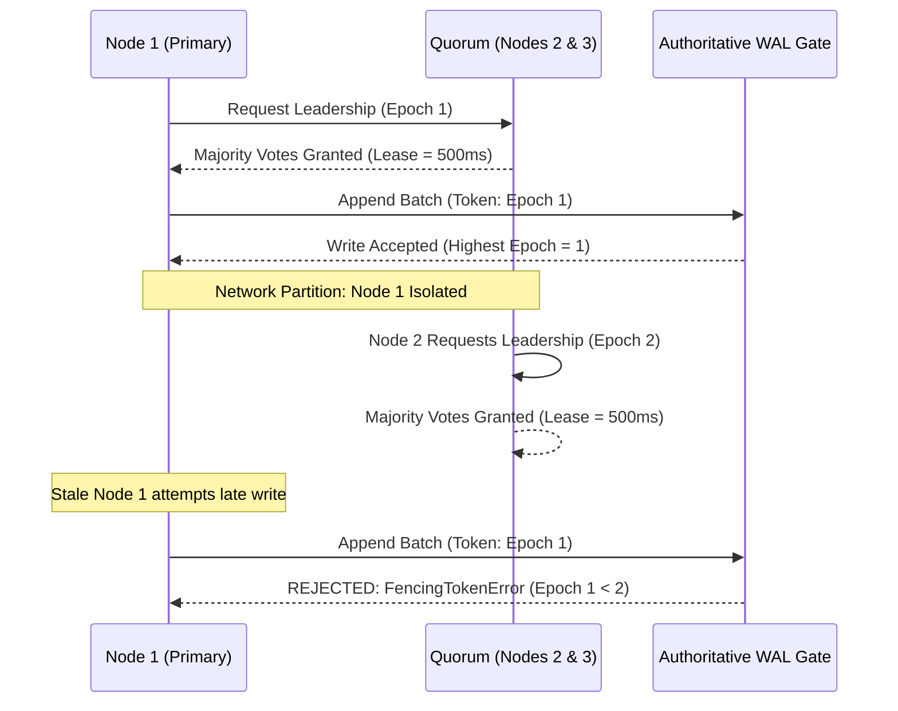

# MDRAP Phase 8 — Consensus Protocol Design

## 1. Protocol Overview
The MDRAP consensus protocol coordinates partition leadership across cluster nodes while guaranteeing that at most one node can append to the authoritative WAL for any partition at any point in physical time.

## 2. Invariants & Proof of Safety
1. **Quorum Intersection Property**: Any two majorities in a cluster of size $N$ share at least one node:
   $$\lfloor N/2 \rfloor + 1 + \lfloor N/2 \rfloor + 1 > N$$
   Therefore, two conflicting leaders cannot be elected in the same term.
2. **Monotonic Epoch Progression**: The term/epoch counter strictly increases:
   $$\text{Epoch}_{t+1} > \text{Epoch}_t$$
3. **Write-Path Fencing Guarantee**: The WAL write gate tracks $\text{Epoch}_{\max}$. Any write with $\text{Epoch} < \text{Epoch}_{\max}$ is rejected deterministically in $O(1)$ time with zero disk I/O performed.
