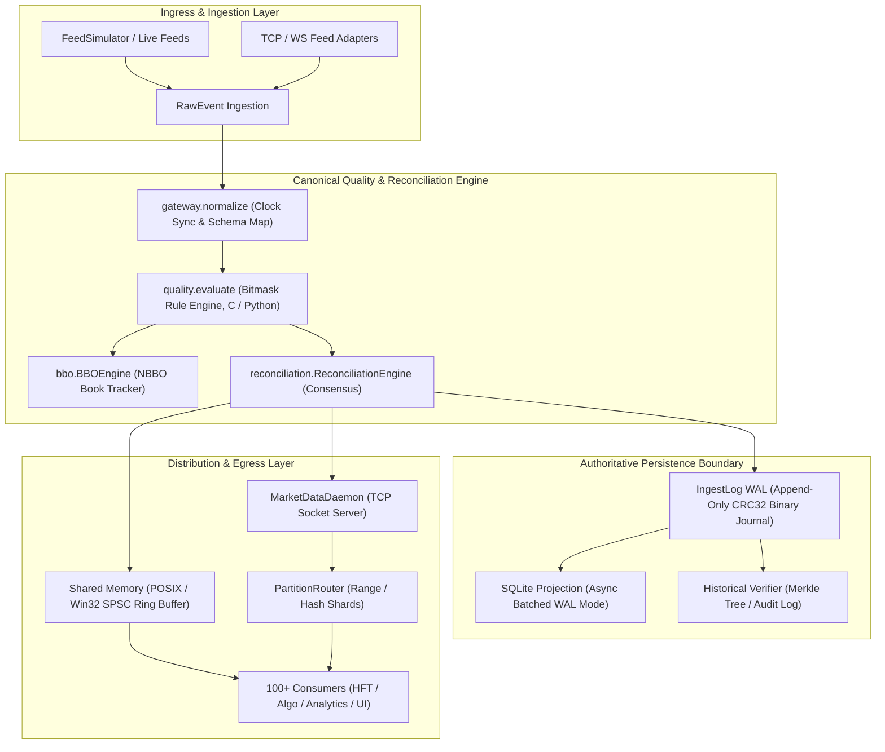

# MDRAP Current Architecture Overview (Starting Phase 8)

## 1. High-Level Architecture Topology
The Market Data Reliability & Acceleration Platform (MDRAP) operates as an ultra-low-latency market data validation, normalization, reconciliation, and audit sidecar sitting between raw upstream feeds and downstream execution/analytics clients.

## 2. Layer-by-Layer Subsystem Breakdown

### 2.1 Ingestion & Normalization (`src/gateway.py`, `src/adapters/`)
- Ingests raw frames from venue feeds (JSON, FIX, ITCH, SBE).
- Assigns monotonic `gateway_seq` via `itertools.count()`.
- Maps exchange timestamps (`exchange_ts`) and high-resolution local arrival timestamps (`receive_timestamp`).
- Validates field contracts (`price > 0`, `quantity > 0`, valid instrument symbol).

### 2.2 Quality & Validation Engine (`src/quality.py`, `src/fastpath.c`)
- Evaluates 12 deterministic validation rules (crossed markets, inverted prices, price spikes via Welford running variance, tick bounce, zero volume, sequence gaps, clock drift).
- Strict quality status priority: `INVALID > SUSPICIOUS > VALID`.
- Zero silent drops: invalid/suspicious events quarantined with explanatory bitmask reasons.
- Dual-implementation parity: Pure Python stdlib reference matching native C hotpath kernel (`fastpath.c`) 1:1.

### 2.3 Reconciliation & Book Construction (`src/reconciliation.py`, `src/bbo.py`, `src/depth.py`)
- Multi-venue price/size aggregation and synthetic NBBO generation.
- Reliability tracking via EWMA latency/quality scoring per feed venue.
- BBO staleness expiration guards and L2 order book ladder reconstruction.

### 2.4 Authoritative Persistence Boundary (`src/mdrap/ingestlog.py`, `src/storage.py`)
- Authoritative durability gate: events must be persisted to the append-only CRC32 binary WAL (`IngestLog`) prior to critical downstream acknowledgment.
- Background asynchronous drainer batches events into SQLite using `executemany` with WAL journal mode (`PRAGMA journal_mode=WAL; PRAGMA synchronous=NORMAL`).
- Streaming historical verifier (`src/historical_verifier.py`) confirms cryptographic integrity without memory exhaustion (<20 MB RAM footprint).

### 2.5 Distribution & Consumer Egress (`src/shm.py`, `src/mdrap/service.py`, `src/partition.py`)
- **Shared Memory (SHM)**: Lockless SPSC ring buffer using 64-byte aligned seqlocks and epoch validation for sub-microsecond local IPC.
- **TCP Streaming Daemon**: Network daemon broadcasting serialized JSON/SBE/binary frames to connected socket clients.
- **Partition Router**: Range and hash partition sharding distributing instrument coverage across parallel worker instances.
