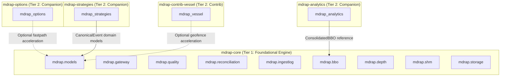

# MDRAP Phase 8 — Dependency and Ownership Graph

## 1. Package Dependency Hierarchy

## 2. Inbound & Outbound Coupling Matrix

| Subsystem | Upstream Inbound Dependencies | Downstream Outbound Dependencies | Coupling Category |
|---|---|---|---|
| `mdrap-core` | None (Autonomous engine) | Python stdlib (`math`, `mmap`, `socket`, `sqlite3`, `time`) | Autonomous Core |
| `mdrap-options` | `mdrap-core` (optional `fastpath`) | Python stdlib (`math`, `statistics`, `dataclasses`) | Unidirectional Downstream |
| `mdrap-analytics` | `mdrap-core` (`mdrap.bbo`) | Python stdlib (`math`, `hashlib`, `time`) | Unidirectional Downstream |
| `mdrap-strategies` | `mdrap-core` (`mdrap.models`, `mdrap.client`) | Python stdlib (`deque`, `json`, `time`) | Unidirectional Downstream |
| `mdrap-contrib-vessel` | `mdrap-core` (optional `fastpath`) | Python stdlib (`math`, `re`, `time`) | Unidirectional Downstream |

## 3. Dependency Invariants
1. **Zero Core-to-Companion Dependency**: `mdrap-core` contains zero import statements referencing `mdrap_options`, `mdrap_analytics`, `mdrap_strategies`, or `mdrap_vessel`.
2. **Minimal External Dependencies**: All packages require only Python 3.10+ standard library at baseline; zero mandatory external PyPI dependencies for core execution.
3. **Clean Monorepo Boundaries**: Companion packages are maintained under `packages/` with independent versioning and distribution manifests.
