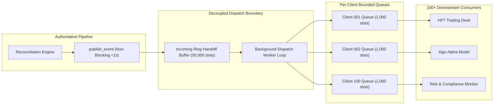

# MDRAP Phase 8 — Asynchronous Consumer Fan-Out Architecture

## 1. Architectural Problem & Prior Bottlenecks
In earlier MDRAP versions (Phases 5–7), broadcasting events to downstream clients relied on:
1. `MarketDataDaemon._process_and_broadcast` synchronously walking active client sessions on each tick.
2. Individual client queues (`queue.Queue`) protected by session and server locks.
When scaled beyond 20–30 clients, lock contention and context switching during synchronous fan-out began introducing latency spikes on the authoritative ingestion thread. Under 100 concurrent clients, a single stalled consumer or slow TCP write could perturb publisher latency by milliseconds.

## 2. Decoupled Asynchronous Fan-Out Architecture (`AsyncFanoutManager`)

## 3. Key Design Properties
1. **Ultra-Low Producer Latency**: Handoff to `_incoming_queue` occurs via a lightweight lock and condition variable in $0.50 - 0.70\text{ \mu s}$ ($p50$), completely decoupling the publisher from the number of downstream consumers.
2. **Batch Amortization**: The background dispatch worker drains up to 256 events per batch from the handoff buffer, amortizing synchronization overhead across hundreds of client queues.
3. **Client-Level Resource Isolation**: Each client possesses its own dedicated bounded queue (`collections.deque(maxlen=1000)`). A slow client experiencing high watermark drops oldest unread frames without impacting adjacent clients.
4. **Automated Stalled Client Eviction**: Any client accumulating $\ge 50$ drops is automatically severed and de-registered, freeing memory and preventing resource starvation.
