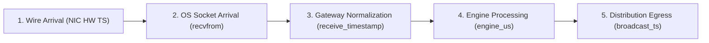

# MDRAP Phase 8 — Ingress Timestamping Contract

## 1. Timestamp Hierarchy & Lineage
MDRAP enforces precise timestamp tracking across each event's complete lifecycle:

## 2. Ingress Clock Contracts

| Timestamp Field | Clock Source | Granularity | Monotonicity Contract | Description |
|---|---|---|---|---|
| `exchange_timestamp` | Upstream Exchange Matching Engine | Microseconds or Nanoseconds | Monotonic per Instrument/Channel | Declared exchange matching time. |
| `hw_ingress_timestamp` | NIC Hardware PTP / Hardware Clock | Nanoseconds | Hardware Monotonic | Physical packet arrival at the Ethernet MAC layer (when bypass NIC active). |
| `receive_timestamp` | Host System Monotonic Clock | Microseconds / Nanoseconds | Strictly Monotonic | Gateway arrival time via `time.time()` / `time.perf_counter_ns()`. |
| `broadcast_timestamp` | Distribution Layer Clock | Microseconds | Monotonic | Time when serialized tick is queued to SHM / client sockets. |

## 3. Clock Skew & Invalidation Invariants
- If `exchange_timestamp > receive_timestamp + 60.0` seconds: flag as `FUTURE_TIMESTAMP` (SUSPICIOUS).
- If `receive_timestamp - exchange_timestamp > 300.0` seconds: flag as `STALE_FEED` (SUSPICIOUS).
- Clocks are never silently adjusted; all skew deltas are preserved in event lineage (`CanonicalEvent.engine_us`).
