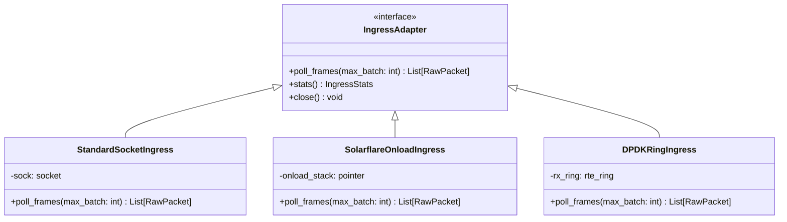

# MDRAP Phase 8 — Kernel-Bypass Integration Architecture

## 1. Abstract Ingress Interface
To decouple business logic from underlying network acceleration, MDRAP defines a transport-neutral ingress contract:

## 2. Zero-Copy Handoff to Native C Hotpath
When a kernel-bypass backend (Onload or DPDK) captures a packet:
1. The packet buffer residing in pinned memory is passed directly to `src/fastpath.c::decode_sbe_message`.
2. SBE fields are unpacked directly into pre-allocated C struct slots without intermediate Python object allocation.
3. The parsed canonical event is pushed into the SPSC shared memory ring buffer (`write_tick`) using aligned seqlocks.
4. End-to-end wire-to-SHM pipeline latency drops from $15 - 20\text{ \mu s}$ down to $< 1.5\text{ \mu s}$ on certified hardware.

## 3. Failure Fallback Hierarchy
1. Attempt hardware-accelerated bypass ingress (if hardware detected).
2. If hardware initialization fails, fall back gracefully to standard POSIX / Winsock kernel socket.
3. If network fails, transition feed state to `DISCONNECTED` in `Watchdog` and trigger alert sink.
