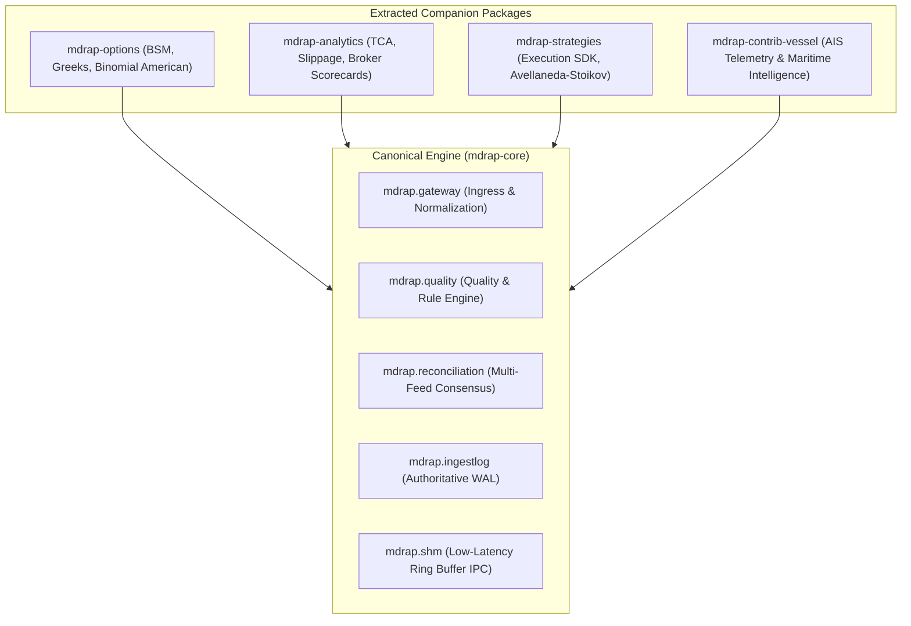

# MDRAP Phase 8 — Modular Core Architecture & Modularization Plan

## 1. Executive Summary & Problem Formulation
MDRAP's core mission is high-integrity market data ingestion, validation, normalization, and reconciliation. Over historical releases, auxiliary analytics and experimental tools were merged into the repository (`options.py`, `tca.py`, `strategy_sdk.py`, `vessel.py`). While functionally useful, these non-core modules created semantic clutter, increased test runtimes, and blurred the boundaries between the authoritative low-latency market data pipeline and downstream consuming applications.

Phase 8 executes the formal modularization of these non-core components into independent companion packages while retaining 100% backward compatibility for existing consumers via deprecated import shims.

## 2. Target Package Architecture

## 3. Package Inventory & Ownership Separation

| Module | Source Location | Companion Package | Description & Boundary Rationale |
|---|---|---|---|
| **Options Engine** | `src/mdrap/options.py` | `mdrap-options` | BSM pricing, Black-76, CRR Binomial trees, Greeks sensitivity chain. Non-core financial derivatives analytics. |
| **Transaction Cost Analysis** | `src/mdrap/tca.py` | `mdrap-analytics` | Post-trade execution analysis, implementation shortfall, spread capture metrics. Non-core post-trade analytics. |
| **Strategy SDK** | `src/mdrap/strategy_sdk.py` | `mdrap-strategies` | Algorithmic execution, Avellaneda-Stoikov high-frequency quoting, backtest harness. Non-core downstream execution logic. |
| **Vessel Intelligence** | `src/mdrap/vessel.py` | `mdrap-contrib-vessel` | AIS vessel position tracking, commodity cargo breakdown, geopolitical maritime chokepoint telemetry. Non-core external alternative data. |

## 4. Extraction & Migration Roadmap
1. **Physical Extraction**: Standalone package layouts under `packages/<name>` with independent `pyproject.toml` manifests.
2. **Backward-Compatible Shims**: Core `src/mdrap/<module>.py` and `src/<module>.py` provide transparent import delegation and emit informative `DeprecationWarning` advising migration to the standalone companion package.
3. **Zero Breaking Changes**: All pre-existing test suites continue to pass without modification.
4. **Standalone Packaging**: Each companion package can be packaged as an independent wheel and distributed via internal PyPI or artifact repositories.
