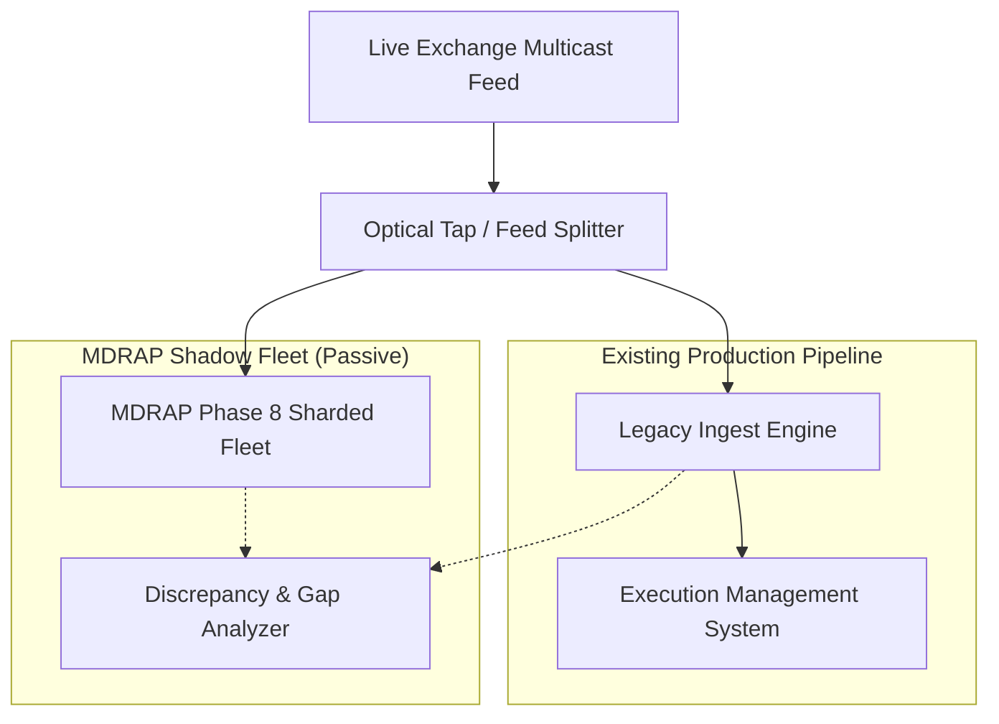

# MDRAP Phase 8 — Live Feed Shadow Validation Runbook

## 1. Shadow Mode Operational Design
Shadow validation (Dark Launch) runs MDRAP in parallel alongside existing production market data infrastructure without routing trading orders or broadcasting to downstream execution systems.

## 2. Measurable Acceptance Criteria for Shadow Graduation

| Metric | Target Threshold | Method of Measurement |
|---|---|---|
| **Sequence Discrepancy Rate** | $< 0.0001\%$ ($< 1$ per million ticks) | Diff between legacy and MDRAP sequence heads |
| **BBO Price Inversion / Disagreement** | $0$ unexplained price mismatches | Real-time cross-engine NBBO comparison |
| **Pipeline Latency SLA** | $p99 < 15\text{ \mu s}$, $p99.9 < 100\text{ \mu s}$ | Local ingress to egress high-resolution timers |
| **Quarantine False Positive Rate** | $< 0.01\%$ on valid market ticks | Manual and automated audit of quarantined events |
| **Continuous Operating Period** | Minimum 5 full trading sessions (32.5 hours) | Uninterrupted uptime with zero crashes or leaks |

## 3. Rollback & Abort Thresholds
- Abort immediately if MDRAP memory growth exceeds 10 MB/hour (memory leak).
- Abort if sequence desynchronization exceeds 100 consecutive ticks.
- Abort if CPU utilization on pinned cores exceeds 90% during non-burst market volume.
