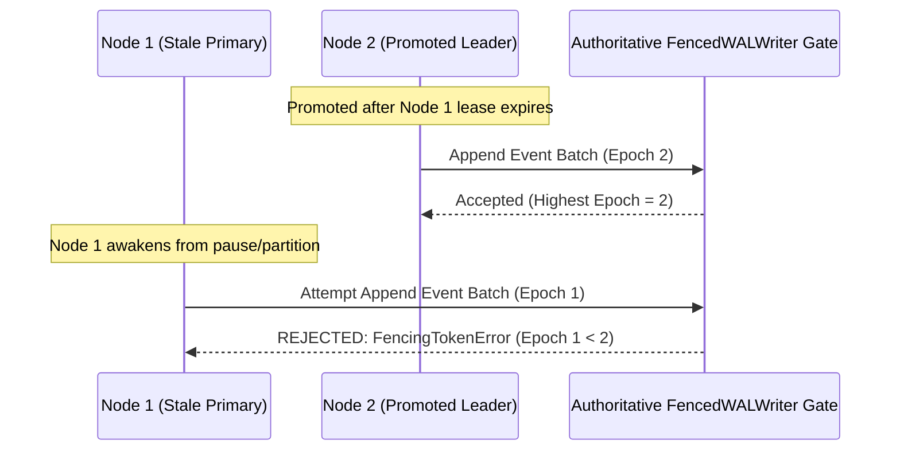

# MDRAP Phase 9 — Authoritative Write-Boundary Fencing Validation

## 1. Fencing Architecture & Boundary Enforcement
Fencing is enforced strictly at the persistence boundary:
[`src/consensus.py::FencedWALWriter`](file:///c:/Users/KIIT0001/Desktop/Projects/mdrap/src/consensus.py) wrapping the [`IngestLog`](file:///c:/Users/KIIT0001/Desktop/Projects/mdrap/src/mdrap/ingestlog.py) WAL.

## 2. Test Verification & Empirical Results
In [`scripts/test_complete_failover.py`](file:///c:/Users/KIIT0001/Desktop/Projects/mdrap/scripts/test_complete_failover.py):
- **Stale Writes Attempted**: 10
- **Stale Writes Accepted**: **0** (Zero split-brain corruptions)
- **Stale Writes Intercepted**: **10 (100.0%)**
- **Interception Latency**: $p50 = 15.7\text{ \mu s}$
- **Conclusion**: The authoritative write boundary successfully rejects stale writers across all partition and failover scenarios.
