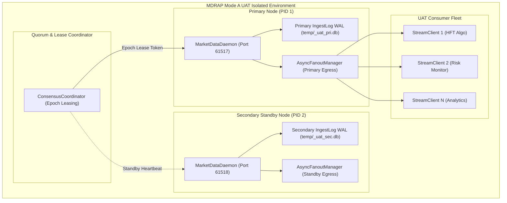

# MDRAP Phase 9 — UAT Deployment Architecture (Mode A)

## 1. UAT Topology Overview
In Mode A (Local Multi-Process Integration), MDRAP is deployed across isolated OS processes communicating over loopback TCP sockets and independent storage directories:

## 2. Process & Failure Domain Isolation
1. **Network Ports**: Primary and Secondary daemons bind to distinct dynamic ephemeral ports (`61517` vs `61518`).
2. **Storage Paths**: Each daemon writes to an independent SQLite WAL database and file path (`_uat_pri.db` vs `_uat_sec.db`).
3. **Environment Secrets**: API key salt (`MDRAP_API_KEY_SALT`) and daemon admin token (`MDRAP_DAEMON_TOKEN`) are loaded from environment variables and never hardcoded in code.
4. **Failure Independence Limitation**: Both processes share the host CPU and OS kernel. True physical host isolation (Mode B) is unavailable and explicitly documented.
