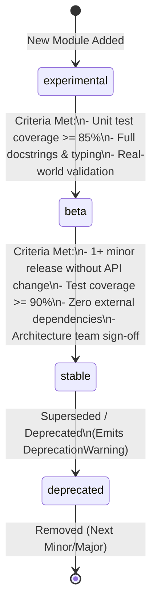

# Architecture Decision Record: Backbone Stability Policy

- **Date**: 2026-09-24
- **Status**: Accepted
- **Scope**: Core Architecture · Module Stability Contracts · API Evolution Policy
- **Deciders**: MDRAP Core Team

---

## 1. Context & Problem Statement

MDRAP has expanded from a lightweight, single-process market data pipeline into a multi-layered ecosystem comprising 72 Python modules, native C acceleration primitives, and multiple domain-specific engines across 12 architectural layers (detailed in [`docs/map.md`](file:///c:/Users/KIIT0001/Desktop/Projects/mdrap/docs/map.md)).

These modules span a wide spectrum of maturity:
1. **Core Infrastructure**: Battle-tested pipeline components, quality validators, storage engines, and binary protocols with zero tolerance for breaking changes.
2. **Analytical & Feed Services**: Functional and well-tested services (REST APIs, feed handlers, analytics) that may evolve as new exchange protocols emerge.
3. **Exploratory & Experimental Tools**: Research scripts, alternative data extractors (SEC filings, vessel AIS tracking), and experimental trading SDKs undergoing active prototyping.

External developers, quantitative trading desks, and vendor integrators building on top of MDRAP require unambiguous, enforceable contracts regarding which interfaces are safe for production dependency versus which are subject to rapid iteration.

---

## 2. Decision: Explicit Module Stability Contracts (`__stability__`)

Every module in the `src/` directory must explicitly declare its stability tier via the module-level attribute `__stability__`:

```python
__stability__ = "stable"  # "stable" | "beta" | "experimental"
```

The three tiers are defined as follows:

```
┌─────────────────────────────────────────────────────────────────────────────┐
│                            STABILITY TIERS                                  │
├─────────────────┬─────────────────────────────────┬─────────────────────────┤
│ Tier            │ Guarantees                      │ Deprecation Requirement │
├─────────────────┼─────────────────────────────────┼─────────────────────────┤
│ stable          │ Public API frozen. Zero breaking│ Minimum 1 minor release │
│                 │ changes without formal cycle.   │ warning before removal. │
├─────────────────┼─────────────────────────────────┼─────────────────────────┤
│ beta            │ Fully tested & functional. May  │ Documented in CHANGELOG │
│                 │ evolve between minor releases.  │ across minor versions.  │
├─────────────────┼─────────────────────────────────┼─────────────────────────┤
│ experimental    │ No backward compatibility       │ None. May change or be  │
│                 │ guarantees. Rapid iteration.    │ removed without notice. │
└─────────────────┴─────────────────────────────────┴─────────────────────────┘
```

### 2.1 `stable` Tier
- **Definition**: Mission-critical platform backbone. The public API surface (exported classes, method signatures, parameter names, return types) is frozen.
- **Breaking Changes**: Strictly prohibited in patch releases. Any breaking alteration requires a formal deprecation period lasting at least one minor release cycle (`vX.Y -> vX.Y+1`) where a runtime `DeprecationWarning` is emitted before removal.
- **Covered Modules**:
  - Core Pipeline: [`models.py`](file:///c:/Users/KIIT0001/Desktop/Projects/mdrap/src/models.py), [`gateway.py`](file:///c:/Users/KIIT0001/Desktop/Projects/mdrap/src/gateway.py), [`quality.py`](file:///c:/Users/KIIT0001/Desktop/Projects/mdrap/src/quality.py), [`reconciliation.py`](file:///c:/Users/KIIT0001/Desktop/Projects/mdrap/src/reconciliation.py), [`pipeline.py`](file:///c:/Users/KIIT0001/Desktop/Projects/mdrap/src/pipeline.py), [`metrics.py`](file:///c:/Users/KIIT0001/Desktop/Projects/mdrap/src/metrics.py), [`config.py`](file:///c:/Users/KIIT0001/Desktop/Projects/mdrap/src/config.py), [`rules.py`](file:///c:/Users/KIIT0001/Desktop/Projects/mdrap/src/rules.py).
  - Storage & Audit: [`storage.py`](file:///c:/Users/KIIT0001/Desktop/Projects/mdrap/src/storage.py), [`archive.py`](file:///c:/Users/KIIT0001/Desktop/Projects/mdrap/src/archive.py), [`security.py`](file:///c:/Users/KIIT0001/Desktop/Projects/mdrap/src/security.py), [`audit_format.py`](file:///c:/Users/KIIT0001/Desktop/Projects/mdrap/src/audit_format.py).
  - Delivery Protocols: [`shm.py`](file:///c:/Users/KIIT0001/Desktop/Projects/mdrap/src/shm.py), [`protocol.py`](file:///c:/Users/KIIT0001/Desktop/Projects/mdrap/src/protocol.py), [`service.py`](file:///c:/Users/KIIT0001/Desktop/Projects/mdrap/src/service.py).
  - Native Hot Path: [`fastpath.py`](file:///c:/Users/KIIT0001/Desktop/Projects/mdrap/src/fastpath.py), [`fastpath.c`](file:///c:/Users/KIIT0001/Desktop/Projects/mdrap/src/fastpath.c).
  - Extension Interfaces: [`adapters/__init__.py`](file:///c:/Users/KIIT0001/Desktop/Projects/mdrap/src/adapters/__init__.py), [`protocols.py`](file:///c:/Users/KIIT0001/Desktop/Projects/mdrap/src/protocols.py).

### 2.2 `beta` Tier
- **Definition**: Production-grade and covered by comprehensive automated tests, but subject to ergonomic refinements or protocol adjustments across minor versions.
- **Breaking Changes**: Permitted across minor version bumps (`v2.1 -> v2.2`), provided all changes are thoroughly documented in [`CHANGELOG.md`](file:///c:/Users/KIIT0001/Desktop/Projects/mdrap/CHANGELOG.md).
- **Covered Modules**:
  - Analytics & Quantitative: [`analytics.py`](file:///c:/Users/KIIT0001/Desktop/Projects/mdrap/src/analytics.py), [`depth.py`](file:///c:/Users/KIIT0001/Desktop/Projects/mdrap/src/depth.py), [`columnar.py`](file:///c:/Users/KIIT0001/Desktop/Projects/mdrap/src/columnar.py), [`backtest.py`](file:///c:/Users/KIIT0001/Desktop/Projects/mdrap/src/backtest.py), [`features.py`](file:///c:/Users/KIIT0001/Desktop/Projects/mdrap/src/features.py), [`options.py`](file:///c:/Users/KIIT0001/Desktop/Projects/mdrap/src/options.py), [`risk.py`](file:///c:/Users/KIIT0001/Desktop/Projects/mdrap/src/risk.py).
  - Feeds & Ingestion: [`ws_feed.py`](file:///c:/Users/KIIT0001/Desktop/Projects/mdrap/src/ws_feed.py), [`polygon_feed.py`](file:///c:/Users/KIIT0001/Desktop/Projects/mdrap/src/polygon_feed.py), [`databento_feed.py`](file:///c:/Users/KIIT0001/Desktop/Projects/mdrap/src/databento_feed.py), [`live.py`](file:///c:/Users/KIIT0001/Desktop/Projects/mdrap/src/live.py).
  - Client & Server Interfaces: [`api.py`](file:///c:/Users/KIIT0001/Desktop/Projects/mdrap/src/api.py), [`client.py`](file:///c:/Users/KIIT0001/Desktop/Projects/mdrap/src/client.py), [`cli.py`](file:///c:/Users/KIIT0001/Desktop/Projects/mdrap/src/cli.py), [`navigator.py`](file:///c:/Users/KIIT0001/Desktop/Projects/mdrap/src/navigator.py).

### 2.3 `experimental` Tier
- **Definition**: Exploratory prototypes, cutting-edge research modules, and incubating features under active design.
- **Breaking Changes**: No guarantees whatsoever. Classes, functions, or entire modules may be renamed, restructured, or eliminated without notice between any release.
- **Covered Modules**:
  - Alternative Data: [`research.py`](file:///c:/Users/KIIT0001/Desktop/Projects/mdrap/src/research.py) (SEC EDGAR), [`news.py`](file:///c:/Users/KIIT0001/Desktop/Projects/mdrap/src/news.py), [`vessel.py`](file:///c:/Users/KIIT0001/Desktop/Projects/mdrap/src/vessel.py) (AIS tracking).
  - Advanced Trading Tools: [`tca.py`](file:///c:/Users/KIIT0001/Desktop/Projects/mdrap/src/tca.py), [`strategy_sdk.py`](file:///c:/Users/KIIT0001/Desktop/Projects/mdrap/src/strategy_sdk.py), [`trading_cli.py`](file:///c:/Users/KIIT0001/Desktop/Projects/mdrap/src/trading_cli.py).

---

## 3. Promotion Policy & Criteria

New modules added to MDRAP default to `experimental` upon entry. To be promoted to a higher stability tier, a module must satisfy rigorous criteria:



1. **Promotion from `experimental` to `beta`**:
   - Automated unit test coverage $\ge 85\%$.
   - Complete type annotations and docstrings conforming to project standards.
   - Demonstrated utility in either test harnesses or reference starter architectures.

2. **Promotion from `beta` to `stable`**:
   - Deployed across at least one full minor release cycle with zero public API alterations.
   - Automated test coverage $\ge 90\%$ including edge cases and fuzz tests.
   - Adherence to zero-external-dependency rule (standard library + `rich` only).
   - Approval by the MDRAP Core Architecture Review team.

---

## 4. Consequences & Enforcement

### Positive Consequences
- **Clear Integrator Contracts**: Institutional users and trading desks can safely build against `stable` modules without fear of silent breaks during platform upgrades.
- **Rapid Innovation**: Research and alpha development can proceed unencumbered in `experimental` modules without imposing backward-compatibility burdens on the core pipeline.
- **Automated Verification**: Tooling and linters can introspect `sys.modules[mod].__stability__` to generate dependency audit reports for external deployments.

### Negative Consequences / Trade-offs
- Core team must maintain strict backward compatibility and migration shims for `stable` modules even when better ergonomics are discovered.
- Contribution overhead: contributors must understand stability tier expectations when submitting new code.

### Governance in Contribution Workflow
- All new modules submitted via Pull Requests must declare the `__stability__` attribute.
- Documented in [`CONTRIBUTING.md`](file:///c:/Users/KIIT0001/Desktop/Projects/mdrap/CONTRIBUTING.md).
- Architectural layer mapping documented and maintained in [`docs/map.md`](file:///c:/Users/KIIT0001/Desktop/Projects/mdrap/docs/map.md).
