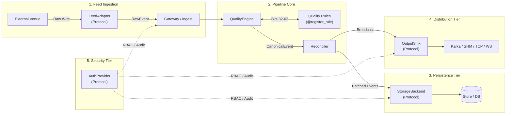

# MDRAP Extension Architecture

The Market Data Reliability & Acceleration Platform (MDRAP) is built on a modular, zero-dependency extension architecture. Extensions decouple core validation and reconciliation logic from venue-specific ingest formats, storage technologies, authorization systems, and downstream publication mechanisms.

MDRAP adheres to a pure Python, standard-library-first design:
- **Zero Heavy Frameworks**: No ORM, no web framework dependencies in the core pipeline; data structures use native dataclasses with `__slots__ = True` for memory efficiency.
- **Protocol-First Interfaces**: Interfaces are defined using `typing.Protocol` with `@runtime_checkable`, enabling structural duck-typing without tight inheritance coupling.
- **Dynamic Plugin Discovery**: Third-party plugins are discovered at runtime via standard library `importlib.metadata.entry_points()`.
- **System Invariants**:
  - **Monotonic Status Escalation**: Data quality priority is strictly `INVALID` > `SUSPICIOUS` > `VALID`. An event's status can escalate but can never be downgraded.
  - **Quarantine, Never Drop**: Malformed or anomalous market data is never silently discarded; payloads and lineage are recorded in evidentiary quarantine.
  - **Deterministic Generation**: Sequence and event identifiers use `itertools.count()`, avoiding non-deterministic `uuid.uuid4()` overhead.

---

## Architecture Overview



---

## Extension Points Summary

MDRAP provides 5 primary extension points:

| # | Extension Point | Protocol / Decorator | Entry Point Group | Description | Sub-Guide |
|---|-----------------|----------------------|-------------------|-------------|-----------|
| 1 | **Feed Adapter** | [`FeedAdapter`](file:///c:/Users/KIIT0001/Desktop/Projects/mdrap/src/adapters/__init__.py) | `mdrap.adapters` | Connects exchange feeds, multicast lines, and proprietary binary sockets to emit [`RawEvent`](file:///c:/Users/KIIT0001/Desktop/Projects/mdrap/src/models.py). | [Feed Adapter Guide](file:///c:/Users/KIIT0001/Desktop/Projects/mdrap/docs/extending/feed-adapter.md) |
| 2 | **Storage Backend** | [`StorageBackend`](file:///c:/Users/KIIT0001/Desktop/Projects/mdrap/src/protocols.py) | Custom factory | Swappable persistence engine for canonical ticks, quarantine records, lineage trails, and BBO snapshots. | [Storage Backend Guide](file:///c:/Users/KIIT0001/Desktop/Projects/mdrap/docs/extending/storage-backend.md) |
| 3 | **Quality Rules** | [`@register_rule`](file:///c:/Users/KIIT0001/Desktop/Projects/mdrap/src/rules.py) | `mdrap.quality_rules` | Custom user-defined quality checks in bitmask range `32..63` executed post-native pass. | [Quality Rules Guide](file:///c:/Users/KIIT0001/Desktop/Projects/mdrap/docs/extending/quality-rules.md) |
| 4 | **Auth Provider** | [`AuthProvider`](file:///c:/Users/KIIT0001/Desktop/Projects/mdrap/src/protocols.py) | Custom factory | Pluggable authentication, RBAC enforcement (`VIEWER` < `OPERATOR` < `ADMIN`), and tamper-evident audit logging. | [Auth Provider Guide](file:///c:/Users/KIIT0001/Desktop/Projects/mdrap/docs/extending/auth-provider.md) |
| 5 | **Output Sink** | [`OutputSink`](file:///c:/Users/KIIT0001/Desktop/Projects/mdrap/src/protocols.py) | Custom factory | Real-time fanout sink for downstream distribution across messaging buses (Kafka, RabbitMQ, ZeroMQ, SHM). | [Output Sink Guide](file:///c:/Users/KIIT0001/Desktop/Projects/mdrap/docs/extending/output-sink.md) |

---

## Extension Discovery Mechanism

MDRAP discovers installed plugins using Python standard library metadata entry points:

```python
import sys

def discover_plugins(group_name: str) -> dict[str, type]:
    """Discover plugins registered under a pyproject.toml entry-point group."""
    if sys.version_info >= (3, 10):
        from importlib.metadata import entry_points
        eps = entry_points(group=group_name)
    else:
        import importlib_metadata  # type: ignore
        eps = importlib_metadata.entry_points().get(group_name, [])

    plugins = {}
    for ep in eps:
        try:
            plugin_cls = ep.load()
            plugins[ep.name] = plugin_cls
        except Exception:
            pass  # Fault isolation: broken plugin does not crash registry
    return plugins
```

Extensions register themselves in their respective `pyproject.toml` file:

```toml
[project.entry-points."mdrap.adapters"]
custom_exchange = "my_package.adapters:CustomExchangeAdapter"

[project.entry-points."mdrap.quality_rules"]
rule_volume_spike = "my_package.rules:register_volume_rules"
```

---

## Flat Module Structure

MDRAP uses a flat module layout under [`src/`](file:///c:/Users/KIIT0001/Desktop/Projects/mdrap/src/). Never import from nested package paths like `mdrap.core.models`. All extensions and scripts import directly from the top-level modules:

```python
# Correct
from models import CanonicalEvent, EventType, QualityStatus, RawEvent, Reason
from storage import Store
from pipeline import Pipeline
from security import ClientEntitlement, Role, SecurityManager

# Incorrect
from mdrap.core.models import CanonicalEvent  # Do not use!
```

---

## Key Source Code References

- [`src/adapters/__init__.py`](file:///c:/Users/KIIT0001/Desktop/Projects/mdrap/src/adapters/__init__.py): [`FeedAdapter`](file:///c:/Users/KIIT0001/Desktop/Projects/mdrap/src/adapters/__init__.py) protocol definition and discovery routine.
- [`src/adapters/template.py`](file:///c:/Users/KIIT0001/Desktop/Projects/mdrap/src/adapters/template.py): Reference implementation of a custom venue feed adapter.
- [`src/protocols.py`](file:///c:/Users/KIIT0001/Desktop/Projects/mdrap/src/protocols.py): Protocol definitions for [`StorageBackend`](file:///c:/Users/KIIT0001/Desktop/Projects/mdrap/src/protocols.py), [`AuthProvider`](file:///c:/Users/KIIT0001/Desktop/Projects/mdrap/src/protocols.py), [`QualityEvaluator`](file:///c:/Users/KIIT0001/Desktop/Projects/mdrap/src/protocols.py), and [`OutputSink`](file:///c:/Users/KIIT0001/Desktop/Projects/mdrap/src/protocols.py).
- [`src/rules.py`](file:///c:/Users/KIIT0001/Desktop/Projects/mdrap/src/rules.py): User quality rule registry and [`@register_rule`](file:///c:/Users/KIIT0001/Desktop/Projects/mdrap/src/rules.py) decorator.
- [`src/models.py`](file:///c:/Users/KIIT0001/Desktop/Projects/mdrap/src/models.py): Canonical domain types ([`RawEvent`](file:///c:/Users/KIIT0001/Desktop/Projects/mdrap/src/models.py), [`CanonicalEvent`](file:///c:/Users/KIIT0001/Desktop/Projects/mdrap/src/models.py), [`QualityStatus`](file:///c:/Users/KIIT0001/Desktop/Projects/mdrap/src/models.py), [`Reason`](file:///c:/Users/KIIT0001/Desktop/Projects/mdrap/src/models.py)).
- [`src/pipeline.py`](file:///c:/Users/KIIT0001/Desktop/Projects/mdrap/src/pipeline.py): Core [`Pipeline`](file:///c:/Users/KIIT0001/Desktop/Projects/mdrap/src/pipeline.py) orchestrator and flush lifecycle.
- [`src/storage.py`](file:///c:/Users/KIIT0001/Desktop/Projects/mdrap/src/storage.py): Default SQLite persistence engine implementation [`Store`](file:///c:/Users/KIIT0001/Desktop/Projects/mdrap/src/storage.py).
- [`src/security.py`](file:///c:/Users/KIIT0001/Desktop/Projects/mdrap/src/security.py): Cryptographic [`SecurityManager`](file:///c:/Users/KIIT0001/Desktop/Projects/mdrap/src/security.py) and RBAC role definitions.
- [`src/service.py`](file:///c:/Users/KIIT0001/Desktop/Projects/mdrap/src/service.py): Background daemon [`MarketDataDaemon`](file:///c:/Users/KIIT0001/Desktop/Projects/mdrap/src/service.py) coordinating broadcast distribution.
