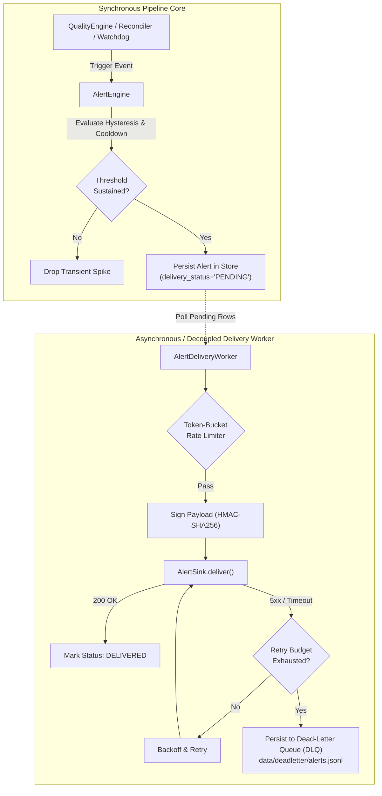

# Implementing Custom Alert Sinks

The Market Data Reliability & Acceleration Platform (MDRAP) monitors data feed health, pipeline anomalies, quality status breaches, and cross-feed reconciliations. When anomalies occur, the alert subsystem coordinates notification delivery through decoupled, rate-limited, and retry-resilient alert sinks.

Custom notification channels (PagerDuty, Slack, OpsGenie, Microsoft Teams, incident management systems, or custom HTTP webhooks) integrate via the [`AlertSink`](file:///c:/Users/KIIT0001/Desktop/Projects/mdrap/src/protocols.py) protocol.

---

## The AlertSink Protocol

Defined in [`src/protocols.py`](file:///c:/Users/KIIT0001/Desktop/Projects/mdrap/src/protocols.py):

```python
from typing import Any, Protocol, runtime_checkable
from dataclasses import dataclass

@dataclass
class DeliveryResult:
    """Outcome of attempting to deliver an alert to an external sink."""
    success: bool
    status_code: int = 0
    error: str | None = None
    retryable: bool = False
    delivery_time_ms: float = 0.0

@runtime_checkable
class AlertSink(Protocol):
    """Protocol for downstream alert notification sinks (webhooks, Slack, PagerDuty, etc.)."""

    def deliver(self, alert: Any) -> DeliveryResult:
        """Deliver an alert payload to the external destination.
        
        Must return DeliveryResult indicating success/failure, status code,
        and whether failure is transient (retryable).
        """
        ...

    def close(self) -> None:
        """Clean up network sockets, thread pools, or sink resources."""
        ...
```

---

## Alert Subsystem Architecture

The alert subsystem guarantees that external delivery failures or network latency **never impact or stall the synchronous market data pipeline**.



### Core Invariants

1. **Pipeline Decoupling**: The synchronous tick processing loop evaluates rules and records breaches into the local persistence tier. `AlertDeliveryWorker` operates decoupled from the pipeline loop so slow HTTP endpoints, DNS latency, or TLS handshakes never introduce tail latency to market data ingestion.
2. **Anti-Flapping & Hysteresis**: Alerts enforce a minimum sustain window (`hysteresis_ticks`) before declaring a breach, require recovery beyond a clear margin (`hysteresis_margin_pct`) before re-arming, and enforce a quiet period (`cooldown_s`) between repeat notifications for persistent breaches.
3. **Cryptographic Integrity**: Webhook payloads are signed using HMAC-SHA256 (`X-MDRAP-Signature`, `X-MDRAP-Timestamp`) backed by `SecurityManager` secret rotation, preventing payload spoofing or replay attacks.
4. **Resilient Rate Limiting & DLQ**: Sinks throttle outbound volume via token-bucket limiting to avoid downstream API bans. Unresolvable errors (4xx client errors or exhausted retries) are appended to a durable local dead-letter queue (`data/deadletter/alerts.jsonl`) with full diagnostic metadata.

---

## Built-In Alert Sinks

MDRAP includes ready-to-use production alert sinks in [`src/alert_sinks.py`](file:///c:/Users/KIIT0001/Desktop/Projects/mdrap/src/alert_sinks.py):

| Sink Class | Protocol | Destination | Key Features |
|---|---|---|---|
| [`WebhookAlertSink`](file:///c:/Users/KIIT0001/Desktop/Projects/mdrap/src/alert_sinks.py) | `AlertSink` | Generic HTTP(S) Webhook | HMAC-SHA256 signature headers, configurable HTTP headers, custom JSON payloads. |
| [`SlackAlertSink`](file:///c:/Users/KIIT0001/Desktop/Projects/mdrap/src/alert_sinks.py) | `AlertSink` | Slack Incoming Webhook | Formatted Slack Block Kit cards with severity indicators and timestamp metadata. |
| [`PagerDutyAlertSink`](file:///c:/Users/KIIT0001/Desktop/Projects/mdrap/src/alert_sinks.py) | `AlertSink` | PagerDuty Events API v2 | Deduplication key mapping, routing key authorization, and event action dispatch. |
| [`MockAlertSink`](file:///c:/Users/KIIT0001/Desktop/Projects/mdrap/src/alert_sinks.py) | `AlertSink` | In-Memory / Test Double | Configurable artificial latency, simulated failure rates, and recorded delivery histories for unit testing. |

---

## Step-by-Step: Implementing a Custom Alert Sink

To integrate an alternative notification platform (for example, Microsoft Teams, Discord, OpsGenie, or internal incident IRC bots), implement the `AlertSink` protocol:

### 1. Define the Sink Class

```python
"""Microsoft Teams Incoming Webhook Alert Sink for MDRAP."""
from __future__ import annotations

import json
import time
import urllib.request
import urllib.error
from typing import Any
from protocols import AlertSink, DeliveryResult

class TeamsAlertSink:
    """Delivers MDRAP operational alerts to Microsoft Teams channels."""

    def __init__(self, webhook_url: str, timeout_s: float = 5.0):
        self.webhook_url = webhook_url
        self.timeout_s = timeout_s

    def deliver(self, alert: Any) -> DeliveryResult:
        start_time = time.perf_counter()
        
        # Format Teams Adaptive Card or MessageCard payload
        severity = getattr(alert, "severity", "warning").upper()
        color = "FF0000" if severity == "CRITICAL" else "FFA500"
        
        card = {
            "@type": "MessageCard",
            "@context": "https://schema.org/extensions",
            "themeColor": color,
            "title": f"MDRAP Alert: {getattr(alert, 'rule_name', 'System Alert')}",
            "text": getattr(alert, 'message', str(alert)),
            "sections": [
                {
                    "facts": [
                        {"name": "Severity", "value": severity},
                        {"name": "Source / Feed", "value": getattr(alert, 'source', 'global')},
                        {"name": "Instrument", "value": getattr(alert, 'instrument_id', 'N/A')},
                        {"name": "Timestamp", "value": str(getattr(alert, 'created_at', time.time()))},
                    ]
                }
            ],
        }

        body = json.dumps(card).encode("utf-8")
        req = urllib.request.Request(
            self.webhook_url,
            data=body,
            headers={"Content-Type": "application/json"},
            method="POST",
        )

        try:
            with urllib.request.urlopen(req, timeout=self.timeout_s) as resp:
                elapsed_ms = (time.perf_counter() - start_time) * 1000.0
                return DeliveryResult(
                    success=200 <= resp.status < 300,
                    status_code=resp.status,
                    delivery_time_ms=elapsed_ms,
                )
        except urllib.error.HTTPError as exc:
            elapsed_ms = (time.perf_counter() - start_time) * 1000.0
            # 5xx errors or 429 rate limits are retryable; 4xx client errors are fatal
            retryable = exc.code in (429, 500, 502, 503, 504)
            return DeliveryResult(
                success=False,
                status_code=exc.code,
                error=str(exc),
                retryable=retryable,
                delivery_time_ms=elapsed_ms,
            )
        except Exception as exc:
            elapsed_ms = (time.perf_counter() - start_time) * 1000.0
            return DeliveryResult(
                success=False,
                status_code=0,
                error=str(exc),
                retryable=True,  # Connection drops/timeouts are retryable
                delivery_time_ms=elapsed_ms,
            )

    def close(self) -> None:
        """Release any pooled connections or background resources."""
        pass
```

### 2. Register via `pyproject.toml`

Register your sink class under the `mdrap.alert_sinks` entry point group:

```toml
[project.entry-points."mdrap.alert_sinks"]
teams = "my_package.teams_sink:TeamsAlertSink"
```

### 3. Wire into the `AlertDeliveryWorker`

```python
from alert_sinks import AlertDeliveryWorker
from storage import Store
from my_package.teams_sink import TeamsAlertSink

store = Store("data/mdrap.db")
teams_sink = TeamsAlertSink("https://outlook.office.com/webhook/...")

worker = AlertDeliveryWorker(
    store=store,
    sink=teams_sink,
    max_per_second=5.0,
    burst_limit=10,
    max_retries=3,
    dlq_path="data/deadletter/alerts.jsonl",
)

# Start background delivery thread
worker.start()

# Emit scheduled heartbeat self-test
worker.emit_heartbeat()

# Clean shutdown
worker.stop()
teams_sink.close()
```

---

## Verifying Sink Compliance

Custom alert sinks should be verified using unit tests that validate both transient failure handling and clean degradation:

```python
import pytest
from protocols import AlertSink, DeliveryResult
from alert_sinks import AlertDeliveryWorker
from storage import Store

def test_custom_sink_complies_with_protocol(tmp_path):
    sink = TeamsAlertSink("http://localhost:9999/dummy")
    assert isinstance(sink, AlertSink)
    
    # Verify delivery result contract
    res = sink.deliver({"rule_name": "TEST", "message": "hello"})
    assert isinstance(res, DeliveryResult)
    assert res.retryable is True
    sink.close()
```
