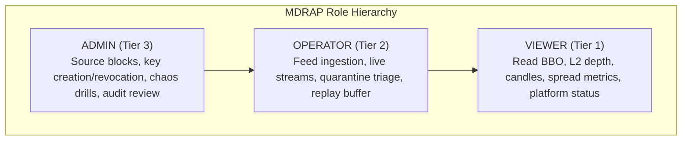
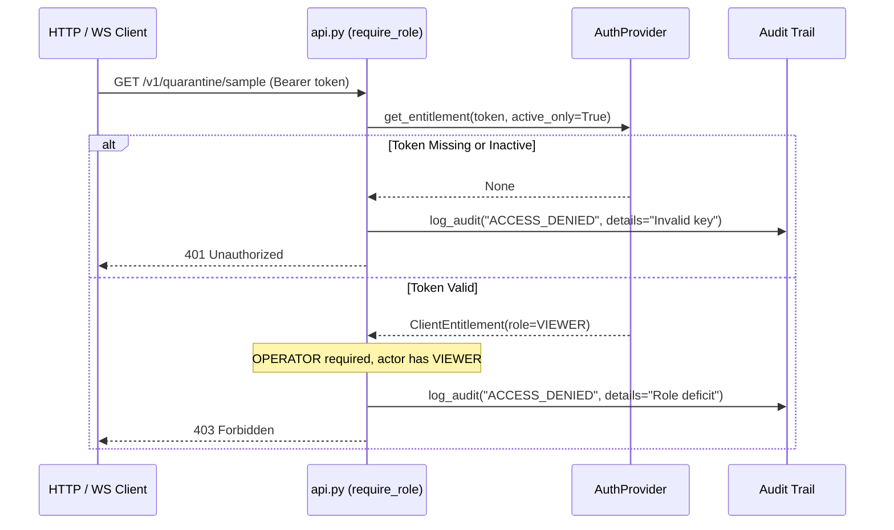

# Implementing Custom Auth Providers

MDRAP secures market data streams, operational APIs, and administration consoles using Role-Based Access Control (RBAC) and cryptographically chained audit trails ([`SecurityManager`](file:///c:/Users/KIIT0001/Desktop/Projects/mdrap/src/security.py)). For enterprise single sign-on (SSO), OAuth2/OIDC, or active directory integration, implement [`AuthProvider`](file:///c:/Users/KIIT0001/Desktop/Projects/mdrap/src/protocols.py).

---

## The AuthProvider Protocol

Defined in [`src/protocols.py`](file:///c:/Users/KIIT0001/Desktop/Projects/mdrap/src/protocols.py):

```python
from typing import Any, Protocol, runtime_checkable
from security import ClientEntitlement, Role

@runtime_checkable
class AuthProvider(Protocol):
    """Protocol for pluggable authentication, RBAC, and audit verification."""

    def get_entitlement(self, token: str, active_only: bool = False) -> ClientEntitlement | None: ...
    def authorize(self, actor_or_token: Any, required_role: Role, action_name: str = "") -> None: ...
    def log_audit(self, action: str, actor: str = "system", role: Role = Role.OPERATOR, details: str = "", timestamp: float | None = None) -> str: ...
```

---

## Role Hierarchy & RBAC Permissions

MDRAP enforces a strictly ordered 3-tier hierarchy:

$$\text{VIEWER (1)} < \text{OPERATOR (2)} < \text{ADMIN (3)}$$



Any role at level $N$ possesses all permissions of levels $< N$.

---

## Integration with FastAPI (`api.py`)

In [`src/api.py`](file:///c:/Users/KIIT0001/Desktop/Projects/mdrap/src/api.py), the [`require_role`](file:///c:/Users/KIIT0001/Desktop/Projects/mdrap/src/api.py) dependency resolves incoming client identity from two standard HTTP header carriers:
1. `X-API-Key: <token>` header
2. `Authorization: Bearer <token>` header

*(Note: Query parameter authentication `?token=<token>` is disabled on REST endpoints to prevent credential leakage in access logs, and is accepted exclusively for browser WebSocket handshakes at `/v1/events/stream`).*



---

## Skeleton OAuth2 / JWT AuthProvider

Below is an enterprise OAuth2/OIDC implementation validating JWT bearer tokens:

```python
"""Enterprise OAuth2 AuthProvider for MDRAP."""
from __future__ import annotations

import time
from typing import Any
import jwt  # PyJWT or standard library HMAC/crypto
from security import AccessDenied, ClientEntitlement, Role

_ROLE_LEVELS = {Role.VIEWER: 1, Role.OPERATOR: 2, Role.ADMIN: 3}

class OAuth2AuthProvider:
    """Validates signed OAuth2/OIDC JWT tokens against enterprise IdP."""

    def __init__(self, public_key: str, issuer: str, audience: str, audit_store: Any = None):
        self.public_key = public_key
        self.issuer = issuer
        self.audience = audience
        self.audit_store = audit_store

    def get_entitlement(self, token: str, active_only: bool = False) -> ClientEntitlement | None:
        """Decode and validate JWT claims into a ClientEntitlement."""
        if not token:
            return None
        try:
            claims = jwt.decode(
                token,
                self.public_key,
                algorithms=["RS256", "ES256"],
                issuer=self.issuer,
                audience=self.audience,
            )
            raw_role = claims.get("mdrap_role", "VIEWER").upper()
            role = Role[raw_role] if raw_role in Role.__members__ else Role.VIEWER
            expires = float(claims.get("exp", 0.0))

            if active_only and expires and time.time() > expires:
                return None

            return ClientEntitlement(
                token=token,
                client_id=claims.get("sub", "oauth2_user"),
                role=role,
                created_at=float(claims.get("iat", time.time())),
                expires_at=expires if expires > 0 else None,
                is_active=True,
            )
        except Exception:
            return None

    def authorize(self, actor_or_token: Any, required_role: Role, action_name: str = "") -> None:
        """Validate RBAC permissions against role hierarchy."""
        ent = (
            self.get_entitlement(actor_or_token, active_only=True)
            if isinstance(actor_or_token, str)
            else actor_or_token
        )
        if not ent or not ent.is_active:
            self.log_audit("ACCESS_DENIED", actor="unknown", role=Role.VIEWER, details=f"Invalid token for {action_name}")
            raise AccessDenied(f"Access denied for '{action_name}'")

        if _ROLE_LEVELS.get(ent.role, 0) < _ROLE_LEVELS.get(required_role, 99):
            self.log_audit("ACCESS_DENIED", actor=ent.client_id, role=ent.role, details=f"Deficit for {action_name}")
            raise AccessDenied(f"Insufficient permissions: requires {required_role.value}")

    def log_audit(
        self,
        action: str,
        actor: str = "system",
        role: Role = Role.OPERATOR,
        details: str = "",
        timestamp: float | None = None,
    ) -> str:
        """Record tamper-evident audit entry using cryptographic chaining."""
        ts = timestamp or time.time()
        role_str = role.value if isinstance(role, Role) else str(role)
        if self.audit_store and hasattr(self.audit_store, "append_audit"):
            return self.audit_store.append_audit(
                actor=actor, role=role_str, action=action, details=details, timestamp=ts, format_version=2
            )
        return "audit_logged"
```

---

## Source References

- [`src/protocols.py`](file:///c:/Users/KIIT0001/Desktop/Projects/mdrap/src/protocols.py): [`AuthProvider`](file:///c:/Users/KIIT0001/Desktop/Projects/mdrap/src/protocols.py) protocol definition.
- [`src/security.py`](file:///c:/Users/KIIT0001/Desktop/Projects/mdrap/src/security.py): Core [`SecurityManager`](file:///c:/Users/KIIT0001/Desktop/Projects/mdrap/src/security.py), [`Role`](file:///c:/Users/KIIT0001/Desktop/Projects/mdrap/src/security.py), and [`ClientEntitlement`](file:///c:/Users/KIIT0001/Desktop/Projects/mdrap/src/security.py).
- [`src/api.py`](file:///c:/Users/KIIT0001/Desktop/Projects/mdrap/src/api.py): FastAPI security dependencies ([`require_role`](file:///c:/Users/KIIT0001/Desktop/Projects/mdrap/src/api.py#L272)).
- [`src/audit_format.py`](file:///c:/Users/KIIT0001/Desktop/Projects/mdrap/src/audit_format.py): Cryptographic hash chain formatting.
