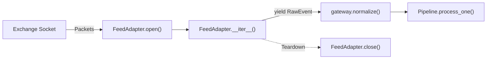

# Implementing Custom Feed Adapters

Market data originates from diverse sources: binary multicast lines (NASDAQ ITCH, CME SBE), FIX streams, WebSockets, and REST endpoints. MDRAP standardizes ingestion via the [`FeedAdapter`](file:///c:/Users/KIIT0001/Desktop/Projects/mdrap/src/adapters/__init__.py) protocol.

---

## The FeedAdapter Protocol

Defined in [`src/adapters/__init__.py`](file:///c:/Users/KIIT0001/Desktop/Projects/mdrap/src/adapters/__init__.py):

```python
from typing import Iterator, Protocol, runtime_checkable
from models import RawEvent

@runtime_checkable
class FeedAdapter(Protocol):
    """Protocol for external exchange feed ingest adapters."""

    def open(self) -> None: ...
    def __iter__(self) -> Iterator[RawEvent]: ...
    def close(self) -> None: ...
```

Any class providing `open()`, `__iter__()`, and `close()` satisfies `FeedAdapter` via structural subtyping without inheritance.



---

## 1. Implementing the Protocol

Adapters yield [`RawEvent`](file:///c:/Users/KIIT0001/Desktop/Projects/mdrap/src/models.py) objects. Raw payloads are dictionaries capturing native feed fields. MDRAP's normalization gateway automatically maps common key variants (`symbol` / `instrument`, `qty` / `quantity`, `bid_sz` / `bid_size`).

Reference implementation based on [`src/adapters/template.py`](file:///c:/Users/KIIT0001/Desktop/Projects/mdrap/src/adapters/template.py):

```python
from __future__ import annotations
import itertools, socket, time
from typing import Iterator
from models import RawEvent

class ExchangeTcpAdapter:
    """Ingests tick stream from a TCP socket and yields RawEvent items."""

    def __init__(self, host: str, port: int, venue: str = "MY_EXCHANGE"):
        self.host, self.port, self.venue = host, port, venue
        self._sock: socket.socket | None = None
        self._raw_counter = itertools.count(1)

    def open(self) -> None:
        self._sock = socket.socket(socket.AF_INET, socket.SOCK_STREAM)
        self._sock.connect((self.host, self.port))
        self._sock.settimeout(2.0)

    def __iter__(self) -> Iterator[RawEvent]:
        if not self._sock:
            raise RuntimeError("Adapter is not open. Call open() first.")
        file_obj = self._sock.makefile("r", encoding="utf-8")
        for line in file_obj:
            line = line.strip()
            if not line:
                continue
            recv_ts = time.time()
            raw_id = f"raw-{next(self._raw_counter)}"
            parts = line.split(",")
            if len(parts) < 5:
                # Quarantine malformed lines without crashing iterator
                yield RawEvent(source=self.venue, payload={"raw": line}, receive_timestamp=recv_ts, raw_id=raw_id)
                continue
            yield RawEvent(
                source=self.venue,
                payload={
                    "seq": int(parts[0]),
                    "symbol": parts[1],
                    "price": float(parts[2]),
                    "quantity": float(parts[3]),
                    "exchange_ts": float(parts[4]),
                },
                receive_timestamp=recv_ts,
                raw_id=raw_id,
                wire=line,
            )

    def close(self) -> None:
        if self._sock:
            try:
                self._sock.shutdown(socket.SHUT_RDWR)
            except Exception:
                pass
            self._sock.close()
            self._sock = None
```

> [!IMPORTANT]
> Record `receive_timestamp=time.time()` at socket ingress. MDRAP uses `receive_timestamp - exchange_timestamp` to track upstream feed latency.

---

## 2. Registration via Entry Points

MDRAP discovers installed adapters via `mdrap.adapters` using [`discover_adapters()`](file:///c:/Users/KIIT0001/Desktop/Projects/mdrap/src/adapters/__init__.py#L33-L56).

Register your adapter in `pyproject.toml`:

```toml
[project.entry-points."mdrap.adapters"]
custom_tcp = "my_package.adapter:ExchangeTcpAdapter"
```

Once registered, MDRAP discovers and instantiates it dynamically:

```python
from adapters import discover_adapters

adapters = discover_adapters()
adapter_cls = adapters["custom_tcp"]
adapter = adapter_cls(host="10.0.0.1", port=9876)
```

---

## 3. Testing the Adapter

Verify runtime protocol compliance and pipeline ingestion:

```python
import pytest
from adapters import FeedAdapter
from models import QualityStatus, RawEvent
from pipeline import Pipeline
from storage import Store
from my_package.adapter import ExchangeTcpAdapter

def test_protocol_conformance():
    adapter = ExchangeTcpAdapter(host="127.0.0.1", port=9000)
    assert isinstance(adapter, FeedAdapter)

def test_pipeline_integration():
    class DummyAdapter(ExchangeTcpAdapter):
        def __iter__(self):
            yield RawEvent(
                source="TEST",
                payload={"seq": 1, "symbol": "AAPL", "price": 150.25, "quantity": 100, "exchange_ts": 1700000000.0},
                receive_timestamp=1700000000.001,
                raw_id="raw-1",
            )

    store = Store(":memory:")
    pipeline = Pipeline(store=store)
    adapter = DummyAdapter(host="127.0.0.1", port=9000)

    events = [pipeline.process_one(raw) for raw in adapter]
    pipeline.finish()

    assert len(events) == 1
    assert events[0].instrument_id == "AAPL"
    assert events[0].quality_status == QualityStatus.VALID
```

---

## Source References

- [`src/adapters/__init__.py`](file:///c:/Users/KIIT0001/Desktop/Projects/mdrap/src/adapters/__init__.py): Protocol definition and `discover_adapters()`.
- [`src/adapters/template.py`](file:///c:/Users/KIIT0001/Desktop/Projects/mdrap/src/adapters/template.py): Reference custom venue template.
- [`src/models.py`](file:///c:/Users/KIIT0001/Desktop/Projects/mdrap/src/models.py): [`RawEvent`](file:///c:/Users/KIIT0001/Desktop/Projects/mdrap/src/models.py) and [`CanonicalEvent`](file:///c:/Users/KIIT0001/Desktop/Projects/mdrap/src/models.py) models.
- [`src/gateway.py`](file:///c:/Users/KIIT0001/Desktop/Projects/mdrap/src/gateway.py): Feed ingestion normalization rules.
