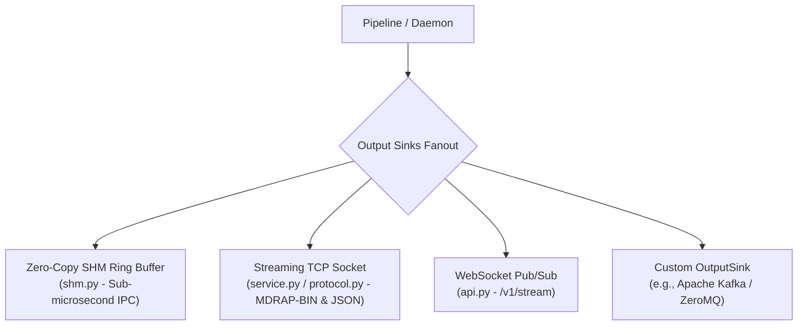

# Implementing Custom Output Sinks

MDRAP delivers validated canonical market data and consolidated top-of-book quotes across multiple high-throughput distribution channels. Custom messaging fabrics (Apache Kafka, RabbitMQ, ZeroMQ, AWS Kinesis) integrate via [`OutputSink`](file:///c:/Users/KIIT0001/Desktop/Projects/mdrap/src/protocols.py).

---

## The OutputSink Protocol

Defined in [`src/protocols.py`](file:///c:/Users/KIIT0001/Desktop/Projects/mdrap/src/protocols.py):

```python
from typing import Any, Protocol, runtime_checkable
from models import CanonicalEvent

@runtime_checkable
class OutputSink(Protocol):
    """Protocol for downstream market data distribution sinks."""

    def broadcast_tick(self, event: CanonicalEvent, bbo: Any = None) -> None: ...
    def broadcast_depth(self, ladder: Any) -> None: ...
    def close(self) -> None: ...
```

---

## MDRAP Broadcast Fanout Architecture



---

## Existing Delivery Paths in MDRAP

| Channel | Module | Wire Format | Target Audience / Use Case |
|---------|--------|-------------|----------------------------|
| **Shared Memory (SHM)** | [`src/shm.py`](file:///c:/Users/KIIT0001/Desktop/Projects/mdrap/src/shm.py) | 128-byte cache-line aligned C-structs | Co-located algorithmic trading bots (< 1 µs latency). Lock-free single-producer multi-consumer. |
| **Streaming TCP** | [`src/service.py`](file:///c:/Users/KIIT0001/Desktop/Projects/mdrap/src/service.py) / [`src/protocol.py`](file:///c:/Users/KIIT0001/Desktop/Projects/mdrap/src/protocol.py) | MDRAP-BIN v1 (92B tick, 108B depth) or JSON | High-throughput institutional LAN distribution and Unix command-line pipes. |
| **WebSocket** | [`src/api.py`](file:///c:/Users/KIIT0001/Desktop/Projects/mdrap/src/api.py) / [`src/ws_feed.py`](file:///c:/Users/KIIT0001/Desktop/Projects/mdrap/src/ws_feed.py) | JSON text frames | Web UIs, trading dashboards, and browser charting engines (`/v1/stream`). |

---

## Skeleton Kafka Producer Implementation

Below is a complete Kafka producer output sink:

```python
"""Apache Kafka output sink for MDRAP."""
from __future__ import annotations

import json
from typing import Any
from models import CanonicalEvent

class KafkaOutputSink:
    """Publishes canonical ticks and depth ladders to Apache Kafka topics."""

    def __init__(self, bootstrap_servers: str, tick_topic: str = "mdrap.ticks", depth_topic: str = "mdrap.depth"):
        from kafka import KafkaProducer  # Optional external client
        self.tick_topic = tick_topic
        self.depth_topic = depth_topic
        self.producer = KafkaProducer(
            bootstrap_servers=bootstrap_servers,
            value_serializer=lambda v: json.dumps(v).encode("utf-8"),
            key_serializer=lambda k: k.encode("utf-8") if k else b"",
            acks=1,
            linger_ms=1,  # Micro-batching for ultra-low latency
            compression_type="lz4",
        )

    def broadcast_tick(self, event: CanonicalEvent, bbo: Any = None) -> None:
        """Serialize and publish canonical tick event."""
        payload = {
            "event_id": event.event_id,
            "sym": event.instrument_id,
            "type": event.event_type.value,
            "price": event.price,
            "size": event.quantity,
            "bid": event.bid_price,
            "ask": event.ask_price,
            "status": event.quality_status.value,
            "exchange_ts": event.exchange_timestamp,
            "proc_ts": event.processing_timestamp,
            "bbo": {
                "bid": bbo.best_bid,
                "ask": bbo.best_ask,
                "spread": bbo.spread,
            } if bbo else None,
        }
        self.producer.send(
            topic=self.tick_topic,
            key=event.instrument_id,
            value=payload,
        )

    def broadcast_depth(self, ladder: Any) -> None:
        """Serialize and publish L2/L3 order book depth ladder."""
        if not ladder:
            return
        payload = {
            "sym": getattr(ladder, "symbol", ""),
            "micro_price": getattr(ladder, "micro_price", None),
            "is_crossed": getattr(ladder, "is_crossed", False),
            "timestamp": getattr(ladder, "timestamp", 0.0),
            "bids": [[b.price, b.size] for b in getattr(ladder, "bids", [])[:10]],
            "asks": [[a.price, a.size] for a in getattr(ladder, "asks", [])[:10]],
        }
        self.producer.send(
            topic=self.depth_topic,
            key=payload["sym"],
            value=payload,
        )

    def close(self) -> None:
        """Flush unwritten broker partitions and close connections."""
        self.producer.flush(timeout=5.0)
        self.producer.close()
```

---

## Integrating Custom Sinks into the Service

To attach custom output sinks to [`MarketDataDaemon`](file:///c:/Users/KIIT0001/Desktop/Projects/mdrap/src/service.py#L51-L135), register the sink in daemon broadcast dispatch:

```python
from service import MarketDataDaemon
from my_package.sinks import KafkaOutputSink

daemon = MarketDataDaemon(port=9876)
kafka_sink = KafkaOutputSink(bootstrap_servers="localhost:9092")

# Hook into broadcast pipeline
def fanout_hook(event, bbo):
    kafka_sink.broadcast_tick(event, bbo)

# Start daemon with fanout enabled
daemon.start(blocking=True)
```

---

## Source References

- [`src/protocols.py`](file:///c:/Users/KIIT0001/Desktop/Projects/mdrap/src/protocols.py): [`OutputSink`](file:///c:/Users/KIIT0001/Desktop/Projects/mdrap/src/protocols.py) protocol definition.
- [`src/shm.py`](file:///c:/Users/KIIT0001/Desktop/Projects/mdrap/src/shm.py): Zero-copy shared memory publisher (`SHMWriter`).
- [`src/service.py`](file:///c:/Users/KIIT0001/Desktop/Projects/mdrap/src/service.py): Streaming TCP daemon and binary frame packager.
- [`src/protocol.py`](file:///c:/Users/KIIT0001/Desktop/Projects/mdrap/src/protocol.py): MDRAP-BIN v1 ultra-fast fixed-width binary wire format.
- [`src/api.py`](file:///c:/Users/KIIT0001/Desktop/Projects/mdrap/src/api.py): FastAPI WebSocket broadcasting on `/v1/stream`.
