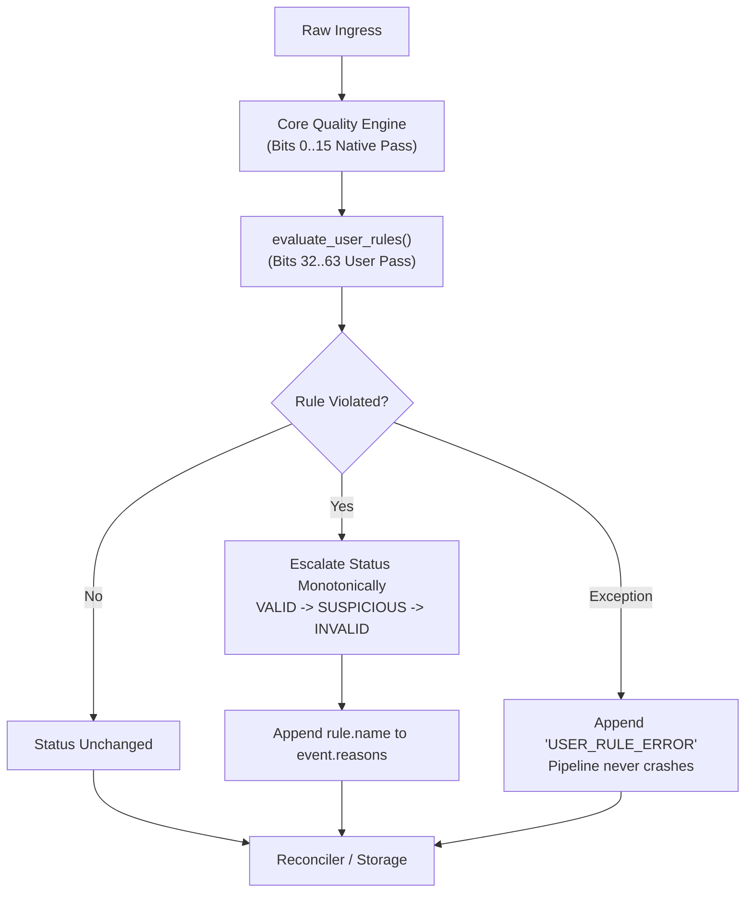

# Authoring Custom Quality Rules

MDRAP evaluates data quality with sub-microsecond latency. Beyond core platform rules, teams can inject proprietary compliance checks, exchange volatility collars, and sanity constraints via user quality rules.

---

## Quality Rule Bitmask Allocation

MDRAP uses a 64-bit mask for rule identifiers:

| Bit Range | Domain | Managed By | Description |
|-----------|--------|------------|-------------|
| **0 .. 15** | Core Platform Rules | MDRAP Engine | Schema validation, duplicate ticks, sequence gaps, crossed quotes, staleness. |
| **16 .. 31** | Protocol & Venue Corridors | MDRAP Extensions | Exchange price bands (NSE 10%), Xetra corridors (5%), Tokuhai indications (8%). |
| **32 .. 63** | User Domain Rules | User / Extensions | Proprietary alpha sanity, custom fat-finger bands, portfolio limits. |

Attempting to register a rule outside `32..63` raises `ValueError`.

---

## Quality Evaluation Lifecycle

User rules are evaluated post-native pass in [`evaluate_user_rules()`](file:///c:/Users/KIIT0001/Desktop/Projects/mdrap/src/rules.py#L81-L103):



### Invariant: Monotonic Status Escalation
Quality status priority is strictly:
$$\text{INVALID (2)} > \text{SUSPICIOUS (1)} > \text{VALID (0)}$$
An event marked `INVALID` by an upstream check can never be downgraded to `SUSPICIOUS` or `VALID` by a user rule.

---

## 1. Writing a Quality Rule Function

A rule function receives a [`CanonicalEvent`](file:///c:/Users/KIIT0001/Desktop/Projects/mdrap/src/models.py) and returns `True` if a violation occurred, or `False` if the tick passed:

```python
from models import CanonicalEvent

def detect_fat_finger(event: CanonicalEvent) -> bool:
    """Flag trades with price > $50,000 or quantity > 1,000,000 units."""
    if event.price is not None and event.price > 50000.0:
        return True
    if event.quantity is not None and event.quantity > 1000000.0:
        return True
    return False
```

---

## 2. Registration via Decorator

Use [`@register_rule`](file:///c:/Users/KIIT0001/Desktop/Projects/mdrap/src/rules.py#L28-L60) to register within application code:

```python
from models import CanonicalEvent, QualityStatus
from rules import register_rule

@register_rule(
    bit=32,
    name="FAT_FINGER_BREACH",
    description="Detects anomalous single-order notional spikes",
    severity=QualityStatus.SUSPICIOUS,
)
def check_fat_finger(event: CanonicalEvent) -> bool:
    if event.price and event.quantity:
        notional = event.price * event.quantity
        if notional > 5_000_000.0:  # $5M single trade cap
            return True
    return False

@register_rule(
    bit=33,
    name="INVALID_ZERO_PRICE_TRADE",
    description="Trades cannot execute at exactly 0.0",
    severity=QualityStatus.INVALID,
)
def check_zero_price_trade(event: CanonicalEvent) -> bool:
    return event.price == 0.0
```

---

## 3. Registration via Entry Points

To package quality rules into reusable wheels without touching core code, expose an initialization function under `mdrap.quality_rules` in `pyproject.toml`:

```toml
[project.entry-points."mdrap.quality_rules"]
compliance_rules = "my_package.rules:register_compliance_rules"
```

In `my_package/rules.py`:

```python
from models import QualityStatus
from rules import register_rule

def register_compliance_rules():
    """Entry point hook called by MDRAP upon startup."""
    register_rule(
        bit=34,
        name="SPREAD_OUTLIER",
        description="Spread exceeds 5% of mid price",
        severity=QualityStatus.SUSPICIOUS,
    )(lambda ev: bool(ev.bid_price and ev.ask_price and (ev.ask_price - ev.bid_price) > (ev.ask_price * 0.05)))
```

---

## 4. Error Handling & Fault Isolation

User quality rules execute within a defensive `try / except` block inside [`evaluate_user_rules()`](file:///c:/Users/KIIT0001/Desktop/Projects/mdrap/src/rules.py#L86-L103). If a user rule raises an uncaught exception (e.g. `ZeroDivisionError`, `AttributeError`):
- The pipeline **never crashes**.
- The event is preserved and tagged with `USER_RULE_ERROR` in `event.reasons`.
- The event routes to evidentiary quarantine for operator inspection.

---

## 5. Unit Testing Quality Rules

MDRAP provides [`unregister_rule()`](file:///c:/Users/KIIT0001/Desktop/Projects/mdrap/src/rules.py#L63-L68) and [`clear_user_rules()`](file:///c:/Users/KIIT0001/Desktop/Projects/mdrap/src/rules.py#L70-L74) for clean test fixtures:

```python
import pytest
from models import CanonicalEvent, EventType, QualityStatus
from rules import clear_user_rules, evaluate_user_rules, register_rule

@pytest.fixture(autouse=True)
def clean_rules():
    clear_user_rules()
    yield
    clear_user_rules()

def test_user_rule_escalation():
    @register_rule(bit=35, name="MAX_PRICE", severity=QualityStatus.INVALID)
    def rule_max_price(ev):
        return (ev.price or 0.0) > 1000.0

    ev = CanonicalEvent(
        event_id="t-1",
        instrument_id="AAPL",
        event_type=EventType.TRADE,
        exchange_timestamp=1700000000.0,
        receive_timestamp=1700000000.001,
        processing_timestamp=0.0,
        source="TEST",
        sequence_number=1,
        price=1200.0,
    )

    evaluated = evaluate_user_rules(ev)
    assert evaluated.quality_status == QualityStatus.INVALID
    assert "MAX_PRICE" in evaluated.reasons
```

---

## Source References

- [`src/rules.py`](file:///c:/Users/KIIT0001/Desktop/Projects/mdrap/src/rules.py): Implementation of [`@register_rule`](file:///c:/Users/KIIT0001/Desktop/Projects/mdrap/src/rules.py) and [`evaluate_user_rules()`](file:///c:/Users/KIIT0001/Desktop/Projects/mdrap/src/rules.py).
- [`src/models.py`](file:///c:/Users/KIIT0001/Desktop/Projects/mdrap/src/models.py): [`QualityStatus`](file:///c:/Users/KIIT0001/Desktop/Projects/mdrap/src/models.py) and [`CanonicalEvent`](file:///c:/Users/KIIT0001/Desktop/Projects/mdrap/src/models.py) domain definitions.
- [`src/quality.py`](file:///c:/Users/KIIT0001/Desktop/Projects/mdrap/src/quality.py): Core platform rules (bits 0..15).
