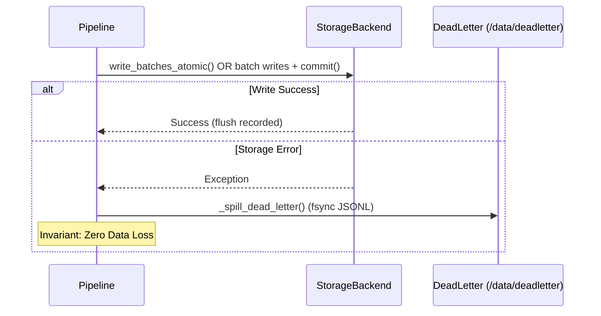

# Implementing Custom Storage Backends

MDRAP ships with an ultra-fast SQLite persistence engine with Write-Ahead Logging (WAL) and memory mapping ([`Store`](file:///c:/Users/KIIT0001/Desktop/Projects/mdrap/src/storage.py)). For distributed deployments, time-series databases, or cloud tiers, persistence can be swapped with any engine (PostgreSQL, TimescaleDB, ClickHouse) implementing [`StorageBackend`](file:///c:/Users/KIIT0001/Desktop/Projects/mdrap/src/protocols.py).

---

## The StorageBackend Protocol

Defined in [`src/protocols.py`](file:///c:/Users/KIIT0001/Desktop/Projects/mdrap/src/protocols.py):

```python
from typing import Any, Protocol, runtime_checkable
from models import CanonicalEvent

@runtime_checkable
class StorageBackend(Protocol):
    """Protocol for pluggable event persistence engines."""

    def write_canonical_batch(self, events: list[CanonicalEvent]) -> None: ...
    def write_quarantine_batch(self, rows: list[tuple]) -> None: ...
    def write_lineage_batch(self, rows: list[tuple]) -> None: ...
    def upsert_source_health(self, rows: list[tuple]) -> None: ...
    def write_batches_atomic(self, canonical=None, quarantine=None, lineage=None, source_health=None) -> None: ...
    def write_bbo_batch(self, bbos: list) -> None: ...
    def commit(self) -> None: ...
    def query_events(self, instrument_id=None, limit=1000) -> list[dict]: ...
    def latest(self, instrument_id: str, limit=1) -> list[dict]: ...
    def feed_health(self) -> list[dict]: ...
    def quarantine_sample(self, limit=20) -> list[dict]: ...
    def counts(self) -> dict[str, int]: ...
    def close(self) -> None: ...
```

---

## Pipeline Flush Lifecycle

[`Pipeline`](file:///c:/Users/KIIT0001/Desktop/Projects/mdrap/src/pipeline.py) batches ticks in memory queues (`BATCH_SIZE=2000` or `flush_interval_s=1.0s`):



### Flush Protocol:
1. **Atomic Optimization**: If backend provides `write_batches_atomic()`, [`Pipeline.flush()`](file:///c:/Users/KIIT0001/Desktop/Projects/mdrap/src/pipeline.py#L610-L647) submits canonical, quarantine, lineage, and health records in one call.
2. **Fallback Sequence**: Otherwise calls `write_canonical_batch()`, `write_quarantine_batch()`, `write_lineage_batch()`, `upsert_source_health()`, then `commit()`.
3. **Dead-Letter Spilling**: On unhandled database exceptions, in-memory batches are dumped to fsync'd JSONL files under `data/deadletter/spill-<ns>.jsonl` before raising.

---

## Skeleton PostgreSQL Implementation

```python
from __future__ import annotations
import json
from typing import Any
from models import CanonicalEvent

class PostgresStorageBackend:
    """Thread-safe PostgreSQL persistence engine implementing StorageBackend."""

    def __init__(self, connection_pool: Any):
        self.pool = connection_pool

    def write_batches_atomic(
        self,
        canonical: list[CanonicalEvent] | None = None,
        quarantine: list[tuple] | None = None,
        lineage: list[tuple] | None = None,
        source_health: list[tuple] | None = None,
    ) -> None:
        with self.pool.connection() as conn, conn.cursor() as cur:
            if canonical:
                cur.executemany(
                    """INSERT INTO canonical_events (
                        event_id, instrument_id, event_type, exchange_timestamp,
                        receive_timestamp, processing_timestamp, source, sequence_number,
                        price, quantity, bid_price, bid_size, ask_price, ask_size,
                        quality_status, reasons, raw_id
                    ) VALUES (%s,%s,%s,%s,%s,%s,%s,%s,%s,%s,%s,%s,%s,%s,%s,%s,%s)
                    ON CONFLICT (event_id) DO NOTHING;""",
                    [(ev.event_id, ev.instrument_id, ev.event_type.value, ev.exchange_timestamp,
                      ev.receive_timestamp, ev.processing_timestamp, ev.source, ev.sequence_number,
                      ev.price, ev.quantity, ev.bid_price, ev.bid_size, ev.ask_price, ev.ask_size,
                      ev.quality_status.value, json.dumps(ev.reasons), ev.raw_id) for ev in canonical],
                )
            if quarantine:
                cur.executemany(
                    """INSERT INTO quarantine (event_id, instrument_id, source, quality_status,
                       reasons, payload_json, receive_timestamp) VALUES (%s,%s,%s,%s,%s,%s,%s)
                       ON CONFLICT (event_id) DO NOTHING;""",
                    quarantine,
                )
            if lineage:
                cur.executemany(
                    """INSERT INTO lineage (event_id, instrument_id, source_event_ids, raw_id,
                       transformations, validations_run, conflict, decision_reason, chosen_source,
                       code_version, created_at) VALUES (%s,%s,%s,%s,%s,%s,%s,%s,%s,%s,%s)
                       ON CONFLICT (event_id) DO NOTHING;""",
                    lineage,
                )
            if source_health:
                cur.executemany(
                    """INSERT INTO source_health (source, total, invalid, suspicious, duplicate, gap,
                       ewma_latency_s, score, updated_at) VALUES (%s,%s,%s,%s,%s,%s,%s,%s,%s)
                       ON CONFLICT (source) DO UPDATE SET total=EXCLUDED.total, invalid=EXCLUDED.invalid,
                       suspicious=EXCLUDED.suspicious, duplicate=EXCLUDED.duplicate, gap=EXCLUDED.gap,
                       ewma_latency_s=EXCLUDED.ewma_latency_s, score=EXCLUDED.score, updated_at=EXCLUDED.updated_at;""",
                    source_health,
                )
            conn.commit()

    def write_canonical_batch(self, events: list[CanonicalEvent]) -> None:
        self.write_batches_atomic(canonical=events)

    def write_quarantine_batch(self, rows: list[tuple]) -> None:
        self.write_batches_atomic(quarantine=rows)

    def write_lineage_batch(self, rows: list[tuple]) -> None:
        self.write_batches_atomic(lineage=rows)

    def upsert_source_health(self, rows: list[tuple]) -> None:
        self.write_batches_atomic(source_health=rows)

    def write_bbo_batch(self, bbos: list) -> None: pass
    def commit(self) -> None: pass

    def query_events(self, instrument_id: str | None = None, limit: int = 1000) -> list[dict]:
        with self.pool.connection() as conn, conn.cursor() as cur:
            sql = "SELECT * FROM canonical_events WHERE instrument_id = %s LIMIT %s;" if instrument_id else "SELECT * FROM canonical_events LIMIT %s;"
            cur.execute(sql, (instrument_id, limit) if instrument_id else (limit,))
            return [dict(row) for row in cur.fetchall()]

    def latest(self, instrument_id: str, limit: int = 1) -> list[dict]:
        return self.query_events(instrument_id=instrument_id, limit=limit)

    def feed_health(self) -> list[dict]:
        with self.pool.connection() as conn, conn.cursor() as cur:
            cur.execute("SELECT * FROM source_health;")
            return [dict(row) for row in cur.fetchall()]

    def quarantine_sample(self, limit: int = 20) -> list[dict]:
        with self.pool.connection() as conn, conn.cursor() as cur:
            cur.execute("SELECT * FROM quarantine ORDER BY receive_timestamp DESC LIMIT %s;", (limit,))
            return [dict(row) for row in cur.fetchall()]

    def counts(self) -> dict[str, int]:
        with self.pool.connection() as conn, conn.cursor() as cur:
            cur.execute("SELECT COUNT(*) FROM canonical_events;")
            c = cur.fetchone()[0]
            cur.execute("SELECT COUNT(*) FROM quarantine;")
            q = cur.fetchone()[0]
            return {"canonical_events": c, "quarantine": q}

    def close(self) -> None:
        self.pool.close()
```

---

## Source References

- [`src/protocols.py`](file:///c:/Users/KIIT0001/Desktop/Projects/mdrap/src/protocols.py): [`StorageBackend`](file:///c:/Users/KIIT0001/Desktop/Projects/mdrap/src/protocols.py) protocol definition.
- [`src/storage.py`](file:///c:/Users/KIIT0001/Desktop/Projects/mdrap/src/storage.py): Production SQLite [`Store`](file:///c:/Users/KIIT0001/Desktop/Projects/mdrap/src/storage.py) with WAL and PRAGMA tuning.
- [`src/pipeline.py`](file:///c:/Users/KIIT0001/Desktop/Projects/mdrap/src/pipeline.py): Batch buffer management, flush execution, and dead-letter queue.
