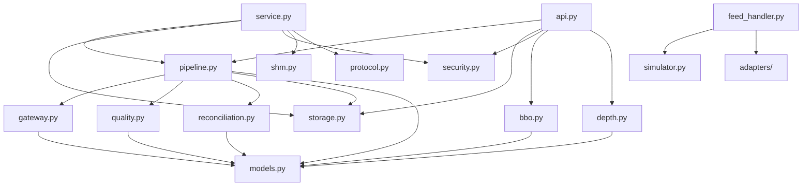

# MDRAP Architecture Map

This document serves as the canonical architectural map and reference for the module layout of the Market Data Reliability & Acceleration Platform (MDRAP). MDRAP employs a flat `src/` layout consisting of 72 Python modules (alongside native C acceleration sources and definition files). All Python modules import directly from one another (for example, `from models import CanonicalEvent` or `from storage import Store`) without nested namespace packages or heavyweight ORM/web frameworks. The platform adheres to strict data segregation across Raw, Canonical, Quarantined, and Derived analytics tiers, enforces an immutable quarantine-never-drop policy, prioritizes quality status evaluation (`INVALID` > `SUSPICIOUS` > `VALID`), and relies on deterministic monotonic identifiers generated via `itertools.count()`.

---

## Module Layers

The 72 Python modules in `src/` are structured across 12 distinct functional layers, categorized from low-level data ingest and canonical pipeline processing to analytical engines, delivery fabrics, and client interfaces.

### Core Pipeline (stable)

| Module | Purpose | Key Exports | Stability |
|---|---|---|---|
| [`models.py`](file:///c:/Users/KIIT0001/Desktop/Projects/mdrap/src/models.py) | Canonical data types | `RawEvent`, `CanonicalEvent`, `EventType`, `QualityStatus`, `Reason`, `AssetClass` | `stable` |
| [`gateway.py`](file:///c:/Users/KIIT0001/Desktop/Projects/mdrap/src/gateway.py) | Ingestion and normalization | `ingest()`, `normalize()`, `SchemaError` | `stable` |
| [`quality.py`](file:///c:/Users/KIIT0001/Desktop/Projects/mdrap/src/quality.py) | Data quality evaluation engine | `QualityEngine`, `QualityConfig` | `stable` |
| [`reconciliation.py`](file:///c:/Users/KIIT0001/Desktop/Projects/mdrap/src/reconciliation.py) | Cross-feed reconciliation | `Reconciler`, `ReliabilityTracker` | `stable` |
| [`pipeline.py`](file:///c:/Users/KIIT0001/Desktop/Projects/mdrap/src/pipeline.py) | Pipeline orchestration | `Pipeline`, `tuned_gc` | `stable` |
| [`metrics.py`](file:///c:/Users/KIIT0001/Desktop/Projects/mdrap/src/metrics.py) | Runtime metrics | `RunMetrics`, `CompactSampleBuffer`, `percentile` | `stable` |
| [`config.py`](file:///c:/Users/KIIT0001/Desktop/Projects/mdrap/src/config.py) | Configuration dataclasses | `PlatformConfig`, `QualityConfig`, `PipelineConfig`, `StorageConfig` | `stable` |
| [`config_loader.py`](file:///c:/Users/KIIT0001/Desktop/Projects/mdrap/src/config_loader.py) | YAML config loading | `load_yaml_config` | `stable` |
| [`rules.py`](file:///c:/Users/KIIT0001/Desktop/Projects/mdrap/src/rules.py) | User-defined quality rules | `@register_rule`, `evaluate_user_rules` | `stable` |
| [`rules.def`](file:///c:/Users/KIIT0001/Desktop/Projects/mdrap/src/rules.def) | C X-Macro quality rule definitions | Preprocessor table of validation rules | `stable` |
| [`protocols.py`](file:///c:/Users/KIIT0001/Desktop/Projects/mdrap/src/protocols.py) | Extension Protocol interfaces | `StorageBackend`, `AuthProvider`, `QualityEvaluator`, `OutputSink` | `stable` |

### Storage (stable)

| Module | Purpose | Key Exports | Stability |
|---|---|---|---|
| [`storage.py`](file:///c:/Users/KIIT0001/Desktop/Projects/mdrap/src/storage.py) | SQLite persistence engine | `Store` | `stable` |
| [`columnar.py`](file:///c:/Users/KIIT0001/Desktop/Projects/mdrap/src/columnar.py) | DuckDB analytical queries | `ColumnarStore` | `beta` |
| [`archive.py`](file:///c:/Users/KIIT0001/Desktop/Projects/mdrap/src/archive.py) | Raw event archival | `RawArchive`, `replay` | `stable` |
| [`bardb.py`](file:///c:/Users/KIIT0001/Desktop/Projects/mdrap/src/bardb.py) | Bar/candle database | `BarDatabase` | `beta` |
| [`chd.py`](file:///c:/Users/KIIT0001/Desktop/Projects/mdrap/src/chd.py) | CHD machine | `CHDMachine` | `beta` |
| [`chd_history.py`](file:///c:/Users/KIIT0001/Desktop/Projects/mdrap/src/chd_history.py) | CHD history engine | `CHDHistoryEngine` | `beta` |

### Ingestion & Feed Handling (stable)

| Module | Purpose | Key Exports | Stability |
|---|---|---|---|
| [`adapters/__init__.py`](file:///c:/Users/KIIT0001/Desktop/Projects/mdrap/src/adapters/__init__.py) | FeedAdapter Protocol + entry_point discovery | `FeedAdapter`, discovery functions | `stable` |
| [`adapters/template.py`](file:///c:/Users/KIIT0001/Desktop/Projects/mdrap/src/adapters/template.py) | Template adapter implementation | Example adapter implementation | `stable` |
| [`feed_handler.py`](file:///c:/Users/KIIT0001/Desktop/Projects/mdrap/src/feed_handler.py) | Streaming feed supervisor | `StreamingFeedSupervisor` | `stable` |
| [`simulator.py`](file:///c:/Users/KIIT0001/Desktop/Projects/mdrap/src/simulator.py) | Synthetic feed simulator | `FeedSimulator`, `SimulatorConfig` | `stable` |
| [`ws_feed.py`](file:///c:/Users/KIIT0001/Desktop/Projects/mdrap/src/ws_feed.py) | WebSocket feed manager for crypto venues | `WebSocketFeedManager` | `beta` |
| [`polygon_feed.py`](file:///c:/Users/KIIT0001/Desktop/Projects/mdrap/src/polygon_feed.py) | Polygon.io feed manager | `PolygonFeedManager` | `beta` |
| [`databento_feed.py`](file:///c:/Users/KIIT0001/Desktop/Projects/mdrap/src/databento_feed.py) | Databento feed manager | `DatabentoFeedManager` | `beta` |
| [`live.py`](file:///c:/Users/KIIT0001/Desktop/Projects/mdrap/src/live.py) | Live market data connector | `LiveConnector` | `beta` |

### Security & Audit (stable)

| Module | Purpose | Key Exports | Stability |
|---|---|---|---|
| [`security.py`](file:///c:/Users/KIIT0001/Desktop/Projects/mdrap/src/security.py) | RBAC, HMAC auth, API key management | `SecurityManager`, `Role`, `ClientEntitlement` | `stable` |
| [`audit_format.py`](file:///c:/Users/KIIT0001/Desktop/Projects/mdrap/src/audit_format.py) | Merkle-chain audit hash computation | `compute_audit_hash` | `stable` |

### Delivery & Output (stable)

| Module | Purpose | Key Exports | Stability |
|---|---|---|---|
| [`shm.py`](file:///c:/Users/KIIT0001/Desktop/Projects/mdrap/src/shm.py) | Shared memory ring buffer SPMC | `SHMWriter`, `SHMReader` | `stable` |
| [`protocol.py`](file:///c:/Users/KIIT0001/Desktop/Projects/mdrap/src/protocol.py) | Binary wire protocol | `pack_tick_frame`, `unpack_tick_frame` | `stable` |
| [`service.py`](file:///c:/Users/KIIT0001/Desktop/Projects/mdrap/src/service.py) | TCP streaming daemon | `MarketDataDaemon` | `stable` |
| [`gateway_tcp.py`](file:///c:/Users/KIIT0001/Desktop/Projects/mdrap/src/gateway_tcp.py) | TCP gateway server | `TCPGatewayServer` | `beta` |

### API (beta)

| Module | Purpose | Key Exports | Stability |
|---|---|---|---|
| [`api.py`](file:///c:/Users/KIIT0001/Desktop/Projects/mdrap/src/api.py) | FastAPI REST + WebSocket server | `create_app`, `AppState` | `beta` |

### Analytics & Quantitative (beta)

| Module | Purpose | Key Exports | Stability |
|---|---|---|---|
| [`analytics.py`](file:///c:/Users/KIIT0001/Desktop/Projects/mdrap/src/analytics.py) | OHLCV, spread, volatility aggregation | `MarketAnalytics` | `beta` |
| [`bbo.py`](file:///c:/Users/KIIT0001/Desktop/Projects/mdrap/src/bbo.py) | Best Bid/Offer engine | `BBOEngine`, `ConsolidatedBBO` | `stable` |
| [`depth.py`](file:///c:/Users/KIIT0001/Desktop/Projects/mdrap/src/depth.py) | L2 order book consolidation | `ConsolidatedDepthEngine` | `beta` |
| [`features.py`](file:///c:/Users/KIIT0001/Desktop/Projects/mdrap/src/features.py) | Technical indicators | `sma`, `ema`, `rsi`, `macd`, `bollinger_bands`, `atr` | `beta` |
| [`options.py`](file:///c:/Users/KIIT0001/Desktop/Projects/mdrap/src/options.py) | BSM options pricing | `bsm_price`, `bsm_greeks`, `implied_volatility` | `beta` |
| [`risk.py`](file:///c:/Users/KIIT0001/Desktop/Projects/mdrap/src/risk.py) | Risk analytics | `PortfolioRiskEngine`, `ReturnSeries`, `DrawdownCircuitBreaker` | `beta` |
| [`flow_tracker.py`](file:///c:/Users/KIIT0001/Desktop/Projects/mdrap/src/flow_tracker.py) | Order flow analysis | `OrderFlowTracker`, `LeeReadyClassifier` | `beta` |
| [`backtest.py`](file:///c:/Users/KIIT0001/Desktop/Projects/mdrap/src/backtest.py) | Backtesting engine | `BacktestEngine` | `beta` |
| [`tca.py`](file:///c:/Users/KIIT0001/Desktop/Projects/mdrap/src/tca.py) | Transaction cost analysis | `TCAEngine`, `TCAMetrics`, `ExecutionRecord` | `experimental` |
| [`portfolio.py`](file:///c:/Users/KIIT0001/Desktop/Projects/mdrap/src/portfolio.py) | Portfolio tracking | `PortfolioTracker` | `beta` |

### Research & Alternative Data (experimental)

| Module | Purpose | Key Exports | Stability |
|---|---|---|---|
| [`research.py`](file:///c:/Users/KIIT0001/Desktop/Projects/mdrap/src/research.py) | Company research engine | `EdgarClient`, `CompanyProfile`, `FilingRecord` | `experimental` |
| [`news.py`](file:///c:/Users/KIIT0001/Desktop/Projects/mdrap/src/news.py) | Financial news and sentiment | `NewsFeed`, `FinancialSentimentAnalyzer` | `experimental` |
| [`corporate_actions.py`](file:///c:/Users/KIIT0001/Desktop/Projects/mdrap/src/corporate_actions.py) | Corporate actions engine | `CorporateActionsEngine` | `experimental` |
| [`vessel.py`](file:///c:/Users/KIIT0001/Desktop/Projects/mdrap/src/vessel.py) | AIS vessel tracking | `VesselTracker`, `Vessel`, `Chokepoint` | `experimental` |

### Infrastructure & Native Acceleration (stable)

| Module | Purpose | Key Exports | Stability |
|---|---|---|---|
| [`fastpath.py`](file:///c:/Users/KIIT0001/Desktop/Projects/mdrap/src/fastpath.py) | C FFI acceleration layer | `FastQualityEngine`, `NativeReplayBuffer`, `is_available` | `stable` |
| [`fastpath.c`](file:///c:/Users/KIIT0001/Desktop/Projects/mdrap/src/fastpath.c) | C source for native acceleration | Fast validation, ring buffer, and Welford variance routines | `stable` |
| [`fastpath.pyi`](file:///c:/Users/KIIT0001/Desktop/Projects/mdrap/src/fastpath.pyi) | Type stubs | Type annotations for native C module | `stable` |

### CLI & Terminal UI (beta)

| Module | Purpose | Key Exports | Stability |
|---|---|---|---|
| [`cli.py`](file:///c:/Users/KIIT0001/Desktop/Projects/mdrap/src/cli.py) | Main CLI entry point | `main` | `beta` |
| [`trading_cli.py`](file:///c:/Users/KIIT0001/Desktop/Projects/mdrap/src/trading_cli.py) | Trading CLI | `add_trading_parsers`, `cmd_backtest`, `cmd_risk` | `experimental` |
| [`navigator.py`](file:///c:/Users/KIIT0001/Desktop/Projects/mdrap/src/navigator.py) | TUI navigator | `MDRAPNavigator` | `beta` |
| [`terminal_display.py`](file:///c:/Users/KIIT0001/Desktop/Projects/mdrap/src/terminal_display.py) | Rich terminal rendering | ANSI/Rich renderers, tables, live tickers | `beta` |
| [`dashboard.py`](file:///c:/Users/KIIT0001/Desktop/Projects/mdrap/src/dashboard.py) | Dashboard view | Summary cockpit and telemetry widgets | `beta` |
| [`term.py`](file:///c:/Users/KIIT0001/Desktop/Projects/mdrap/src/term.py) | Console abstraction | Terminal screen, formatting, and cursor utilities | `stable` |

### SDK & Client Libraries (beta)

| Module | Purpose | Key Exports | Stability |
|---|---|---|---|
| [`client.py`](file:///c:/Users/KIIT0001/Desktop/Projects/mdrap/src/client.py) | Python SDK client | `MDRAPClient` | `beta` |
| [`strategy_sdk.py`](file:///c:/Users/KIIT0001/Desktop/Projects/mdrap/src/strategy_sdk.py) | Strategy development SDK | Quantitative strategy base classes and runner interfaces | `experimental` |

### Supporting Infrastructure (various)

| Module | Purpose | Key Exports | Stability |
|---|---|---|---|
| [`symbology.py`](file:///c:/Users/KIIT0001/Desktop/Projects/mdrap/src/symbology.py) | Symbol resolution | `resolve_symbol` | `stable` |
| [`venues.py`](file:///c:/Users/KIIT0001/Desktop/Projects/mdrap/src/venues.py) | Global venue definitions | Global venue definitions and metadata registry | `stable` |
| [`fx.py`](file:///c:/Users/KIIT0001/Desktop/Projects/mdrap/src/fx.py) | FX currency conversion | `FXConverter` | `beta` |
| [`scheduler.py`](file:///c:/Users/KIIT0001/Desktop/Projects/mdrap/src/scheduler.py) | Task scheduler | `Scheduler`, `ScheduledJob`, `CronParser` | `beta` |
| [`watchdog.py`](file:///c:/Users/KIIT0001/Desktop/Projects/mdrap/src/watchdog.py) | Source health watchdog | `SourceWatchdog` | `stable` |
| [`alerts.py`](file:///c:/Users/KIIT0001/Desktop/Projects/mdrap/src/alerts.py) | Alert engine | `AlertEngine` | `beta` |
| [`benchmark.py`](file:///c:/Users/KIIT0001/Desktop/Projects/mdrap/src/benchmark.py) | Pipeline benchmarking | `run_benchmark` | `stable` |
| [`export.py`](file:///c:/Users/KIIT0001/Desktop/Projects/mdrap/src/export.py) | CSV/JSON export utilities | Export utilities for ticks, bars, and anomalies | `stable` |
| [`exporter.py`](file:///c:/Users/KIIT0001/Desktop/Projects/mdrap/src/exporter.py) | Market data exporter | `MarketDataExporter` | `beta` |
| [`manifest.py`](file:///c:/Users/KIIT0001/Desktop/Projects/mdrap/src/manifest.py) | Build manifest generation | Build manifest generator and commit hash utilities | `stable` |
| [`chaos.py`](file:///c:/Users/KIIT0001/Desktop/Projects/mdrap/src/chaos.py) | Chaos/fault injection | `ChaosEngine`, `ChaosInjector` | `beta` |
| [`stresstest.py`](file:///c:/Users/KIIT0001/Desktop/Projects/mdrap/src/stresstest.py) | Stress testing | `stress_end_to_end`, `stress_gateway`, `stress_quality_engine` | `beta` |
| [`workload_simulator.py`](file:///c:/Users/KIIT0001/Desktop/Projects/mdrap/src/workload_simulator.py) | Concurrent workload simulator | `ConcurrentWorkloadSimulator`, `UserArchetype`, `DeviceConfig` | `beta` |
| [`multicast_arbitrator.py`](file:///c:/Users/KIIT0001/Desktop/Projects/mdrap/src/multicast_arbitrator.py) | A/B multicast feed arbitration | `ABFeedArbitrator` | `beta` |
| [`sbe.py`](file:///c:/Users/KIIT0001/Desktop/Projects/mdrap/src/sbe.py) | SBE codec | Simple Binary Encoding (SBE) encoders and decoders | `experimental` |
| [`itch.py`](file:///c:/Users/KIIT0001/Desktop/Projects/mdrap/src/itch.py) | ITCH 5.0 parser | `ITCHParser`, `ITCHOrderBookTracker` | `beta` |
| [`fix_engine.py`](file:///c:/Users/KIIT0001/Desktop/Projects/mdrap/src/fix_engine.py) | FIX protocol engine | `FIXSession`, `FIXEngineServer` | `experimental` |
| [`mbo.py`](file:///c:/Users/KIIT0001/Desktop/Projects/mdrap/src/mbo.py) | Market-by-Order book | `OrderBookMBO` | `beta` |

---

## Extension Points

MDRAP provides 5 primary extension points that allow external packages or user code to plug into the pipeline lifecycle without modifying core engine files:

| Extension Point | Protocol | Entry Point Group | Registration | Documentation |
|---|---|---|---|---|
| Feed Adapters | `FeedAdapter` | `mdrap.adapters` | `entry_points` | [docs/extending/feed-adapter.md](file:///c:/Users/KIIT0001/Desktop/Projects/mdrap/docs/extending/feed-adapter.md) |
| Quality Rules | — (decorator) | `mdrap.quality_rules` | `@register_rule(bit=N)` | [docs/extending/quality-rules.md](file:///c:/Users/KIIT0001/Desktop/Projects/mdrap/docs/extending/quality-rules.md) |
| Storage Backends | `StorageBackend` | `mdrap.storage_backends` | `entry_points` | [docs/extending/storage-backend.md](file:///c:/Users/KIIT0001/Desktop/Projects/mdrap/docs/extending/storage-backend.md) |
| Auth Providers | `AuthProvider` | `mdrap.auth_providers` | `entry_points` | [docs/extending/auth-provider.md](file:///c:/Users/KIIT0001/Desktop/Projects/mdrap/docs/extending/auth-provider.md) |
| Output Sinks | `OutputSink` | `mdrap.output_sinks` | `entry_points` | [docs/extending/output-sink.md](file:///c:/Users/KIIT0001/Desktop/Projects/mdrap/docs/extending/output-sink.md) |

---

## Dependency Graph

The following Mermaid flowchart displays core module relationships and dependencies across ingestion, validation, state reconciliation, persistence, and output distribution:



---

## Stability Labels

MDRAP categorizes all modules using explicit stability tiers to clarify public API support and deprecation lifecycle commitments:

- **stable**: Public API will not break without a deprecation cycle. Safe to depend on for production deployments and third-party integrations.
- **beta**: API may change between minor versions. Functional, tested, and active in pipeline benchmarks, but interface contracts are not yet frozen.
- **experimental**: No stability guarantees. May be incomplete, undergoing rapid iteration, untested in production environments, or subject to redesign/removal.

Each module declares its stability tier at the module level:

```python
__stability__ = "stable"  # or "beta" | "experimental"
```
