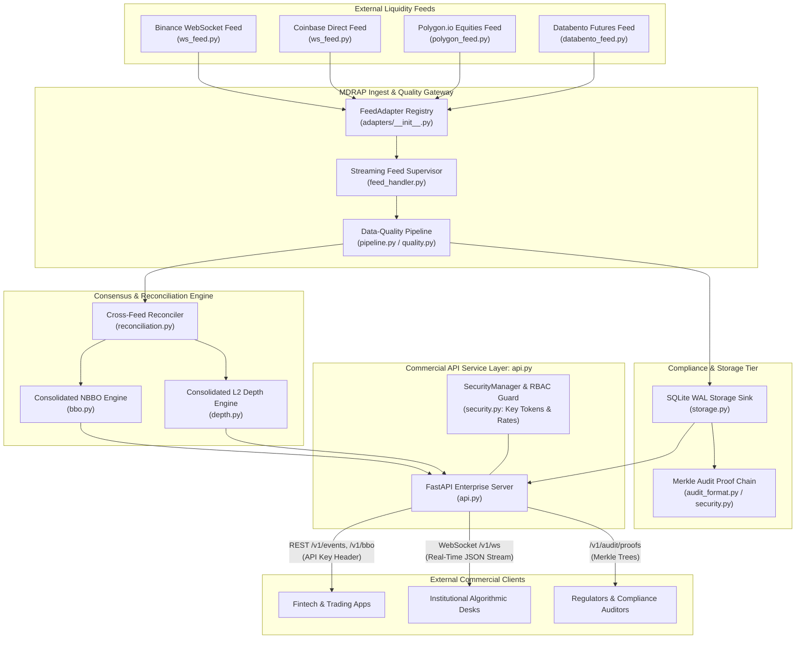
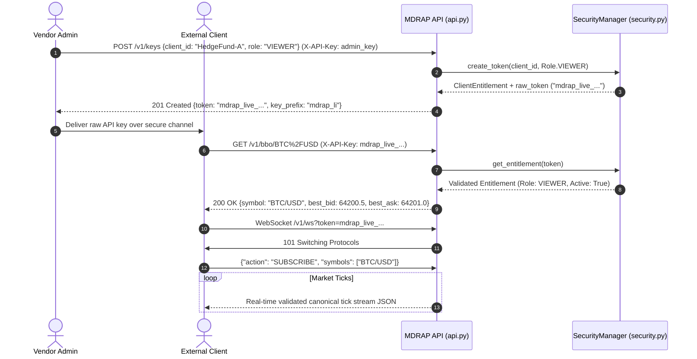

# Market Data Redistribution Starter Architecture

Production deployment blueprint for commercial market data vendors, aggregators, and institutional B2B redistribution hubs using the Market Data Reliability & Acceleration Platform (MDRAP).

---

## 1. Overview & Vendor Objectives

Market data redistributors ingest feeds from disparate sources (exchanges, alternative trading systems, OTC desks), resolve latency anomalies and broken timestamps, build a reconciled consensus view (Consolidated NBBO and consolidated L2 depth), and stream reliable feeds to commercial clients with rigorous access control and auditability.

Key vendor capabilities provided:
- **Feed Normalization & Redundancy**: Ingesting from multiple venues (Binance, Coinbase, Kraken, Polygon, Databento) via standardized adapters.
- **Cross-Venue Consensus & Arbitration**: Dynamic reliability scoring and failover arbitration across concurrent feeds.
- **Commercial REST & WebSocket API**: Secure, token-authenticated endpoints for real-time streaming, historical ticks, and market depth.
- **Multi-Tenant Security & API Key RBAC**: Client entitlement tiers (`VIEWER`, `OPERATOR`, `ADMIN`) with automatic rate limiting and revocation.
- **Cryptographic Audit Trail**: Merkle-chained SHA-256 hash proofs for regulatory compliance (SEC Rule 613 / MiFID II RTS 25).



---

## 2. Core Components Used

| Component | Module | Role in Data Vendor Platform |
|---|---|---|
| **Feed Adapter Infrastructure** | [`adapters/__init__.py`](file:///c:/Users/KIIT0001/Desktop/Projects/mdrap/src/adapters/__init__.py), [`feed_handler.py`](file:///c:/Users/KIIT0001/Desktop/Projects/mdrap/src/feed_handler.py) | Dynamic [`FeedAdapter`](file:///c:/Users/KIIT0001/Desktop/Projects/mdrap/src/adapters/__init__.py) discovery via standard library entry points (`mdrap.adapters`) and feed life-cycle supervision. |
| **Exchange Feed Managers** | [`ws_feed.py`](file:///c:/Users/KIIT0001/Desktop/Projects/mdrap/src/ws_feed.py), [`polygon_feed.py`](file:///c:/Users/KIIT0001/Desktop/Projects/mdrap/src/polygon_feed.py), [`databento_feed.py`](file:///c:/Users/KIIT0001/Desktop/Projects/mdrap/src/databento_feed.py) | Connectors handling vendor-specific handshakes, subscriptions, reconnects, and message normalization. |
| **Reconciliation & Consensus** | [`reconciliation.py`](file:///c:/Users/KIIT0001/Desktop/Projects/mdrap/src/reconciliation.py), [`bbo.py`](file:///c:/Users/KIIT0001/Desktop/Projects/mdrap/src/bbo.py), [`depth.py`](file:///c:/Users/KIIT0001/Desktop/Projects/mdrap/src/depth.py) | Multi-venue best bid/offer synthesis, source reliability scoring ([`ReliabilityTracker`](file:///c:/Users/KIIT0001/Desktop/Projects/mdrap/src/reconciliation.py)), and consolidated Level-2 order books. |
| **Commercial API Service** | [`api.py`](file:///c:/Users/KIIT0001/Desktop/Projects/mdrap/src/api.py) | Enterprise FastAPI application exposing authenticated REST endpoints and WebSocket broadcast distribution. |
| **Security & Entitlements** | [`security.py`](file:///c:/Users/KIIT0001/Desktop/Projects/mdrap/src/security.py) | Token management, client provisioning, token bucket rate limiting (20,000 eps/client), and RBAC (`VIEWER`, `OPERATOR`, `ADMIN`). |
| **Cryptographic Audit Trail** | [`storage.py`](file:///c:/Users/KIIT0001/Desktop/Projects/mdrap/src/storage.py), [`audit_format.py`](file:///c:/Users/KIIT0001/Desktop/Projects/mdrap/src/audit_format.py) | Merkle-tree rooted hash chaining for non-repudiation of every published quote and trade. |

---

## 3. Containerized Deployment (Docker)

Deploying MDRAP as a self-hosted vendor hub is managed using the multi-stage [`Dockerfile`](file:///c:/Users/KIIT0001/Desktop/Projects/mdrap/Dockerfile) and Docker Compose:

### `docker-compose.yml`

```yaml
version: "3.8"

services:
  mdrap-vendor-api:
    build:
      context: .
      dockerfile: Dockerfile
    container_name: mdrap_data_hub
    restart: unless-stopped
    ports:
      - "8000:8000"   # Commercial REST & WebSocket API
    environment:
      - MDRAP_HOST=0.0.0.0
      - MDRAP_PORT=8000
      - MDRAP_DB_PATH=/data/mdrap_vendor.db
      - MDRAP_CORS_ORIGINS=*
      - MDRAP_DAEMON_TOKEN=${MDRAP_ADMIN_BOOTSTRAP_TOKEN}
    volumes:
      - mdrap_data:/data
    healthcheck:
      test: ["CMD", "curl", "-f", "http://127.0.0.1:8000/v1/health"]
      interval: 15s
      timeout: 5s
      retries: 3
      start_period: 10s

volumes:
  mdrap_data:
    driver: local
```

Start the service:

```bash
# Set your bootstrap admin token and launch the container
export MDRAP_ADMIN_BOOTSTRAP_TOKEN="secret-admin-token-12345"
docker compose up -d
```

---

## 4. API Authentication & Entitlement Flow

MDRAP enforces Role-Based Access Control (RBAC) across three distinct permission tiers:

| Role | Permissions | Typical Consumer |
|---|---|---|
| `VIEWER` | Read-only access to `/v1/events`, `/v1/bbo`, `/v1/depth`, and `/v1/ws`. | Commercial subscribers, fintech apps, client algorithms. |
| `OPERATOR` | Feed lifecycle management, circuit breaker reset, manual sync. | Internal monitoring engineers, data reliability officers. |
| `ADMIN` | API key provisioning, entitlement revocation, rate limit overrides. | Platform owners, billing automation services. |



### 1. Generating a Client API Key

```bash
curl -X POST "http://localhost:8000/v1/keys" \
  -H "X-API-Key: secret-admin-token-12345" \
  -H "Content-Type: application/json" \
  -d '{
    "client_id": "Acme-Fund",
    "role": "VIEWER",
    "expires_at": null
  }'
```

**Response:**
```json
{
  "token": "mdrap_live_9fa872bca93b8214d021f009",
  "key_prefix": "mdrap_li",
  "client_id": "Acme-Fund",
  "role": "VIEWER",
  "created_at": 1788220000.0,
  "message": "Store this API key securely. It will not be shown again."
}
```

### 2. Client Querying Real-Time Consolidated BBO

Clients pass their key via `X-API-Key` or `Authorization: Bearer <token>`:

```bash
curl -X GET "http://localhost:8000/v1/bbo/BTC%2FUSD" \
  -H "X-API-Key: mdrap_live_9fa872bca93b8214d021f009"
```

### 3. Client WebSocket Streaming Subscription

```python
import asyncio
import json
import websockets

API_TOKEN = "mdrap_live_9fa872bca93b8214d021f009"
WS_URL = f"ws://localhost:8000/v1/ws?token={API_TOKEN}"


async def stream_market_data():
    async with websockets.connect(WS_URL) as ws:
        # Subscribe to specific symbols or "ALL"
        sub_msg = {"action": "SUBSCRIBE", "symbols": ["BTC/USD", "ETH/USD"]}
        await ws.send(json.dumps(sub_msg))
        print("[*] Subscribed to real-time vendor feed.")

        while True:
            msg = await ws.recv()
            event = json.loads(msg)
            print(f"[RECV] {event.get('type')}: {event.get('symbol')} @ {event.get('price')} (Status: {event.get('quality_status')})")


if __name__ == "__main__":
    asyncio.run(stream_market_data())
```

---

## 5. Regulatory Compliance & Merkle Audit Verification

For audits and compliance verification, the vendor API allows clients and regulators to inspect cryptographic proofs confirming no market data records were forged, modified, or omitted:

```bash
# Verify integrity of an event batch via Merkle root hash
curl -X GET "http://localhost:8000/v1/audit/proofs?from_seq=1000&to_seq=2000" \
  -H "X-API-Key: mdrap_live_9fa872bca93b8214d021f009"
```

---

## 6. What You DON'T Need for Data Redistribution

As an external vendor and redistribution service, your architecture does not require execution-specific components:

- **No Local Shared Memory Ring Buffer ([`shm.py`](file:///c:/Users/KIIT0001/Desktop/Projects/mdrap/src/shm.py))**: Clients connect over network boundaries via HTTP/WebSocket, not through local POSIX shared memory pointers.
- **No Native C Fastpath Accelerator ([`fastpath.py`](file:///c:/Users/KIIT0001/Desktop/Projects/mdrap/src/fastpath.py), [`fastpath.c`](file:///c:/Users/KIIT0001/Desktop/Projects/mdrap/src/fastpath.c))**: While supported, pure Python quality evaluation (~1.2 µs) is well within public cloud and internet distribution network latency budgets (1–20 ms).
- **No Backtest Engine or Strategy SDK ([`backtest.py`](file:///c:/Users/KIIT0001/Desktop/Projects/mdrap/src/backtest.py), [`strategy_sdk.py`](file:///c:/Users/KIIT0001/Desktop/Projects/mdrap/src/strategy_sdk.py))**: Vendors sell clean market data; strategies run on customer infrastructure.
- **No Derivatives Pricing Engines ([`options.py`](file:///c:/Users/KIIT0001/Desktop/Projects/mdrap/src/options.py))**: Avoid computing Greeks on the ingest server unless specifically offering implied volatility derivative feeds.
