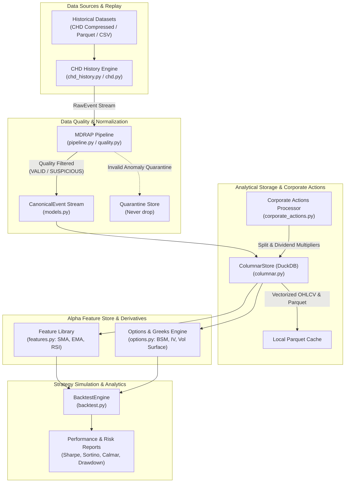

# Quantitative Research Platform Starter Architecture

Architecture and workflow blueprint for quantitative researchers, data scientists, and algorithmic strategists utilizing the Market Data Reliability & Acceleration Platform (MDRAP).

---

## 1. Overview & Research Objectives

Quantitative research demands clean, survivor-bias-free, point-in-time market data to prevent lookahead bias and model overfitting. 

This starter architecture provides:
- **Strict Data Hygiene**: Historical ticks are rigorously validated and scrubbed of sequence gaps, price anomalies, and crossed books before feature generation.
- **High-Performance Vectorized Storage**: Embedded DuckDB columnar store for multi-gigabyte analytical queries, vectorized resampling, and Parquet caching.
- **Accurate Corporate Actions Adjustments**: Backward price and volume adjustments for stock splits, dividends, and ticker changes.
- **Microstructure & Technical Alpha Features**: Native calculation of moving averages, RSI, Bollinger Bands, and order flow imbalance.
- **Event-Driven Backtesting**: Point-in-time trade/quote simulation with slippage models, transaction costs, and portfolio risk ratios.



---

## 2. Core Components Used

| Component | Module | Role in Research Platform |
|---|---|---|
| **Core Pipeline & Quality** | [`pipeline.py`](file:///c:/Users/KIIT0001/Desktop/Projects/mdrap/src/pipeline.py), [`quality.py`](file:///c:/Users/KIIT0001/Desktop/Projects/mdrap/src/quality.py), [`models.py`](file:///c:/Users/KIIT0001/Desktop/Projects/mdrap/src/models.py) | Ingests raw historical records, validates timestamp monotonicity and price consistency, and enforces quality status (`VALID`, `SUSPICIOUS`, `INVALID`). |
| **CHD History Replay** | [`chd_history.py`](file:///c:/Users/KIIT0001/Desktop/Projects/mdrap/src/chd_history.py), [`chd.py`](file:///c:/Users/KIIT0001/Desktop/Projects/mdrap/src/chd.py) | Fast historical replay of compressed exchange order books and tick streams with nano-precision timestamp alignment. |
| **Columnar Storage (DuckDB)** | [`columnar.py`](file:///c:/Users/KIIT0001/Desktop/Projects/mdrap/src/columnar.py) | Embedded [`ColumnarStore`](file:///c:/Users/KIIT0001/Desktop/Projects/mdrap/src/columnar.py) powering sub-second vectorized aggregations, windowed metrics, and Parquet persistence. |
| **Corporate Actions Engine** | [`corporate_actions.py`](file:///c:/Users/KIIT0001/Desktop/Projects/mdrap/src/corporate_actions.py) | Normalizes raw historical prices against stock splits, reverse splits, cash dividends, and ticker renames to avoid phantom returns. |
| **Alpha Feature Store** | [`features.py`](file:///c:/Users/KIIT0001/Desktop/Projects/mdrap/src/features.py) | Point-in-time technical and microstructure features: `sma()`, `ema()`, `rsi()`, `macd()`, `bollinger_bands()`, and `atr()`. |
| **Options & Greeks Modeling** | [`options.py`](file:///c:/Users/KIIT0001/Desktop/Projects/mdrap/src/options.py) | Black-Scholes-Merton (BSM) options pricing, implied volatility (IV) solvers, and analytic Greeks (`delta`, `gamma`, `vega`, `theta`). |
| **Backtest Engine** | [`backtest.py`](file:///c:/Users/KIIT0001/Desktop/Projects/mdrap/src/backtest.py) | Event-driven historical simulation with [`BacktestEngine`](file:///c:/Users/KIIT0001/Desktop/Projects/mdrap/src/backtest.py), paper execution, equity curve sampling, and drawdown analysis. |

---

## 3. End-to-End Implementation Example

The following script demonstrates the complete research workflow:
1. Loads historical raw events and validates data quality via [`Pipeline`](file:///c:/Users/KIIT0001/Desktop/Projects/mdrap/src/pipeline.py).
2. Stores canonical events into embedded DuckDB via [`ColumnarStore`](file:///c:/Users/KIIT0001/Desktop/Projects/mdrap/src/columnar.py).
3. Applies historical split factors via [`CorporateActionsEngine`](file:///c:/Users/KIIT0001/Desktop/Projects/mdrap/src/corporate_actions.py).
4. Calculates technical features (RSI / Moving Averages) via [`features.py`](file:///c:/Users/KIIT0001/Desktop/Projects/mdrap/src/features.py).
5. Executes an event-driven momentum strategy using [`BacktestEngine`](file:///c:/Users/KIIT0001/Desktop/Projects/mdrap/src/backtest.py).

```python
"""
Quantitative Research Platform Starter:
Historical Replay -> Data Quality -> DuckDB -> Features -> Backtest
"""

from __future__ import annotations

import time
import itertools
from models import RawEvent, CanonicalEvent, EventType, QualityStatus
from storage import Store
from pipeline import Pipeline
from columnar import ColumnarStore
from corporate_actions import CorporateActionsEngine, CorporateAction, ActionType
from features import sma, rsi
from backtest import BacktestEngine
from strategy_sdk import Strategy, OrderSide


# 1. Define a Quantitative Alpha Strategy
class MeanReversionStrategy(Strategy):
    """Simple intraday mean reversion strategy driven by RSI indicator."""

    def __init__(self, symbol: str, rsi_period: int = 14):
        super().__init__(name="IntradayMeanReversion")
        self.symbol = symbol
        self.rsi_period = rsi_period
        self.prices: list[float] = []

    def on_tick(self, event: CanonicalEvent) -> None:
        if event.instrument_id != self.symbol or event.price is None:
            return

        self.prices.append(event.price)
        if len(self.prices) <= self.rsi_period:
            return

        # Compute point-in-time RSI over recent window
        recent_rsi = rsi(self.prices[-50:], period=self.rsi_period)
        if not recent_rsi or recent_rsi[-1] != recent_rsi[-1]:  # check for NaN
            return

        current_rsi = recent_rsi[-1]
        pos = self.get_position(self.symbol)

        # Oversold signal: buy
        if current_rsi < 30 and pos.quantity == 0:
            self.submit_market_order(self.symbol, OrderSide.BUY, 100.0)
        # Overbought signal: exit position
        elif current_rsi > 70 and pos.quantity > 0:
            self.submit_market_order(self.symbol, OrderSide.SELL, pos.quantity)


# 2. Main Research Pipeline Execution
def run_research_pipeline():
    print("[*] Initializing Quantitative Research Environment...")
    raw_store = Store(":memory:")
    pipeline = Pipeline(store=raw_store)
    duck_store = ColumnarStore(db_path=":memory:", threads=4)
    corp_engine = CorporateActionsEngine()

    # Register sample corporate action (e.g. 2:1 split on AAPL)
    corp_engine.add_action(
        CorporateAction(
            action_id=1,
            action_type=ActionType.SPLIT,
            symbol="AAPL",
            effective_date="2026-09-01",
            effective_timestamp=1788220800.0,
            ratio=2.0,
            description="2:1 Stock Split",
        )
    )

    # 3. Simulate Ingesting Historical Ticks
    print("[*] Replaying historical tick stream through Quality Engine...")
    base_price = 220.0
    canonical_batch: list[CanonicalEvent] = []
    seq_gen = itertools.count(1)

    t0 = 1788220000.0  # Simulated historical epoch
    for i in range(1000):
        t = t0 + i * 2.0
        # Inject synthetic drift and price movement
        drift = (i * 0.05) if i < 500 else (25.0 - (i - 500) * 0.08)
        p = round(base_price + drift, 2)
        raw = RawEvent(
            source="HIST_FEED",
            payload={
                "instrument": "AAPL",
                "event_type": "TRADE",
                "price": p,
                "size": 100.0,
                "bid": p - 0.02,
                "ask": p + 0.02,
                "exchange_ts": t,
                "sequence": next(seq_gen),
            },
            receive_timestamp=t + 0.01,
        )
        ev = pipeline.process_one(raw)
        if ev and ev.quality_status in (QualityStatus.VALID, QualityStatus.SUSPICIOUS):
            canonical_batch.append(ev)

    print(f"[*] Validated {len(canonical_batch)} clean events. Ingesting into DuckDB...")
    duck_store.ingest_events(canonical_batch)

    # 4. Analytical Vectorized SQL Query via DuckDB
    print("\n[*] Vectorized DuckDB Resampling (5-Minute Bars):")
    resampled_df = duck_store.resample_ohlcv(symbol="AAPL", interval="5 minutes")
    for row in resampled_df.to_dict(orient="records")[:5]:
        print(f"  Bar: {row['window_start']} | O: {row['open']} H: {row['high']} L: {row['low']} C: {row['close']} V: {row['volume']}")

    # 5. Execute Historical Backtest
    print("\n[*] Running Event-Driven Backtest...")
    backtest = BacktestEngine(initial_capital=100_000.0, benchmark_symbol="AAPL")
    strategy = MeanReversionStrategy(symbol="AAPL", rsi_period=14)
    result = backtest.run(strategy=strategy, events=canonical_batch)

    # 6. Display Performance Metrics
    print("\n" + "=" * 50)
    print("BACKTEST PERFORMANCE SUMMARY")
    print("=" * 50)
    print(f"Strategy:            {result.strategy_name}")
    print(f"Initial Capital:     ${result.initial_capital:,.2f}")
    print(f"Final Equity:        ${result.final_equity:,.2f}")
    print(f"Total Return:        {result.total_return_pct:+.2f}%")
    print(f"Sharpe Ratio:        {result.sharpe_ratio:.2f}")
    print(f"Sortino Ratio:       {result.sortino_ratio:.2f}")
    print(f"Max Drawdown:        {result.max_drawdown_pct:.2f}%")
    print(f"Win Rate:            {result.win_rate:.1f}%")
    print(f"Total Trades:        {result.total_trades}")
    print("=" * 50)

    duck_store.close()
    raw_store.close()


if __name__ == "__main__":
    run_research_pipeline()
```

---

## 4. Analytical Query Patterns with DuckDB

[`ColumnarStore`](file:///c:/Users/KIIT0001/Desktop/Projects/mdrap/src/columnar.py) enables researchers to query tick archives with standard SQL using vectorized SIMD kernels:

```python
from columnar import ColumnarStore

store = ColumnarStore(db_path="data/analytics.duckdb", read_only=True)

# 1. Volume-Weighted Average Price (VWAP) per minute
vwap_df = store.con.execute("""
    SELECT 
        time_bucket(INTERVAL '1 minute', to_timestamp(exchange_timestamp)) AS minute,
        SUM(price * quantity) / SUM(quantity) AS vwap,
        SUM(quantity) AS total_volume
    FROM canonical_ticks
    WHERE instrument_id = 'AAPL' AND price IS NOT NULL
    GROUP BY 1 ORDER BY 1
""").df()

# 2. Spread and Quoted Size Imbalance
spread_df = store.con.execute("""
    SELECT 
        instrument_id,
        AVG(ask_price - bid_price) AS avg_spread,
        AVG((bid_size - ask_size) / (bid_size + ask_size)) AS avg_depth_imbalance
    FROM canonical_ticks
    WHERE bid_price IS NOT NULL AND ask_price IS NOT NULL
    GROUP BY instrument_id
""").df()
```

---

## 5. What You DON'T Need for Research

When running a research or backtesting workstation, you should omit low-level production streaming infrastructure:

- **No Shared Memory Ring Buffer ([`shm.py`](file:///c:/Users/KIIT0001/Desktop/Projects/mdrap/src/shm.py))**: In-memory Python iterables or DuckDB columnar scans are significantly more ergonomic for batch analysis than POSIX IPC ring buffers.
- **No Headless TCP Socket Daemons ([`service.py`](file:///c:/Users/KIIT0001/Desktop/Projects/mdrap/src/service.py), [`gateway_tcp.py`](file:///c:/Users/KIIT0001/Desktop/Projects/mdrap/src/gateway_tcp.py))**: Avoid running network server loops; load datasets directly from local files or object storage.
- **No Live WebSocket Exchange Handlers ([`ws_feed.py`](file:///c:/Users/KIIT0001/Desktop/Projects/mdrap/src/ws_feed.py), [`live.py`](file:///c:/Users/KIIT0001/Desktop/Projects/mdrap/src/live.py))**: Research uses immutable historical snapshots rather than live non-deterministic internet feeds.
- **No Live Terminal Rendering ([`terminal_display.py`](file:///c:/Users/KIIT0001/Desktop/Projects/mdrap/src/terminal_display.py))**: Terminal cockpits generate high console I/O; researchers should use Jupyter Notebooks, Pandas DataFrames, or Matplotlib charts.
